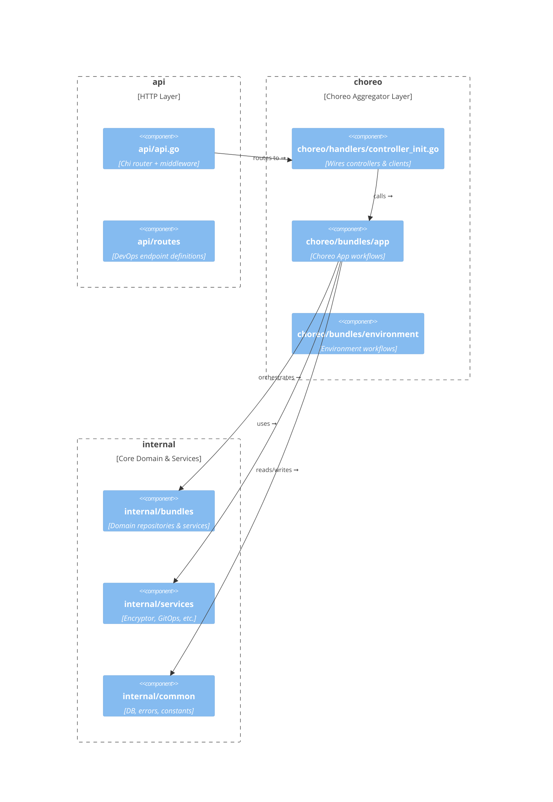

## 1.2 Package layout and layering rules (api vs choreo vs internal)

The Rudder codebase follows a **three-layer** structure to isolate concerns, simplify testing, and enforce clear service boundaries. Each layer has a dedicated responsibility:

- **API layer** (`api/`) – HTTP entrypoints, routing, middleware
- **Choreo layer** (`choreo/`) – Aggregated “Choreo” endpoints, controller wiring
- **Internal layer** (`internal/`) – Core domain bundles, services, persistence, common utilities

```bash
.
├── api/                     # HTTP router, middlewares, DevOps endpoints
├── choreo/                  # Aggregated Choreo endpoints & handler wiring
│   ├── bundles/             # High-level controllers per domain
│   └── handlers/            # HTTP handler initialization
└── internal/                # Domain logic, bundles, services, common, metrics
    ├── bundles/             # CRUD/repositories/models per feature
    ├── services/            # Core integrations (encryptor, gitops, etc.)
    └── common/              # Shared constants, DB client, logging context
```

---

### API layer (`api/`)

This layer handles incoming HTTP traffic, applies middleware, and delegates to lower layers.

- **Routing & middleware**
- Entry point in `api/api.go` sets up a Chi router, structured logging, panic recovery, request cache.
- Mounts DevOps routes under `/api/v1/` and Choreo routes under `/api/v1/choreo`.

- **DevOps endpoints**
- `routes/AppRoutes` – component CRUD (create, list, delete)
- `routes/ConfigMapRoutes`, `routes/SecretRoutes`, etc.

```go
// api/api.go
r.Route("/api/v1/", func(r chi.Router) {
  r.Use(middlewares.RequestCache) 
  r.Route("/component", routes.AppRoutes)
  r.Route("/configmaps", routes.ConfigMapRoutes)
  // ...
  r.Route("/choreo/components", choreo_routes.ComponentRoutes)
})
```

- **Key files**

| File | Responsibility |
| --- | --- |
| `api/api.go` | Bootstraps router, middleware, top-level routes |
| `api/middlewares.go` | Logging, operating mode, panic recovery |
| `api/routes/*.go` | DevOps endpoint definitions |


---

### Choreo layer (`choreo/`)

This layer implements the **Choreo-specific API**, composing internal bundles and external services into meaningful workflows.

#### Bundles (`choreo/bundles/`)

Each bundle exposes a **controller interface** and implements high-level operations by orchestrating:

- Internal domain bundles (`internal/bundles/*`)
- External control-plane clients (`external-services/*`)

| Bundle | Directory | Description |
| --- | --- | --- |
| **App** | `choreo/bundles/app` | Full app lifecycle: create, deploy, config, clean |
| **Environment** | `choreo/bundles/environment` | Environment provisioning, namespace initialization |
| **Mapping** | `choreo/bundles/mapping` | Configuration-to-component mappings |
| **Release Management** | `choreo/bundles/release_management` | Release rollouts, tracking |
| **Continuous Delivery** | `choreo/bundles/continuous-delivery` | Image generation, delivery pipelines |


Controllers in this layer include methods like `NewChoreoAppController`, `NewReleaseController`, and `ComponentEndpointController`, each wiring together:

```go
// choreo/handlers/controller_init.go
ChoreoAppController = choreoapp.NewChoreoAppController(
  vaultSvc,
  apiVersionSvc,
  cicdSvc,
  clientSet,
  appEnvSvc,
  envSvc,
  cfgDeployer,
  // ...other dependencies
)
releaseController = choreoapp.NewReleaseController()
```

#### Handlers (`choreo/handlers/`)

- `**controller_init.go**` initializes all Choreo controllers and external-service clients.
- Exposes HTTP handlers via `choreo_routes`, which are then mounted in the API layer.

---

### Internal layer (`internal/`)

The **core domain logic** and **shared utilities** reside here. Nothing in this directory is exposed directly over HTTP.

#### Domain Bundles (`internal/bundles/`)

Each feature has its own bundle folder, following the **Repository–Service–Model** convention:

- **Repository** – Database CRUD (GORM)
- **Service** – Business logic orchestration
- **Model** – GORM entity definitions
- **Generator** – Kubernetes manifest generators

Common bundles:

- `app` – Application objects, environments, containers
- `configmap` – ConfigMap creation, retrieval
- `configuration` – Configuration schema enforcement
- `environment` – Namespace and environment entities
- `gateway` – Ingress, service and HTTP scaler manifests
- `release_management` – Release tracking repositories
- `continuous-delivery` – Image registry, ByOI image builders

```bash
internal/bundles/app/
├── repository.go  
├── service.go  
├── models.go  
└── generator.go
```

#### Core Services (`internal/services/`)

Shared integrations:

- **Encryptor** (`encryptor.NewEncryptor`) – Vault encryption/decryption
- **GitOps** (`gitops.NewService`) – GitOps push/pull operations
- **Config Migrator** – Configuration migration logic

#### Common Utilities (`internal/common/`)

- `**db/**` – MSSQL client wrapper, transaction helpers
- `**errors.go**` – Custom error types
- `**constants.go**` – Memory/CPU defaults, naming conventions
- `**logctx/**` – Logging context fields

#### Metrics (`internal/metrics/`)

Prometheus instrumentation and collectors for all layers.

---



---

**Layering rules in practice**

- **API** never calls `internal/bundles` directly; it goes through **Choreo**.
- **Choreo bundles** orchestrate **internal bundles** and **external clients**.
- **Internal bundles** contain no HTTP or Chi dependencies.
- Tests in each layer mock dependencies from lower layers only.

This strict separation keeps HTTP concerns, high-level business workflows, and low-level domain logic neatly decoupled.