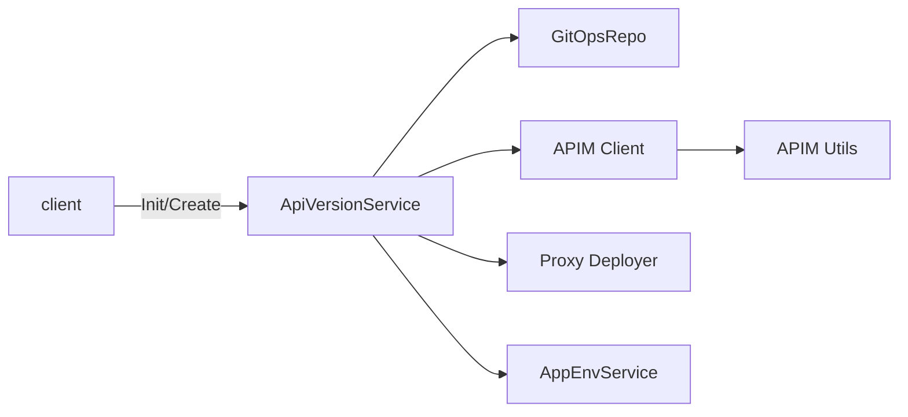

# 12. API Version Service (APIVersionSvc Domain)

This section covers the **helpers**, **repository**, and **service behavior** involved in managing API versions for legacy component types. It explains how API versions tie into component endpoints, swagger/spec retrieval (via GitOps), and the APIM deployment lifecycle.

---

## 12.1 API Version Helpers 📦

The helpers in `api_version_helpers.go` provide constructors for `app.ChoreoApiVersion` objects and utility functions for computing service URLs.

| Helper | Purpose |
| --- | --- |
| **createApiVersionObj** | Builds a new `ChoreoApiVersion` with the provided version, branch, and accessibility for legacy proxies |
| **createApiVersionObjFromExistingApiVersion** | Clones an existing API version into a new object with a fresh ID and branch |
| **getServiceURL** | Computes the HTTP URL for a proxy by inspecting container or image ports. Returns `http://<svc>:<port>` |
| **getPlaceHolderServiceURL** | Provides a placeholder URL (`resource-name.ns-name.svc.cluster.local:9090`) used during initial proxy creation |


```go
// Example: createApiVersionObj
func createApiVersionObj(application app.App, version string, latest bool, branch string, accessibility string) (*app.ChoreoApiVersion, error) {
    if application.IsLegacyComponentProxyRequired() && !application.HasApimName() {
        return nil, fmt.Errorf("apim name not found for component")
    }
    obj := app.ChoreoApiVersion{
        AppId:         application.ID,
        ApiVersion:    version,
        Latest:        &latest,
        Branch:        branch,
        ApimName:      application.ApimName,
        ApimContext:   application.ApimContext,
        State:         app.ApiNotCreatedYet,
        Accessibility: accessibility,
        XPlatformerData: common.XPlatformerData{
            OrganizationID: application.OrganizationID,
            ProjectID:      application.ProjectID,
        },
    }
    obj.EnsureID()
    return &obj, nil
}
```

---

## 12.2 API Version Repository 📚

The repository in `api_version_repository.go` persists and retrieves `ChoreoApiVersion` records in MSSQL via GORM. It supports:

- **GetApiVersionById**: Fetch by app ID and version ID.
- **GetApiVersionByIdOnly**: Fetch by version ID alone.
- **GetApiVersionByIdWithApp**: Preloads the associated `App` object.
- **GetApiVersionsList**: Lists all versions, newest first.
- **GetApiVersionsWithImages**: Preloads related releases and image metadata.
- **GetProxyIdsForApiVersion**: Returns APIM proxy IDs for a given version.

Each method uses `db.DB(ctx)` for transactions and filtering .

```go
// GetApiVersionById retrieves a specific API version
func (r *apiVersionRepository) GetApiVersionById(
    ctx context.Context,
    appId common.UniqueIdentifier,
    apiVersion common.UniqueIdentifier,
) (*app.ChoreoApiVersion, error) {
    var version app.ChoreoApiVersion
    if dbc := db.DB(ctx).
        Where(&app.ChoreoApiVersion{AppId: appId, Base: common.Base{ID: apiVersion}}).
        Take(&version); dbc.Error != nil {
        return nil, dbc.Error
    }
    return &version, nil
}
```

---

## 12.3 API Version Service Behavior 🚀

The `ApiVersionService` implemented in `api_version_service.go` orchestrates the lifecycle of proxy-based API versions, integrating with:

- **GitOps** (`gitops.GitOpsRepo`) for **swagger/spec retrieval** and **hash-based** lookups.
- **APIM client** (`external-services/apim`) and **APIM utilities** (`apimutils`) for import, versioning, and environment-specific updates.
- **Proxy Deployer** (`external-services/proxy-deployer`) for managing revision deployments.
- **AppEnvService** for initializing and resuming AppEnvironments.

### Key Methods

1. **InitApiVersion**

Initializes the first API proxy for a component. It:

- Skips non-legacy types.
- Fetches the **initial swagger definition** via `gitOpsSvc.GetInitialSwaggerDef`.
- Imports it into APIM with a placeholder URL.
- Sets `version.ApimId` and lifecycle state.

1. **CreateNewApiVersion**

Creates a new DB record and, if needed, a new APIM version:

- Validates uniqueness and branch rules.
- Reuses existing proxy ID or copies from a base version.
- In a transaction:
- Marks previous versions as non-latest.
- Calls `ApimClient().CreateNewVersion` to copy proxy in APIM.
- Persists the new `ChoreoApiVersion`.
- Triggers `appEnvSvc.InitializeAppEnvsForNewApiVersion`.

1. **deployApiDefinition** & **importSwaggerDefinition**
2. Retrieves the OpenAPI definition from GitOps (using `image.GitOpsHash`).
3. Computes the **upstream URL** via `getUpstreamUrl`.
4. Calls `ApimClient().ImportSwaggerDefinition` with enriched properties (org, app, component type).

1. **DeployProxyForLegacyComponentRelease**

For each AppEnvironment release:

- Loads `AppEnv` with preloaded API version and container/image.
- Fetches swagger via `fetchOpenApiDefinition`.
- Imports definition, **creates** and **deploys** revisions via proxy-deployer.

1. **UpdateEnvUrls** / **updateEnvSpecificUrl**

Updates production and sandbox endpoints in APIM for each accessibility:

- Retrieves `APIMSettings` and selects vhosts with `apimutils.FindApimEnv`.
- Calls `ApimClient().UpdateEnvSpecificAPIProperties` per environment.
- Ensures external/internal proxies are routed correctly.

1. **UndeployReleaseRevision** & **undeployApiRevision**
2. Retrieves the release and its API version.
3. Uses `GetDeploymentList` to find last undeployed revision (`apimutils.FindLastUndeployedRevision`).
4. Calls `ProxyDeployer.UndeployRevision`.

1. **ChangeAccessibilityReleaseRevision**

Handles live switching between internal/external proxies by:

- Redeploying revisions on the target vhost.
- Updating `ApiAdditionalProperty` for `accessibility`.
- Undeploying from the old accessibility.

### Integration with Swagger/Spec Hashing

- **GitOps-based lookup** uses the image’s **GitOpsHash** to fetch the correct swagger definition:

```go
  def, err := svc.gitOpsSvc.FindSwaggerDefInRepo(ctx, component.ID, image.GitOpsHash, component.ComponentType)
```

This ties API versioning to the exact spec version under source control .

### Dependency Diagram



This diagram illustrates how the service coordinates external components to manage API proxies.

---

**Card Block: Key Takeaway**

```card
{
    "title": "API Version Lifecycle",
    "content": "The ApiVersionService uses GitOps for spec retrieval, APIM for proxy import/versioning, and proxy-deployer for revision management."
}
```