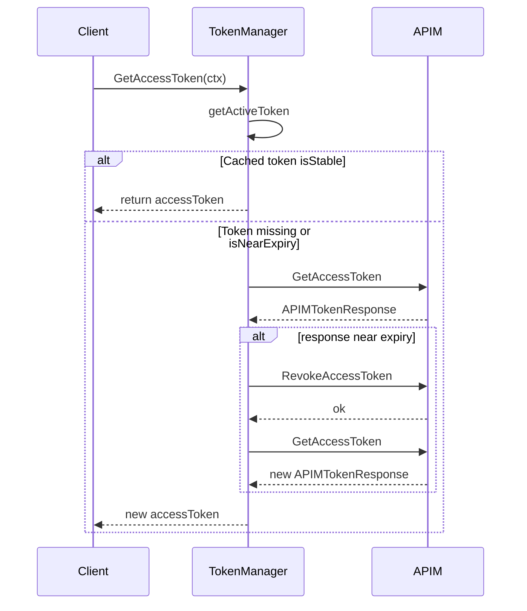

## 13.2 APIM Auth: Token Manager, TokenInfo Caching, and Test Coverage

This section covers how Rudder acquires, caches, and renews bearer tokens for APIM calls. It describes the **TokenManager** interface, the **TokenInfo** cache, renewal policies, integration with HTTP clients, and comprehensive test coverage.

---

### 13.2.1 TokenManager Interface and Implementation

Rudder defines a pluggable **TokenManager** interface in

`external-services/apim-auth/token_manager.go`. It abstracts bearer-token retrieval for all APIM clients.

```go
// TokenManager defines how to obtain a bearer token.
type TokenManager interface {
  GetAccessToken(ctx context.Context) (string, error)
}

// tokenManager implements TokenManager with caching and renewal.
type tokenManager struct {
  client    Client                // APIM OAuth client
  config    TokenManagerConfig    // renewal policies
  tokenInfo *TokenInfo            // cached token metadata
  sync.RWMutex                    // guards tokenInfo
}

// NewTokenManager constructs a TokenManager.
func NewTokenManager(oauthClient Client) TokenManager { … }
```

- **GetAccessToken** first checks if the manager is **disabled** (always fetch).
- Otherwise, it calls `getActiveToken` to return a cached token or trigger `renewToken`.

---

### 13.2.2 TokenInfo and Configurations

Caching behavior centers on two types:

| Type | Purpose |
| --- | --- |
| **TokenManagerConfig** | Controls renewal windows and skip-check periods |
| **TokenInfo** | Holds the current token, its issue and expiry time |


```go
// TokenManagerConfig defines caching policies.
type TokenManagerConfig struct {
  disabled                      bool   // skip cache, fetch every call
  revokeBeforeSeconds           int64  // renew this many secs before expiry
  skipValidityCheckAfterSeconds int64  // consider token stable after this age
  tokenMaxAgeSeconds            int64  // used to compute token age
}

// TokenInfo caches a token’s metadata.
type TokenInfo struct {
  accessToken string
  obtainedAt  time.Time
  expiryTime  time.Time
}

// isNearExpiry returns true when token is close to expiry.
func (t TokenInfo) isNearExpiry(cfg TokenManagerConfig) bool { … }

// isStable returns true when token is far from expiry and old enough.
func (t TokenInfo) isStable(cfg TokenManagerConfig) bool { … }
```

These methods decide whether a cached token can be used directly or must be renewed .

---

### 13.2.3 Token Acquisition & Renewal Flow



1. **getActiveToken**
2. Returns cached token if **isStable**.
3. Returns empty string if **isNearExpiry** or uninitialized.
4. If recently renewed, verifies with APIM (`GetAccessToken`) that the token wasn’t revoked by another pod.
5. **renewToken** (single-writer lock)
6. If another goroutine already set a stable token, returns it.
7. Fetches latest token from APIM.
8. If that token is near expiry, calls **RevokeAccessToken**, then fetches a fresh token.
9. Updates `tokenInfo` and returns the new token.

---

### 13.2.4 Integration with APIM Clients

Both the **Publisher** and **Dev-Portal** HTTP clients embed a TokenManager. Before sending any request, they inject the bearer token:

```go
accessToken, err := apimClient.TokenManager.GetAccessToken(ctx)
req.Header.Set("Authorization", fmt.Sprintf("Bearer %s", accessToken))
```

This pattern appears in

- `external-services/apim/apim_service.go`
- `external-services/apim-dev-portal/client.go`

ensuring consistent authorization across all APIM calls .

---

### 13.2.5 Test Coverage

Rudder includes extensive tests for both the **token cache logic** and **concurrent access**:

| File | Purpose |
| --- | --- |
| external-services/apim-auth/token_info_test.go | Unit tests for `isNearExpiry` and `isStable`. |
| external-services/apim-auth/token_manger_test.go | Concurrency tests ensuring only one renewal call. |


**TokenInfo Tests** verify edge cases around near-expiry and stability:

```go
func TestIsNearExpiry(t *testing.T) { … }     // checks both near and far expiry
func TestIsStable(t *testing.T) { … }        // checks fresh vs stable tokens
```

**TokenManager Concurrency Tests** spin up multiple goroutines calling `GetAccessToken`:

- **Initial fetch**: only one `GetAccessToken` call to APIM, no revokes.
- **Expired token**: first goroutine revokes then fetches; others reuse new token but still verify.
- **Stable token**: all goroutines return immediately, no APIM calls.

This ensures thread-safe, efficient token management under load .

---

### 13.2.6 Mocks

A generated **TokenManagerMock** allows injecting fake behavior in higher-level tests:

```go
type TokenManagerMock struct {
  GetAccessTokenFunc func(ctx context.Context) (string, error)
  // call tracking…
}
func (m *TokenManagerMock) GetAccessToken(ctx context.Context) (string, error) { … }
```

This mock supports verifying how often `GetAccessToken` is invoked by APIM clients without real HTTP calls .

---

💡 **Key takeaway**: Rudder’s APIM auth layer minimizes unnecessary token fetches, handles near-expiry gracefully, and protects against race conditions through careful use of read/write locks and renewal policies.