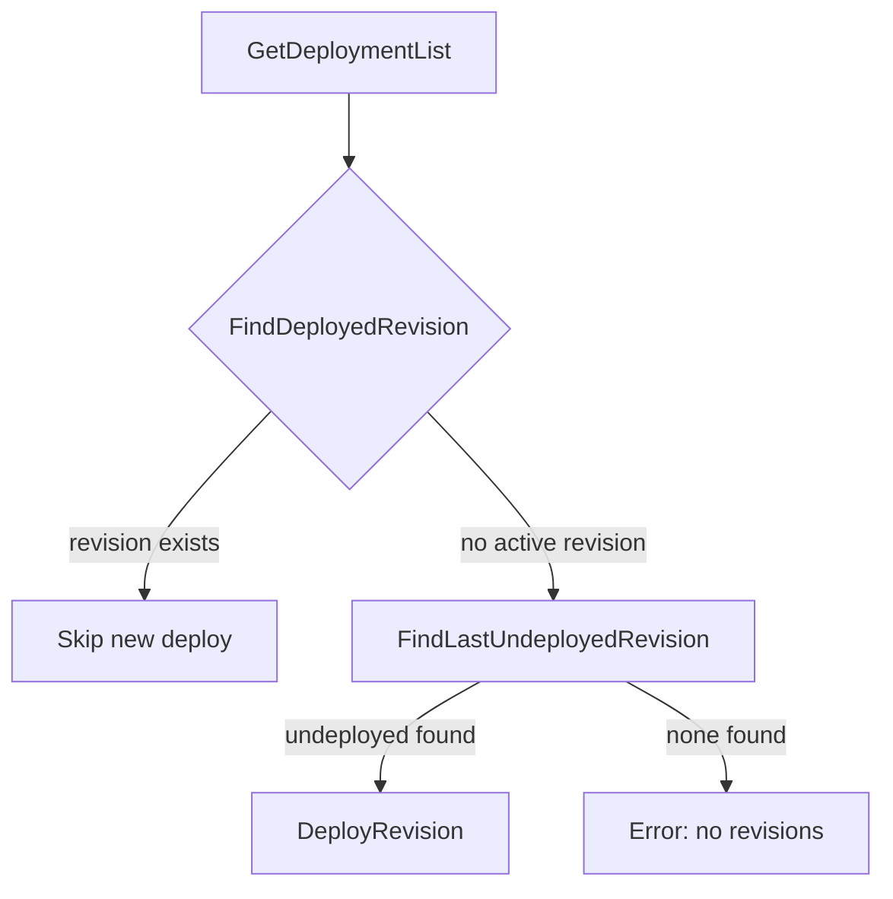

# 13.3 APIM Deploy Utilities: Finding Deployments and Proxy Mutation

This module provides utilities for the “release → APIM revision/deploy” flow. It includes functions to select the correct revision from APIM deployments and to mutate the proxy’s JSON representation before updating it in APIM.

## 13.3.1 Purpose and Context

These utilities live under `internal/services/apimutils` and support Choreo’s release pipelines by:

- Selecting the **active** or **latest undeployed** APIM revision for a given environment.
- Applying property updates to an API proxy’s JSON payload (e.g., accessibility, component type).
- Ensuring smooth integration between Choreo’s Go service and the external APIM control-plane.

They assume that:

- APIM returns a list of `apim.DeployedRevision` objects, each with `Name`, `DeployedTime`, and optional `SuccessDeployedTime`.
- Proxy definitions include an `additionalProperties` array and an `additionalPropertiesMap` object.

---

## 13.3.2 Find Deployments Utility 🔍

File: `internal/services/apimutils/find_deployments.go`

This utility provides two core functions:

| Function | Purpose |
| --- | --- |
| **FindDeployedRevision** | Return the first deployment matching `apimEnvName` with `DeployedTime` set. |
| **FindLastUndeployedRevision** | Return the undeployed revision (no `DeployedTime`) with the most recent `SuccessDeployedTime`. |


```go
// FindDeployedRevision returns the currently active deployment.
// If none exists, it returns nil.
func FindDeployedRevision(deployments []apim.DeployedRevision, apimEnvName string) *apim.DeployedRevision

// FindLastUndeployedRevision returns the undeployed revision
// sorted by descending SuccessDeployedTime.
// If none exists, it returns nil.
func FindLastUndeployedRevision(deployments []apim.DeployedRevision, apimEnvName string) *apim.DeployedRevision
```

Key details:

- **Environment name matching** supports legacy names via `newToOldEnvMap`.
- Sorting uses `slices.SortFunc` to prefer revisions with a non-nil `SuccessDeployedTime` .
- If no undeployed revisions are found, `FindLastUndeployedRevision` returns `nil`.

### Flowchart of Revision Selection



### Test Coverage

The behavior is validated in `internal/services/apimutils/apim_deploy_utils_test.go`, covering cases where:

- An undeployed revision is chosen correctly.
- No undeployed or unknown environments yield `nil`.

---

## 13.3.3 Proxy JSON Mutation Utility 🔧

File: `internal/services/apimutils/modify_proxy_object.go`

Test: `internal/services/apimutils/modify_proxy_object_test.go`

This utility updates an API proxy’s JSON payload by upserting properties in its `additionalProperties` array.

```go
type ProxyUpdate struct {
    UpsertProperties []apim.APIAdditionalProperty
}

// ModifyProxyJsonObject applies the ProxyUpdate to apiJson.
// It returns the mutated JSON, a flag indicating if a change occurred, and an error.
func ModifyProxyJsonObject(
    apiJson json.RawMessage,
    update ProxyUpdate,
) (updatedJson json.RawMessage, changed bool, err error)
```

**Key steps:**

1. Unmarshal only `additionalProperties` into a local struct.
2. For each `UpsertProperties` entry:
3. **Append** if the property name is new.
4. **Overwrite** existing values if changed.
5. If no changes, return the original JSON with `changed=false`.
6. Use `sjson` to set the updated array and reset `additionalPropertiesMap` to an empty object (avoiding duplicate entries).
7. Return the mutated JSON with `changed=true` if any modifications occurred.

#### Before / After Example

```json
// Before (api_info1.json)
"additionalProperties": [
  { "name": "accessibility", "value": "external", "display": true }
]
```

```json
// After applying ProxyUpdate{UpsertProperties:[
//   {Name:"componentType",Value:"GQL",Display:true},
//   {Name:"accessibility",Value:"internal",Display:false},
// ]}
"additionalProperties": [
  { "name": "accessibility", "value": "internal", "display": false },
  { "name": "componentType", "value": "GQL", "display": true }
]
```

---

## 13.3.4 Integration in Release Flows

These utilities are used by **ApiVersionService** in `choreo/bundles/app/apiversionsvc/api_version_service.go` to orchestrate APIM proxy deployments:

1. **Fetch deployments**

```go
   deployments, _ := svc.ApimClient().GetDeploymentList(ctx, apim.GetDeploymentsAPIMRequest{…})
```

1. **Decide action**
2. Call `FindDeployedRevision` to skip redundant deploys.
3. Otherwise, call `FindLastUndeployedRevision` to select the next revision.

1. **Mutate proxy JSON**

When updating proxy metadata (e.g., changing accessibility), call:

```go
   update := apimutils.ProxyUpdate{
     UpsertProperties: []apim.APIAdditionalProperty{ … },
   }
   updatedJSON, changed, _ := apimutils.ModifyProxyJsonObject(originalJSON, update)
```

1. **Push update**

Send `updatedJSON` back to APIM via `UpdateProxyDetails` or a similar API client method.

Together, these utilities automate the decision logic and JSON handling needed for robust APIM proxy deployments in Choreo’s CI/CD workflow.