# 13.4 APIM Developer Portal Client and Mocks

This section documents the **APIM Developer Portal** integration in Rudder. It covers:

- The **internal types** for requests and responses.
- The **Client** interface and its HTTP-based implementation.
- The **mock** (`ClientMock`) for unit tests.
- How the client is injected and used across the codebase.

---

## 📦 Types (`external-services/apim-dev-portal/types.go`)

These Go structs model requests and responses when calling the APIM Developer Portal APIs:

| Type | Purpose |
| --- | --- |
| **GetApplicationById** | Identify an application by `OrganizationUUID` and `ApplicationId`. |
| **GetApplicationByName** | Query applications via `OrganizationUUID` and `ApplicationName`. |
| **ApimAppCreateRequest** | Payload to create a new application (`OrganizationUUID` + `*Application`). |
| **DeleteApplicationRequest** | Alias for `GetApplicationById`, used to delete an application. |
| **GetApiSubscriptionRequest** | Fetch subscriptions for an API (`OrganizationUUID`, `ApiId`, `Limit`). |
| **ApiUnSubsubscriptionRequest** | Unsubscribe a subscription (`OrganizationUUID`, `SubscriptionId`). |
| **ApplicationList** | Wrapper for a list of `Application` returned by the portal. |
| **Application** | Full application record (ID, name, attributes, subscription count, etc.). |


```go
type GetApplicationById struct {
  OrganizationUUID string
  ApplicationId    string
}

type GetApplicationByName struct {
  OrganizationUUID  string
  ApplicationName   string
}

type ApimAppCreateRequest struct {
  OrganizationUUID string
  Payload          *Application
}

type ApiUnSubsubscriptionRequest struct {
  OrganizationUUID string
  SubscriptionId   string
}

// ... and so on for other types
```

These types drive both the **Client** calls and the **mock** behavior  .

---

## 🚀 Client Interface & Implementation (`external-services/apim-dev-portal/client.go`)

### Client Interface

```go
type Client interface {
  GetApimAppById(ctx context.Context, params GetApplicationById) (*Application, error)
  GetApimAppByName(ctx context.Context, params GetApplicationByName) (*ApplicationList, error)
  SubscribeApi(ctx context.Context, params ApiSubscriptionRequest) (*ApiSubscriptionResponse, error)
  UnsubscribeApi(ctx context.Context, params ApiUnSubsubscriptionRequest) error
  GetApiSubscriptions(ctx context.Context, params GetApiSubscriptionRequest) (*AdditionalSubscriptionInfoList, error)
  CreateApimApp(ctx context.Context, params ApimAppCreateRequest) (*Application, error)
  DeleteApimApp(ctx context.Context, params DeleteApplicationRequest) error
}
```

### Factory & Struct

- `**apiManagerDevPortal**` holds an `*http.Client` and an `apim_auth.TokenManager`.
- `**NewApiManagerDevPortalClient**` constructs the real client.

```go
func NewApiManagerDevPortalClient(
    httpClient *http.Client,
    tokenManager apim_auth.TokenManager,
) Client {
    return &apiManagerDevPortal{
      httpClient:   httpClient,
      TokenManager: tokenManager,
    }
}
```

### Key Methods

#### Get Application by Name

```go
func (c *apiManagerDevPortal) GetApimAppByName(
    ctx context.Context,
    params GetApplicationByName,
) (*ApplicationList, error) {
    url := fmt.Sprintf("%s/api/am/devportal/v2/applications",
        config.GetConfig().ChoreoAPIMUrl)

    req, _ := http.NewRequest(http.MethodGet, url, nil)
    q := req.URL.Query()
    q.Add("organizationId", params.OrganizationUUID)
    q.Add("query", params.ApplicationName)
    req.URL.RawQuery = q.Encode()

    token, err := c.GetAccessToken(ctx)
    if err != nil {
        return nil, err
    }
    req.Header.Set("Authorization", fmt.Sprintf("Bearer %s", token))
    req.Header.Set("Content-Type", "application/json")
    req.Header.Set("activityid", common.GetRequestIdFromContext(ctx))

    var res ApplicationList
    err = request.New(ctx, c.httpClient, req, http.StatusOK).
        SetResult(&res).
        Send()
    if err != nil {
        return nil, fmt.Errorf(
           "DevportalClient: cannot retrieve application for name %s: %w",
           params.ApplicationName, err)
    }
    return &res, nil
}
```

#### Create Application

```go
func (c *apiManagerDevPortal) CreateApimApp(
    ctx context.Context,
    params ApimAppCreateRequest,
) (*Application, error) {
    url := fmt.Sprintf("%s/api/am/devportal/v2/applications",
        config.GetConfig().ChoreoAPIMUrl)

    body, _ := json.Marshal(params.Payload)
    req, _ := http.NewRequest(http.MethodPost, url, bytes.NewBuffer(body))
    q := req.URL.Query()
    q.Add("organizationId", params.OrganizationUUID)
    req.URL.RawQuery = q.Encode()

    token, err := c.GetAccessToken(ctx)
    if err != nil {
        return nil, err
    }
    req.Header.Set("Authorization", fmt.Sprintf("Bearer %s", token))
    req.Header.Set("Content-Type", "application/json")
    req.Header.Set("activityid", common.GetRequestIdFromContext(ctx))

    var app Application
    err = request.New(ctx, c.httpClient, req, http.StatusCreated).
        SetResult(&app).
        Send()
    if err != nil {
        return nil, fmt.Errorf(
           "DevportalClient: cannot create application: %w", err)
    }
    return &app, nil
}
```

These methods standardize URL construction, authentication, error handling, and JSON parsing .

---

## 🤖 Mock Implementation (`external-services/apim-dev-portal/devportal_mock.go`)

Generated by `moq`, `ClientMock` implements the same `Client` interface:

```go
type ClientMock struct {
  CreateApimAppFunc       func(ctx context.Context, params ApimAppCreateRequest) (*Application, error)
  GetApimAppByNameFunc    func(ctx context.Context, params GetApplicationByName) (*ApplicationList, error)
  SubscribeApiFunc        func(ctx context.Context, params ApiSubscriptionRequest) (*ApiSubscriptionResponse, error)
  UnsubscribeApiFunc      func(ctx context.Context, params ApiUnSubsubscriptionRequest) error
  GetApiSubscriptionsFunc func(ctx context.Context, params GetApiSubscriptionRequest) (*AdditionalSubscriptionInfoList, error)
  DeleteApimAppFunc       func(ctx context.Context, params DeleteApplicationRequest) error

  calls struct {
    CreateApimApp       []struct{ Ctx context.Context; Params ApimAppCreateRequest }
    GetApimAppByName    []struct{ Ctx context.Context; Params GetApplicationByName }
    SubscribeApi        []struct{ Ctx context.Context; Params ApiSubscriptionRequest }
    UnsubscribeApi      []struct{ Ctx context.Context; Params ApiUnSubsubscriptionRequest }
    GetApiSubscriptions []struct{ Ctx context.Context; Params GetApiSubscriptionRequest }
    DeleteApimApp       []struct{ Ctx context.Context; Params DeleteApplicationRequest }
  }

  lockCreateApimApp       sync.RWMutex
  lockGetApimAppByName    sync.RWMutex
  lockSubscribeApi        sync.RWMutex
  lockUnsubscribeApi      sync.RWMutex
  lockGetApiSubscriptions sync.RWMutex
  lockDeleteApimApp       sync.RWMutex
}
```

- `**XxxFunc**`** fields** allow injecting custom behavior.
- `**XxxCalls()**`** methods** return the history of invocations for assertions.
- **Locks** ensure thread safety when tests run in parallel .

### Example Test Setup

```go
mocked := &apim_dev_portal.ClientMock{
  CreateApimAppFunc: func(ctx context.Context, params ApimAppCreateRequest) (*Application, error) {
    return &Application{ApplicationId: "app-123"}, nil
  },
  SubscribeApiFunc: func(ctx context.Context, params ApiSubscriptionRequest) (*ApiSubscriptionResponse, error) {
    return &ApiSubscriptionResponse{SubscriptionId: "sub-456"}, nil
  },
}

// Use `mocked` wherever a `apim_dev_portal.Client` is required.
// After exercising code paths, assert calls:
if len(mocked.CreateApimAppCalls()) != 1 {
  t.Fatalf("expected one create call, got %d", len(mocked.CreateApimAppCalls()))
}
```

---

## 🔗 Integration & Usage

- **Client Wiring**

In `external-services/clients/clients.go`, the dev-portal client is constructed and stored in the global `clientSet`:

```go
  apimTokenManager := apim_auth.NewTokenManager(...)
  apiManager := apim.NewApiManager(...)
  clientSet.apimDevPortalClient = apim_dev_portal.NewApiManagerDevPortalClient(httpClient, apimTokenManager)
```

- **Dependency Injection**

Most controllers and services receive `apim_dev_portal.Client` via constructor injection.

For example, the **Component Dependency Controller** uses it to discover dependent applications:

```go
  type componentDependencyController struct {
    apimDevPortalClient apim_dev_portal.Client
    // ...
  }
```

- **API Subscription Flows**

In publishing workflows, the service may call:

- `GetApimAppByName` to find or filter applications.
- `SubscribeApi` / `UnsubscribeApi` to manage API visibility based on network policies.

---



```mermaid
sequenceDiagram
  participant Controller
  participant DevPortalClient
  participant APIMService
  Controller->>DevPortalClient: GetApimAppByName(query)
  DevPortalClient->>APIMService: GET /applications?organizationId=…&query=…
  APIMService-->>DevPortalClient: ApplicationList
  Controller->>DevPortalClient: SubscribeApi(app, api)
  DevPortalClient->>APIMService: POST /subscriptions?…
  APIMService-->>DevPortalClient: ApiSubscriptionResponse
```

This diagram highlights the **request–response** flow when subscribing an application to an API.

---

> **Card Note**
> This integration abstracts all HTTP details and token management. Mocks enable isolated unit tests.