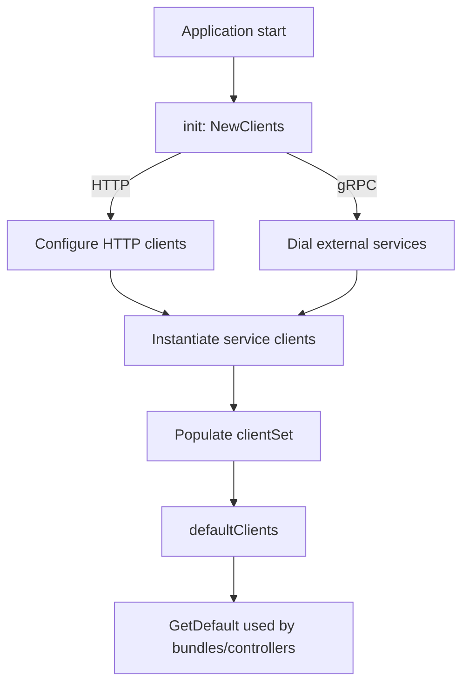

# 14. External Control-Plane Integrations (External-Services Domain + Clients Domain)

This section describes how Rudder wires and exposes external control-plane service clients. It covers the **clients** package in `external-services/clients`, detailing the central initialization logic, default instance, and mock overrides.

## 14.1 Central client wiring and defaults (clients package)

The **clients** package provides a single `Interface` that bundles all external HTTP and gRPC service clients. It handles:

- Uniform HTTP client configuration (timeouts, TLS settings)
- gRPC connections with insecure credentials
- Construction of service-specific client wrappers
- A global default instance for consumption by bundles and handlers
- A mechanism to override clients in tests via mocks

---

## 14.1.1 Interface and clientSet

Every external client is exposed through a method on the `Interface`. Internally, a `clientSet` struct holds concrete instances.

```go
//go:generate moq -skip-ensure -rm -out clients_mock.go . Interface
type Interface interface {
  NegotiatorClient() negotiator.NegotiatorClient
  ProjectManager() projectmanager.ProjectManager
  CICDClient() cicd_svc.CICDService
  MizzenClient() mizzen.Mizzen
  ApimClient() apim.ApiManager
  ApimDevPortalClient() apim_dev_portal.Client
  EndpointResolverClient() endpoint_resolver.EndpointResolver
  VaultSvcClient() vault_service.VaultService
  SubsSvcClient() subscriptionsvc.SubscriptionServiceClient
  ConfigMountSvcClient() app_service.ConfigurationMountServiceClient
  UserSvcClient() app_service.UserServiceClient
  AlertClient() alert_service.AlertService
  CloudManagerClient() cloud_manager.CloudManager
  ProxyDeployerClient() proxy_deployer.Interface
  RedisClient() redis_server.Interface
  AppGwRedisClient() redis_server.Interface
  ServiceRegistryClient() service_registry.ServiceRegistry
  ConfigurationMgtClient() configurationservice.ConfigurationService
  ConnectionServiceClient() connection_service.ConnectionService
  ConfigurationMappingClient() configurationmappingservice.Client
  SchemaServiceClient() configurationschemaservice.Client
  UrlManagementClient() url_manager.URLManager
  STSManagementClient() stsmgtservice.STSManager
  AuthzServiceClient() authz_service.ChoreoAuthorizationClient
}
```

Each method returns the corresponding client instance from the `clientSet` .

---

## 14.1.2 NewClients: constructing the clientSet

`NewClients` initializes all HTTP and gRPC clients using configuration values from `config.GetConfig()`. It returns a `*clientSet` or an error.

### HTTP Clients initialization 🔧

- **Base client**
- Timeout: 2 minutes
- Transport: custom `TLSClientConfig` with `ServerName="choreo-am-service"` and `InsecureSkipVerify=true`
- **Service-specific clients**
- `proxyDeployerClient`, `cloudManagerClient`, `cicdClient`, `urlManagerClient`, `secretManagerClient`, `endpointResolverClient`, `serviceRegistryConn`, `configMgtClient`, `dependencyConfigClient`, `configurationMappingHttpClient`, `stsManagerClient`
- All share a 2 minute timeout, default `Transport`

```go
client := &http.Client{
  Timeout: time.Minute * 2,
  Transport: &http.Transport{
    TLSClientConfig: &tls.Config{
      ServerName:         "choreo-am-service",
      InsecureSkipVerify: true,
    },
  },
}
proxyDeployerClient := &http.Client{ Timeout: time.Minute * 2 }
...
stsManagerClient := &http.Client{ Timeout: time.Minute * 2 }
```

### gRPC clients initialization ☁️

The subscription, app-service, and authorization services are accessed via gRPC. Each uses insecure transport credentials:

```go
subsSvcConn, err := grpc.Dial(
  config.GetConfig().SubscriptionSvcUrl,
  grpc.WithTransportCredentials(insecure.NewCredentials()),
)
if err != nil {
  return nil, fmt.Errorf("subscription service: %w", err)
}

appSvcConn, err := grpc.Dial(
  config.GetConfig().AppServiceURL,
  grpc.WithTransportCredentials(insecure.NewCredentials()),
)
// ...
authzConn, err := grpc.Dial(
  config.GetConfig().AuthzServiceURL,
  grpc.WithTransportCredentials(insecure.NewCredentials()),
)
// ...
```

If any dial fails, `NewClients` returns an error .

### clientSet construction

All HTTP and gRPC connections are wrapped into service clients:

```go
return &clientSet{
  projectManagerClient: projectmanager.NewProjectManagerClient(),
  cicdServiceClient:    cicd_svc.NewCICDService(cicdClient),
  mizzenClient:         mizzen.NewMizzenClient(config.GetConfig().MizzenUrl),
  apimClient:           apiManager,
  apimDevPortalClient:  apim_dev_portal.NewApiManagerDevPortalClient(client, apimTokenManager),
  endpointResolverClient: endpoint_resolver.NewEndpointResolver(endpointResolverClient, apimTokenManager),
  vaultSvc:               vault_service.NewVaultService(secretManagerClient),
  subsSvcClient:          subscriptionsvc.NewSubscriptionServiceClient(subsSvcConn),
  configMountSvcClient:   app_service.NewConfigurationMountServiceClient(appSvcConn),
  userSvcClient:          app_service.NewUserServiceClient(appSvcConn),
  alertClient:            alert_service.NewAlertService(client),
  cloudManagerClient:     cloud_manager.NewCloudManagerClient(cloudManagerClient),
  proxyDeployerClient:    proxy_deployer.NewClient(proxyDeployerClient, apimTokenManager),
  redisClient:            redis_server.NewRedisClient(redisClientManager, redisclientmanager.WebAppRedisIndex),
  appGwRedisClient:       redis_server.NewRedisClient(redisClientManager, redisclientmanager.AppGwRedisDbIndex),
  serviceRegistryClient:  service_registry.NewServiceRegistry(serviceRegistryConn),
  configurationMgtClient: configurationservice.NewConfigurationServiceClient(configMgtClient),
  connectionServiceClient: connection_service.NewConnectionService(dependencyConfigClient),
  configurationMappingClient: configurationmappingservice.NewClient(configurationMappingHttpClient),
  urlManagementServiceClient: url_manager.NewURLManagerClient(urlManagerClient),
  stsManagementServiceClient: stsmgtservice.NewSTSManagerClient(stsManagerClient, apiManager),
  schemaServiceClient:         configurationschemaservice.NewClient(secretManagerClient),
  authzService:                authz_service.NewChoreoAuthorizationClient(authzConn),
}, nil
```

The complete field list is defined on `clientSet` .

---

## 14.1.3 Default instance and mock injection

A package-level variable `defaultClients` holds the singleton `*clientSet`. On import, `init()` calls `NewClients()`; failures are fatal:

```go
var defaultClients *clientSet

func init() {
  var err error
  defaultClients, err = NewClients()
  if err != nil {
    logrus.Fatal(err)
  }
}

func GetDefault() interface {
  Interface
  SetMizzenNamespaceInitializer(initializer mizzen.NamespaceInitializer)
} {
  return defaultClients
}
```

To support unit tests, `SetDefaultClients` accepts an `InterfaceMock` (generated by `moq`) and overwrites only the clients for which mock functions are provided. It returns a reset function to restore the original `defaultClients`:

```go
func SetDefaultClients(mocks InterfaceMock) (reset func()) {
  prv := defaultClients
  if mocks.ApimClientFunc != nil {
    defaultClients.apimClient = mocks.ApimClientFunc()
  }
  // ... other clients ...
  return func() { defaultClients = prv }
}
```

This enables per-test injection of fake clients without affecting global state .

---

## Client wiring overview



This setup ensures all controllers and services across Rudder consume a consistent set of wired clients, with centralized configuration for timeouts, TLS, and endpoint URLs.