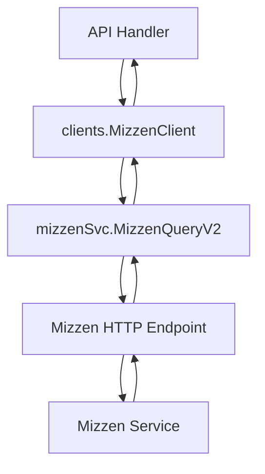

# 14.3 Mizzen Integration (Cluster Queries, Namespace Init) and Known Error Modes

This section describes how Rudder integrates with Mizzen for data-plane resource queries and deployments, covers namespace initialization on deployment failures, and catalogs known error responses. It also explains how API tests emulate Mizzen responses using JSON fixtures.

---

## ❓ Purpose

Rudder’s **Mizzen integration** enables:

- Retrieving resource and cluster status from Mizzen
- Deploying Kubernetes manifests (with optional namespace auto-creation)
- Handling control-plane errors gracefully

This integration sits in the **External-Services** domain and is wired into the **Clients** set via `clients.Interface.MizzenClient()`.

---

## 🔗 Key Interfaces & Types

### Mizzen Interface

Rudder defines a `Mizzen` interface that abstracts Mizzen HTTP calls :

```go
type Mizzen interface {
  MizzenQuery(ctx context.Context, clusterID string, q MizzenQueryParams) ([]byte, error)
  MizzenQueryV2(ctx context.Context, clusterID common.UniqueIdentifier, q MizzenQueryParams) ([]byte, error)
  GetDeploymentStatus(ctx context.Context, clusterID common.UniqueIdentifier, q DeploymentQueryParams) (*DeploymentStatusSummary, error)
  GetDataplaneInfo(ctx context.Context, clusterID common.UniqueIdentifier) (Dataplane, error)
  DeployManifest(ctx context.Context, clusterID common.UniqueIdentifier, manifest any, method string, force bool) error
  DeleteResource(ctx context.Context, req ResourceDeleteRequest) error
  ProxyPDPRedis(ctx context.Context, clusterID common.UniqueIdentifier, method string, db int, key, value string) (string, error)
  CheckEnvClusterHealth(ctx context.Context, clusterID common.UniqueIdentifier) error
  ProxyUserApp(ctx context.Context, req ProxyHttpRequest) (*ProxyHttpResponse, error)
}
```

### Core Types

- **MizzenQueryParams**, **DeploymentQueryParams**: carry API version, kind, namespace, name, selectors.
- **DeploymentStatusSummary**: mapped resource status fields.
- **Dataplane**: cluster metadata and capabilities.
- **ResourceDeleteRequest**: parameters for delete API.
- **NamespaceInitializer**: function signature for on-demand namespace creation.

---

## 🔍 Cluster Queries

### MizzenQuery & MizzenQueryV2

- **MizzenQuery** issues a generic GET to `/api/v1/Query/{clusterId}`.
- **MizzenQueryV2** targets `/api/v1/Query/{clusterId}/{apiVersion}/{kind}` and supports query parameters (`namespace`, `name`, selectors).

Both return raw JSON bytes or a `QueryError` on non-2xx status .

### GetDeploymentStatus & GetDataplaneInfo

- **GetDeploymentStatus** maps JSON into `DeploymentStatusSummary`.
- **GetDataplaneInfo** fetches cluster details into `Dataplane`.

These wrap `MizzenQueryV2` and `/cluster/{clusterId}` endpoints, respectively, unmarshalling JSON or returning errors .

```go
dataplane, err := client.GetDataplaneInfo(ctx, clusterID)
if err != nil { /* handle */ }
```

---



---

## 🛠 Namespace Initialization

When `DeployManifest` fails due to missing namespace, Rudder can auto-create it.

1. Wrap a `Mizzen` instance with `NewMizzenClientWithNamespaceInitializer` supplying a `NamespaceInitializer` function.
2. On **POST** failure, if `IsNamespaceNotFoundErr(err)` and config flag `DeployNsOnDeployErr` is true, invoke initializer and retry.

```go
func NewMizzenClientWithNamespaceInitializer(m Mizzen, initNamespace NamespaceInitializer) Mizzen
```

In `namespace_init.go` :

```go
if IsNamespaceNotFoundErr(err) && config.GetConfig().DeployNsOnDeployErr {
  initErr := m.initializeNamespace(ctx, clusterID, manifest)
  if initErr != nil { return fmt.Errorf("... %s", initErr) }
  return m.Mizzen.DeployManifest(ctx, clusterID, manifest, method, force)
}
```

---

## 🚨 Known Error Modes

Rudder documents common Mizzen error payloads in **mizzen_errors.md** and handles them via `QueryError` in **mizzen_errors.go**.

| HTTP Code | Scenario | JSON Snippet |
| --- | --- | --- |
| 408 | Timeout ⚠️ | `{ "error":"Timeout","statusCode":408,...}` |
| 400 | Bad Request | `{ "name":"BadRequestError","message":"Invalid Cluster ID" }` |
| 404 / 422 | Kubernetes API (NotFound) | Full Status object with `"reason":"NotFound"` |
| Bulk 2xx | Bulk delete per-item status | Array of command results |


```go
type QueryError struct {
  Body   string
  Query  any
  Status int
}
func (e QueryError) Error() string {
  if e.Status == http.StatusRequestTimeout { return "mizzen: cluster request timeout" }
  if e.Body == ""                     { return "mizzen: empty response" }
  return e.Body
}
func IsQueryError(err error, status int) bool { /* ... */ }
```

---

## 🧪 API Tests & Response Emulation

Rudder’s **API tests** spin up a mock Mizzen server using `requestutils.NewTestServerWithURL` and **go:embed** JSON fixtures under `api/tests/testdata`.

### CronJob Status Flow

- Embeds `mizzen_query_cronjob_by_name.json`.
- Handler verifies path `/api/v1/Query/{cluster}/{apiVersion}/{kind}` and query params.
- Returns fixture payload; API endpoint returns structured `ResourceStatus`.

```go
//go:embed testdata/mizzen_query_cronjob_by_name.json
var mizzenCronJobByNameResult string

srv, _ := requestutils.NewTestServerWithURL(mizzenUrl, http.HandlerFunc(func(w http.ResponseWriter, r *http.Request) {
  w.WriteHeader(http.StatusOK)
  w.Write([]byte(mizzenCronJobByNameResult))
}))
```

### Storage Class Query

- Embeds `storage_class_mizzen_response.json` and `storage_class_list.json`.
- Mock server responds to `/api/v1/Query/{cluster}/storage.k8s.io/v1/StorageClass`.
- Test compares API JSON output to expected list.

```go
//go:embed testdata/storage_class_mizzen_response.json
var storageClassResponse string

//go:embed testdata/storage_class_list.json
var storageClassList string
```

---

**Summary:** Rudder’s Mizzen client enables robust resource queries and deployments, auto-creates namespaces on demand, and gracefully handles known error modes. API tests emulate real cluster responses via JSON fixtures to validate end-to-end flows.