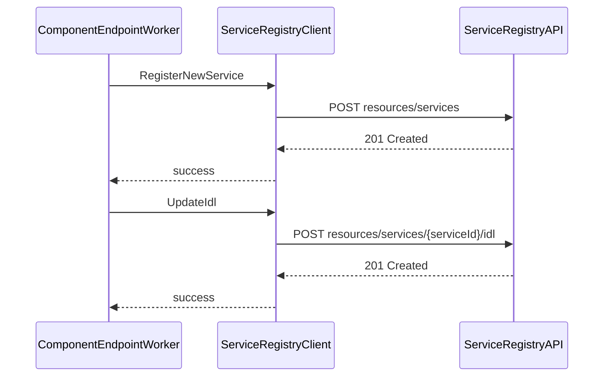

# 14. External Control-Plane Integrations (External-Services Domain + Clients Domain)

## 14.4 Service Registry integration (service/IDL registration lifecycle)

This section explains how the Rudder API service integrates with the external Service Registry control-plane. It covers service registration, IDL payload management, correlation-ID handling, retry/timeout patterns, and the mock implementation used in unit tests.

---

## ServiceRegistry Client Overview

The `service_registry` package provides an HTTP client to interact with the Service Registry API. It exposes methods to:

- Register and delete services
- Attach or update IDL definitions
- Query service versions and IDL environment IDs
- Detect schema or visibility changes

The client is instantiated via:

```go
func NewServiceRegistry(httpClient *http.Client) ServiceRegistry
```

and accessed in application code through the `clients` package:

```go
type Interface interface {
  // ...
  ServiceRegistryClient() service_registry.ServiceRegistry
  // ...
}
```

---

## Key Payload Generators 🔧

### getIdlType

Maps Rudder’s internal `common.EndpointType` to the Service Registry IDL type:

```go
func (svc *serviceRegistry) getIdlType(apiType common.EndpointType) string {
  switch apiType {
  case common.EndpointTypeREST:
    return "OpenAPI"
  case common.EndpointTypeGraphQL:
    return "GraphQL_SDL"
  case common.EndpointTypeGRPC:
    return "Proto3"
  case common.EndpointTypeTCP:
    return "TCP"
  case common.EndpointTypeUDP:
    return "UDP"
  case common.EndpointTypeWS:
    return "AsyncAPI"
  default:
    return "TCP"
  }
}
```

### getIdlPayload

Constructs the `IDL` struct with content, type, and environment:

```go
func (svc *serviceRegistry) getIdlPayload(
  ctx context.Context,
  environmentId string,
  apiDefinition string,
  apiType string,
) (IDL, error) {
  idl := IDL{}
  idlType := svc.getIdlType(common.EndpointType(apiType))
  if idlType == "" {
    return idl, fmt.Errorf("invalid API type: %v", apiType)
  }
  idl.IdlType = idlType
  idl.EnvironmentId = environmentId
  idl.Content = apiDefinition
  return idl, nil
}
```

---

## Registering a New Service 📑

The `RegisterNewService` method builds a full `ServiceRequest` and sends it to the registry:

```go
func (svc *serviceRegistry) RegisterNewService(
  ctx context.Context,
  componentName string,
  orgId string,
  apiType string,
  apiVersion string,
  visibilities []common.EndpointVisibility,
  projectId string,
  componentId string,
  environmentId string,
  description string,
  summary string,
  categories []string,
  tags []string,
  apidefinition string,
  endpointId string,
  endpointName string,
  apimApiId string,
  securitySchemes []string,
) error { ... }
```

Steps performed:

1. **Build payload**

Uses `getChoreoServicePayload` to assemble `ServiceRequest`.

1. **HTTP POST**

Endpoint:

```plaintext
   POST {ServiceRegistryURL}/resource-registry/resources/services?orgId={orgId}
```

1. **Headers & Body**
2. Header `Correlation-Id` set via `common.GetRequestIdFromContext(ctx)`
3. JSON body: `ServiceRequest`
4. **Resilience**
5. Retries on HTTP 500
6. Timeout: 10 seconds
7. **Logging**

Logs success and failure with component and version details.

---

## Updating an IDL Definition 🔄

To attach or replace a service’s API definition, `UpdateIdl` posts a new IDL payload:

```go
func (svc *serviceRegistry) UpdateIdl(
  ctx context.Context,
  orgId string,
  serviceId string,
  environmentId string,
  apiDefinition string,
  apiType string,
) error { ... }
```

Key behavior:

- **Payload**: Obtained via `getIdlPayload`
- **Endpoint**:

```plaintext
  POST {ServiceRegistryURL}/resource-registry/resources/services/{serviceId}/idl
```

| Key | Value |
| --- | --- |
| orgId | Organization identifier |
| idlType | Type from `getIdlType` |
| environmentId | IDL environment identifier |


- **Query Params**:
- **Body**: Raw API definition text
- **Resilience**:
- Retries on HTTP 500
- Timeout: 10 seconds
- **Error Logging**: Captures failures in payload creation and HTTP errors

---

## Correlation ID & Resilience Patterns

All Service Registry calls employ a consistent error-handling pattern:

- **Correlation ID**

Each request sets header `Correlation-Id` from `ctx`.

- **Retries**

Uses `request.RetryOnStatus(http.StatusInternalServerError)`

- **Timeout**

Applies `request.Timeout(10*time.Second)`

- **Logging**

Errors surface via `logctx.GetLogger(ctx).Errorf(...)`

---

## Mock Implementation for Unit Tests 🧪

The `service_registry_mock.go` file provides a thread-safe mock of `ServiceRegistry`. It records each call’s arguments for assertions.

| Mock Field | Description |
| --- | --- |
| `UpdateIdl []struct` | Tracks calls to `UpdateIdl` |
| `RegisterNewService` | Tracks calls to `RegisterNewService` |
| `lockUpdateIdl` | Protects `UpdateIdl` slice |
| `lockRegisterNewService` | Protects `RegisterNewService` slice |


Usage in tests:

```go
mock := &ServiceRegistryMock{
  UpdateIdlFunc: func(...) error { return nil },
}
// After invocation:
calls := mock.UpdateIdlCalls()
```

---

## Service-IDL Lifecycle Sequence



This diagram shows how the application worker registers a new service and updates its IDL through the `service_registry` client.