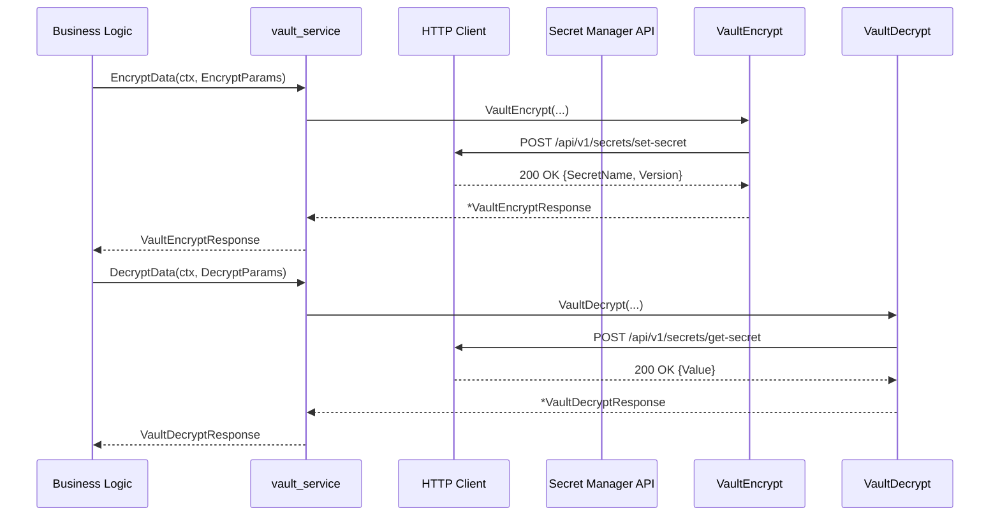

# 14.5 Vault Service Integration (Secret Read/Write) and Request Types 🔒

This section describes how Rudder integrates with the external Vault (secret-manager) service for **encrypting**, **decrypting**, and **managing** secrets. It covers the core client interface, HTTP request flows, payload/response types, and configuration boundaries.

---

## Overview

The **Vault service** module encapsulates all interactions with the Choreo secret-manager API. It provides:

- A **`VaultService`** interface for high-level secret operations.
- Low-level HTTP calls in **`vault_requests.go`**.
- Typed request/response structures in **`types.go`**.
- Built-in retry, timeout, and error handling.

This integration enables Rudder to securely persist and retrieve secrets (config maps, environment variables, etc.) via the secret-manager.

---

## Client Interface and Implementation

- **`VaultService`** defines operations for encrypting, decrypting, listing, and deleting secrets .

```go
type VaultService interface {
  EncryptData(ctx context.Context, params EncryptParams) (VaultEncryptResponse, error)
  DecryptData(ctx context.Context, params DecryptParams) (VaultDecryptResponse, error)
  GetSecrets(ctx context.Context, req MultiSecretRequest) (MultiSecretResponse, error)
  DeleteSecrets(ctx context.Context, req MultiSecretRequest) (MultiSecretResponse, error)
  DeleteSecret(ctx context.Context, req DeleteSecretRequest) (SecretResponse, error)
}
```

- **Default Implementation**
- `DefaultVaultService` is initialized in `init()`.
- Use `NewVaultService(httpClient *http.Client)` to inject a custom HTTP client .

---

## High-Level Methods

| Method | Description |
| --- | --- |
| EncryptData | Wraps `VaultEncrypt`; aborts if `params.Skip==true`. |
| DecryptData | Wraps `VaultDecrypt`; aborts if `params.Skip==true`. |
| GetSecrets | Batch-reads secrets (`/api/v1/secrets/get`). |
| DeleteSecrets | Batch-deletes secrets (`/api/v1/secrets/delete`). |
| DeleteSecret | Deletes a single secret (`/api/v1/secrets`). |


Each method applies default cluster-ID logic (uses `DefaultUserAppKvDataPlaneId` unless `UseClusterKv`), and enforces `ClusterId` presence for non-system secrets .

---

## HTTP Request Flows



- **Timeouts**
- `gorequest.New().Timeout(5s)` for encrypt/decrypt .
- `request.New(...).Timeout(30s).RetryOnStatus(500).MaxRetries(3)` for multi-secret and delete flows .

- **Error Handling**
- Non-200/300+ statuses return Go `error`.
- Retries adhere to `requestutils.DefaultRetryParams()`.

---

## Request Payload Types

| Type | Fields |
| --- | --- |
| **VaultEncryptRequest** | `SecretName`<br>`Value`<br>`SystemSecret`<br>`ClusterId` (omitted if `SystemSecret==true`) |
| **VaultDecryptRequest** | `SecretName`<br>`Version`<br>`SystemSecret`<br>`ClusterId` (omitted if `SystemSecret==true`) |
| **MultiSecretRequest** | `ClusterId`<br>`SystemSecret`<br>`Secrets` (`[]Secret`) |
| **DeleteSecretRequest** | `ClusterId`<br>`SystemSecret`<br>`SecretName` |


```go
type MultiSecretRequest struct {
  ClusterId    string   `json:"ClusterId"`
  SystemSecret bool     `json:"SystemSecret"`
  Secrets      []Secret `json:"Secrets"`
}
```

---

## Response Types

| Type | Description |
| --- | --- |
| **VaultEncryptResponse** | `{ "SecretName": VaultID, "Version": VaultVersion }` |
| **VaultDecryptResponse** | `{ "Value": Data }` |
| **MultiSecretResponse** | `{ Data []*Secret; Error []*SecretError; SecretStoreProvider; SecretStoreName }` |
| **SecretResponse** | `{ SecretName; Version; Value; Id; SecretStoreProvider; SecretStoreName }` |


---

## Configuration & Encryption Boundaries

- **`SystemSecret`**
- When `true`, secrets use global vault (cluster-agnostic).
- Omits `ClusterId` from payload.

- **`UseClusterKv`**** vs. Default**
- By default, uses `config.DefaultUserAppKvDataPlaneId`.
- If `UseClusterKv==true`, uses `params.ClusterId` from caller context .

---

## Integration in Clients Domain

- **ClientSet Wiring**

In `external-services/clients/clients.go`, VaultService is injected:

```go
  secretManagerClient := &http.Client{ Timeout: 2 * time.Minute }
  vaultSvc := vault_service.NewVaultService(secretManagerClient)
  clientSet := &clientSet{ vaultSvc: vaultSvc, /* ... */ }
```

- **Mocking Support**

`vault_service_mock.go` is generated via `moq` to stub out all `VaultService` methods for tests .

---

## Usage in Configuration/Secret Flows

1. **Controller Layer**

`NewSecretController(..., vaultSvc)` injects `VaultService` into the configmap bundle  .

1. **Encryptor**

The `encryptor.Encryptor` uses `vaultSvc.EncryptData` to seal secret data before `Save(ctx)` and Kubernetes deployment.

1. **Decryption**

On reads or during promotion, `vaultSvc.DecryptData` or `GetSecrets` resolves stored secrets for application use.

```go
res, err := DefaultVaultService.EncryptData(ctx, EncryptParams{
  VaultId: "existing-id", Data: jsonData, UseClusterKv: true,
})
```

---

> **card** { "title": "Key Integration Point", "content": "All secret operations route through `VaultService`, centralizing retries, error handling, and cluster-ID management." }