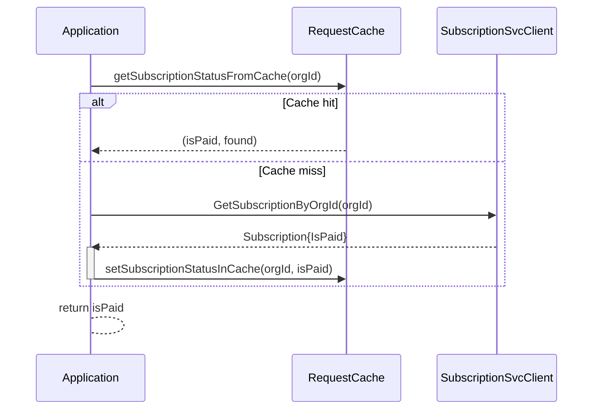

# 14.6 Subscription Service Integration and Paid-Org Checks

This section describes how Rudder integrates with the external Subscription Service to enforce feature gating based on an organization’s paid status. It covers:

- gRPC stubs under `external-services/subscriptionsvc/`
- Helper routines and caching in `internal/services/subscriptionsvcutils/`
- Enforcement points in application code (e.g., private data-plane actions)

---

## External gRPC Client Stubs

Rudder depends on generated Go clients for the Subscription Service. These live under `external-services/subscriptionsvc/`.

**Key artifacts**

- `subscriptions.pb.go` and `subscriptions_grpc.pb.go`: contain message types and server/client method handlers.
- `types.proto`: defines core messages such as `Subscription`, `OrgIdSubItemIdMappingV2`, and pagination requests  .

**Common RPCs used**

| RPC Method | Purpose |
| --- | --- |
| GetFilteredOrgIdList /…V2 | List org IDs filtered by paid/free flag, paginated |
| GetSubscriptionByOrgId /…V2 | Fetch subscription record for a single org |
| GetSubscriptionByOrgHandle /…V2 | Alternate lookup by org handle |


---

## Client Mocks

To facilitate testing, Rudder provides a mock client in `internal/services/subscriptionsvcutils/subscription_status_mock.go`.

It implements `SubscriptionServiceClientMock`, with overridable functions such as `GetSubscriptionByOrgIdFunc` and `GetSubscriptionByOrgIdV2Func`.

```go
func SubscriptionSvcClientMock(isPaid *bool) *subscriptionsvc.SubscriptionServiceClientMock {
  return &subscriptionsvc.SubscriptionServiceClientMock{
    GetSubscriptionByOrgIdFunc: func(...){
      return &subscriptionsvc.GetSubscriptionResponse{
        Subscription: &subscriptionsvc.Subscription{IsPaid: common.BoolPointerAsBool(isPaid, false)},
      }, nil
    },
    GetSubscriptionByOrgIdV2Func: func(...){
      return &subscriptionsvc.GetSubscriptionResponseV2{
        Subscription: &subscriptionsvc.SubscriptionV2{IsPaid: common.BoolPointerAsBool(isPaid, false)},
      }, nil
    },
  }
}
```

---

## Helper Utilities (`subscriptionsvcutils`)

### GetPaidOrganizationsMap 🔍

Aggregates paid organization IDs across v1 and v2 APIs using pagination helpers.

- **Signature**

```go
  func GetPaidOrganizationsMap(
    ctx context.Context,
    client subscriptionsvc.SubscriptionServiceClient,
    pageSize int32,
  ) (map[common.ChoreoOrgID]bool, error)
```

- **Flow**
- Invoke `getPaidOrganizationsV1` (calls `GetFilteredOrgIdList`)
- Invoke `getPaidOrganizationsV2` (calls `GetFilteredOrgIdListV2`)
- Merge both result maps

```go
list, err := getPaidOrganizationsV1(ctx, client, pageSize)
...
v2List, err := getPaidOrganizationsV2(ctx, client, pageSize)
for k, v := range v2List { list[k] = v }
return list, nil
```

---

### GetSubscriptionStatus with Caching 🗄️

Determines if a given org is paid by checking cache, then v1/v2 calls.

1. **Cache lookup** via `getSubscriptionStatusFromCache`
2. **Header injection** (`user-idp-id: choreo:system`)
3. **v1 check**: `GetSubscriptionByOrgId`
4. **v2 checks**: iterate over subscription types
5. **Cache set** on first hit via `setSubscriptionStatusInCache`

```go
func GetSubscriptionStatus(
  ctx context.Context,
  client subscriptionsvc.SubscriptionServiceClient,
  orgId common.ChoreoOrgID,
) (bool, error) {
  if isPaid, found := getSubscriptionStatusFromCache(ctx, orgId); found {
    return isPaid, nil
  }
  ctx = metadata.AppendToOutgoingContext(ctx, "user-idp-id", "choreo:system")
  // v1
  res, err := client.GetSubscriptionByOrgId(ctx, &subscriptionsvc.GetSubscriptionRequest{Identifier: orgId.String()})
  ...
  // v2
  res2, err := client.GetSubscriptionByOrgIdV2(ctx, &subscriptionsvc.GetSubscriptionRequestV2{
    Identifier:       orgId.String(),
    SubscriptionType: "choreo-subscription",
  })
  ...
  setSubscriptionStatusInCache(ctx, orgId, isPaid)
  return isPaid, nil
}
```

**Caching helpers**

```go
func getSubscriptionStatusFromCache(...) (bool, bool) { ... }
func setSubscriptionStatusInCache(...)            { ... }
```

---

## Tests

- **get_paid_orgs_map_test.go** covers pagination edge cases and merges across v1/v2 .
- **get_sub_by_org_id_test.go** validates caching behavior and error paths for `GetSubscriptionStatus` .

---

## Enforcement in Application Code

Premium-only actions are gated by subscription status. In `internal/bundles/app/pvt_dp_paid_actions.go`:

```go
func validatePvtDpOrWithSubActions(ctx context.Context, env *environment.Environment, action string) error {
  // Private DP always allowed
  if err := environment.ValidatePrivateDataPlaneFeature(*env, action); err == nil {
    return nil
  }
  // Shared DP: require paid org
  isPaid, err := subscriptionsvcutils.GetSubscriptionStatus(
    ctx,
    clients.GetDefault().SubsSvcClient(),
    env.OrganizationID,
  )
  if err != nil {
    return fmt.Errorf("error fetching subscription: %v", err)
  }
  if !isPaid {
    return common.BadRequestError(
      fmt.Errorf("%s in shared dataplane is only allowed for paid users", action),
    ).WithCode("NOT_ALLOWED_IN_SHARED_DP_WITHOUT_SUB")
  }
  return nil
}
```

This logic is invoked across private-data-plane operations (e.g., container updates, HPA creation) to block free-tier usage on shared environments.

---

## Sequence Diagram: Subscription Check Flow



This diagram illustrates how Rudder minimizes RPC calls by caching subscription status and falls back to gRPC calls only on cache misses.

---

By centralizing subscription logic in **`subscriptionsvcutils`**, Rudder ensures consistent gating across features and simplifies testing with dedicated mocks and helpers.