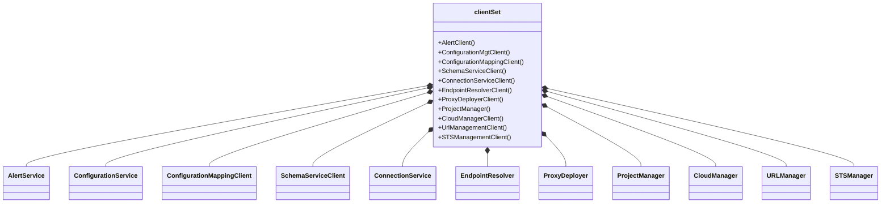

# 14.7 Additional External Control-Plane Integrations

This section covers the **secondary external service clients** in `external-services/*`. These clients are wired into the application via `external-services/clients/clients.go` and are consumed by various bundles and handlers across the codebase.



The following table maps each integration to its **package path**, **purpose**, and **dependent bundles/handlers**.

| Emoji | Service | Package Path | Purpose | Dependencies |
| --- | --- | --- | --- | --- |
| 🔔 | Alert Service | `external-services/alert-service` | Acquire tokens and publish alerts via Choreo’s notification API | `choreo/bundles/app` controllers, admin routines |
| ⚙️ | Configuration Service | `external-services/configuration-service` | CRUD on configuration groups | Bundles: `configuration`, `configmap`, `configurationsvc` |
| 🗺️ | Configuration-Mapping Service | `external-services/configuration-mapping-service` | Manage key-value mappings for components | `ComponentConfigController`, migration scripts |
| 📋 | Configuration-Schema Service | `external-services/configuration-schema-service` | Retrieve schema-based mounts for releases | `ConfigurationDescriptor`, `ComponentConfigController` |
| 🔗 | Connection Service | `external-services/connection-service` | Resolve and delete component connections | `ComponentDependencyController`, config loaders |
| 🕵️ | Endpoint Resolver | `external-services/endpoint-resolver` | Discover component endpoints from API Manager | `ComponentEndpointController` |
| ⚓️ | Proxy Deployer | `external-services/proxy-deployer` | Manage API proxy revisions and deployments | API-gateway bundles |
| 👷 | Project Manager | `external-services/project-manager` | Notify project events (builds, updates, undeploys) | CI/CD and release bundles |
| ☁️ | Cloud Manager | `external-services/cloud-manager` | Fetch deployment pipelines and promotion trees | `continuous-delivery`, environment bundles |
| 🌐 | URL Manager | `external-services/url-manager` | Manage custom domains and URL mappings | WebAppService, ComponentEndpointController |
| 🔒 | STS Management Service | `external-services/sts-mgt-service` | Create and update OAuth clients on Data-Plane STS | AuthKey and AppGateway bundles |


## Client Wiring Anchor

All clients are instantiated in `external-services/clients/clients.go`. For example:

```go
...
alertClient:                alert_service.NewAlertService(client),
cloudManagerClient:         cloud_manager.NewCloudManagerClient(cloudManagerClient),
proxyDeployerClient:        proxy_deployer.NewClient(proxyDeployerClient, apimTokenManager),
configurationMgtClient:     configurationservice.NewConfigurationServiceClient(configMgtClient),
...
urlManagementServiceClient: url_manager.NewURLManagerClient(urlManagerClient),
stsManagementServiceClient: stsmgtservice.NewSTSManagerClient(stsManagerClient, apiManager),
schemaServiceClient:        configurationschemaservice.NewClient(secretManagerClient),
...
```

---

## 🔔 Alert Service

The **Alert Service** client handles authentication and publishes alerts to Choreo’s notification endpoint.

- **Key Interface & Constructor**

```go
  type AlertService interface {
    GetAlertAccessToken(ctx context.Context) (string, error)
    SendAlertMessage(ctx context.Context, alertPublish AlertPublishRequest) (*AlertPublishStatusResponse, error)
  }

  func NewAlertService(httpClient *http.Client) AlertService
```

- **Usage**
- Injected into `ChoreoAppController` for operational alerts
- Admin migration handlers for error and status notifications

---

## ⚙️ Configuration Service

The **Configuration Service** client exposes CRUD operations on configuration groups.

- **Key Interface & Constructor**

```go
  type ConfigurationService interface {
    AddConfiguration(ctx context.Context, orgId string, group ConfigurationGroup) (*ConfigurationGroup, error)
    GetConfiguration(ctx context.Context, orgId, groupUuid string) (ConfigurationGroup, error)
    UpdateConfiguration(ctx context.Context, orgId string, group ConfigurationGroup) error
    DeleteConfiguration(ctx context.Context, orgId string, groupUuid string) error
  }

  func NewConfigurationServiceClient(httpClient *http.Client) ConfigurationService
```

- **Usage**
- Bundles `configuration` and `configmap` for mounting and syncing configs
- `ConfigurableController` for user-driven config updates

---

## 🗺️ Configuration-Mapping Service

This client retrieves and updates component configuration mappings by revision.

- **Key Interface & Constructor**

```go
  type Client interface {
    GetDeployConfigurationMappings(ctx context.Context, ..., revision *int) (*DeployConfigurationMappingResponse, error)
    CreateConfigMap(ctx context.Context, orgId string, params CreateConfigMapRequest) (*ConfigurationMapping, error)
    GetConfigMapping(ctx context.Context, req GetConfigMappingRequest, revision *int) (*ConfigurationMapping, error)
  }

  func NewClient(httpClient *http.Client) Client
```

- **Usage**
- `ComponentConfigController` for upserting env variables and files
- Migration scripts adjusting mapping revisions

---

## 📋 Configuration-Schema Service

Fetches schema-based mounts (env vars, files) for components.

- **Key Interface & Constructor**

```go
  type Client interface {
    GetDeployConfigurationMounts(ctx context.Context, orgId, projectId, componentId, deploymentTrackId, envTemplateId, commitHash, componentType string) (*GetConfigMountResponse, error)
  }

  func NewClient(httpClient *http.Client) Client
```

- **Usage**
- `ConfigurationDescriptor` in `bundles/app` to generate K8s secrets and volumes
- Schema-based configurators in release pipelines

---

## 🔗 Connection Service

Resolves runtime connection details and cleans them up.

- **Key Interface & Constructor**

```go
  type ConnectionService interface {
    GetEnvironmentConnection(ctx context.Context, orgId, connectionId, envTemplateId string) (*EnvConnection, error)
    DeleteConnections(ctx context.Context, req DeleteConnectionsRequest) error
    PostResolveConnection(ctx context.Context, params ResolveConnectionRequest) (*[]ResolvedConnection, error)
  }

  func NewConnectionService(httpClient *http.Client) ConnectionService
```

- **Usage**
- `ComponentDependencyController` to rename and promote connection-based env vars
- Cleanup of connection resources on undeploy

---

## 🕵️ Endpoint Resolver

Discovers and validates endpoints defined in a component.

- **Key Interface**

```go
  type EndpointResolver interface { /* methods to list, get, create endpoints */ }
```

- **Usage**
- `ComponentEndpointController` orchestrates endpoint creation in APIM
- Endpoint generation tests reference this client

---

## ⚓️ Proxy Deployer

Handles merging and deploying API proxy revisions.

- **Key Interface & Constructor**

```go
  type Interface interface {
    CreateRevision(ctx context.Context, req RevisionCreateRequest) (*RevisionCreateResponse, error)
    DeployRevision(ctx context.Context, req RevisionDeployRequest) (*RevisionDeployUndeployResponse, error)
  }

  func NewClient(httpClient *http.Client, tokenManager apim_auth.TokenManager) Interface
```

- **Usage**
- API Gateway services (`appgwsvc`, `gateway`)
- Release pipelines for REST/GraphQL endpoints

---

## 👷 Project Manager

Sends build, update, and undeploy notifications to the control plane.

- **Key Interface & Constructor**

```go
  type ProjectManager interface {
    NotifyBuild(ctx context.Context, params BuildNotification) error
    NotifyComponentUpdate(ctx context.Context, componentId common.UniqueIdentifier) error
    NotifyUndeploy(ctx context.Context, params RevisionUndeployNotification) error
    // ...
  }

  func NewProjectManagerClient() ProjectManager
```

- **Usage**
- `ReleaseService` to alert control plane on CI/CD events
- Dependency controllers to fetch project metadata

---

## ☁️ Cloud Manager

Retrieves deployment pipelines and promotion trees for environments.

- **Key Interface & Constructor**

```go
  type CloudManager interface {
    GetDeploymentPipeline(ctx context.Context, id common.UniqueIdentifier) (*DeploymentPipeline, error)
    ValidateComponentToken(ctx context.Context, token string) (TokenValidateResponse, error)
    UpdateClusterIdByOrgId(ctx context.Context, orgId, clusterId, newClusterID common.UniqueIdentifier) ([]…)
    // ...
  }

  func NewCloudManagerClient(httpClient *http.Client) CloudManager
```

- **Usage**
- `continuous-delivery` bundle for promoting releases
- Environment bundles to traverse pipelines

---

## 🌐 URL Manager

Manages custom domains and component URL mappings.

- **Key Interface & Constructor**

```go
  type URLManager interface {
    GetCustomDomains(ctx context.Context, orgUuid string) ([]CustomDomain, error)
    GetCustomURLMappings(ctx context.Context, orgUuid, componentId string) ([]CustomURLMapping, error)
  }

  func NewURLManagerClient(httpClient *http.Client) URLManager
```

- **Usage**
- `WebAppService` and `ComponentEndpointController` to apply custom URLs
- Short-URL toggle admin endpoints

---

## 🔒 STS Management Service

Creates and updates OAuth clients on the Data-Plane STS.

- **Key Interface & Constructor**

```go
  type STSManager interface {
    CreateOAuthApp(ctx context.Context, req apim.OAuthAppCreateRequest, orgId, envId string) (*apim.OAuthApp, string, error)
    UpdateCallbackURLs(ctx context.Context, clientId string, req apim.UpdateOAuthAppCallbackRequest, orgId, envId string) error
    // ...
  }

  func NewSTSManagerClient(httpClient *http.Client, apimTokenManager apim_auth.TokenManager) STSManager
```

- **Usage**
- `AuthKeysService` and `AppGateway` bundles for OAuth setup
- Default in `ChoreoAppController` for public endpoints

---

Each of these clients fulfils a specific role in integrating Rudder with Choreo’s control-plane services. They are all wired through `clients.NewClients()` into a single `clientSet`, promoting consistency and ease of testing via generated mocks.