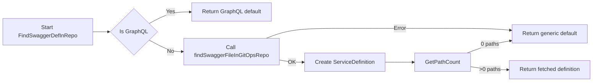

# 15. GitOps and API Definition Processing

This section describes how Rudder’s GitOps domain ingests, validates, and normalizes API definitions. It covers the GitOps service implementation and the API_DEF_TEST_DATA fixtures that exercise edge cases in OpenAPI/Swagger processing.

## 15.1 GitOps service: service definition parsing, defaults, and validation rules

The GitOps service (`internal/services/gitops`) retrieves OpenAPI/Swagger definitions from a GitOps repository, applies defaults for missing or invalid definitions, and exposes parsing utilities. Its core responsibilities are:

- **Fetching** definitions via a CICD client
- **Decoding** folder and file content responses
- **Counting** and **validating** paths
- **Extracting** base paths from servers
- **Converting** YAML definitions to JSON
- **Falling back** to sensible defaults on errors

---

## Service Interface and Entry Points

The `GitOpsRepo` interface defines three methods.

New service instances are created via `NewGitOpsService`.

```go
type GitOpsRepo interface {
  FindSwaggerDefInRepo(ctx, appId, gitHash, componentType) (*ServiceDefinition, error)
  GetSwaggerDefByPath(ctx, appId, gitHash, componentType, path) (*ServiceDefinition, error)
  GetInitialSwaggerDef(ctx, componentType) ServiceDefinition
}

func NewGitOpsService(cicdClient cicd_svc.CICDService) GitOpsRepo
```

- **FindSwaggerDefInRepo** locates a Swagger file under `swagger/`, validates it, and falls back on defaults if missing or invalid.
- **GetSwaggerDefByPath** retrieves a specific file or returns a default when the path is empty.
- **GetInitialSwaggerDef** provides a default OpenAPI definition before deployment.

---

## Default Definitions

When no valid definition exists, the service generates generic OpenAPI specs:

| Component Type | Default Function | Description |
| --- | --- | --- |
| BYOC REST API | `createDefaultSwaggerDef` | All methods (`get`, `put`, `post`, `delete`, `patch`) 📄 |
| GraphQL | `createGraphQLSwaggerDef` | Single `post` endpoint |
| Other (proxy cases) | Embedded `DefHelloApi` | Greetings API example |


```go
func createDefaultSwaggerDef(reason string) string { … }      // 
func createGraphQLSwaggerDef(reason string) string { … }     // 
//go:embed greetings_api.yaml
var DefHelloApi string                                    // 
```

---

## Definition Ingestion Flow



This flow ensures that invalid, empty, or missing OpenAPI files result in a fallback definition.

---

## Folder and File Decoding

- **decodeFolderContent**
- Unmarshals JSON into `cicd_svc.FileListResponse`
- Errors or empty data trigger a logged error

- **decodeFileContent**
- Unmarshals JSON into `cicd_svc.FileContentResponse`
- Base64-decodes `Data.Content` to a string

```go
func (svc *gitOpsService) decodeFolderContent(...) (FileListResponse, error) { … }  // 
func (svc *gitOpsService) decodeFileContent(...) (*string, error) { … }            // 
```

---

## ServiceDefinition Parsing & Utilities

The `ServiceDefinition` struct wraps a raw definition and tracks whether it’s a default.

```go
type ServiceDefinition struct {
  Definition string
  isDefault  bool
}
```

Key methods include:

- **IsDefault() bool**
- **GetJSON() (string, error)**
- Returns JSON directly if already JSON
- Converts YAML to JSON otherwise
- **GetBasePath() (string, error)**
- Parses the first `servers[0].url` and extracts the base path
- **GetBasePathForMi() (string, error)**
- Strips protocol before extracting path segments
- **GetPathCount() (int, error)**
- Counts keys under `paths` in the spec
- **isJSON() bool**
- Simple JSON unmarshal check

---

## Validation Rules & Edge Cases

The test fixtures under `internal/services/gitops/api_def_test_data/` illustrate special scenarios:

| Fixture | Description |
| --- | --- |
| swagger2.json | Swagger 2.0 with empty `paths` |
| empty_paths.yaml | OpenAPI 3 with empty `paths` |
| definition_with_two_paths.yaml | Two distinct paths and a custom server URL |
| multiple_url_segments.yaml | Multi-segment server path (`.well-known/...`) |


ServiceDefinition behavior under tests:

- **GetBasePath**
- Returns `/`, `/helloWorld`, or `/.well-known/smart-configuration`
- **GetPathCount**
- Yields counts of 0, 1, 2 or errors on invalid input
- **isJSON**
- Recognizes JSON vs. YAML definitions

---

```card
{
    "title": "Fallback Behavior",
    "content": "Definitions with no paths or retrieval errors default to generic OpenAPI specs."
}
```