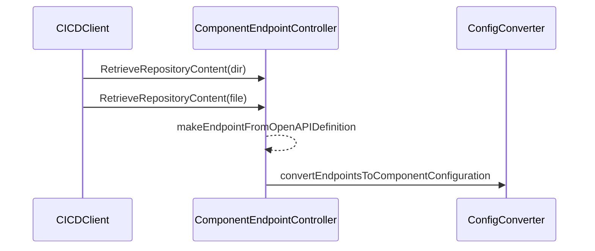
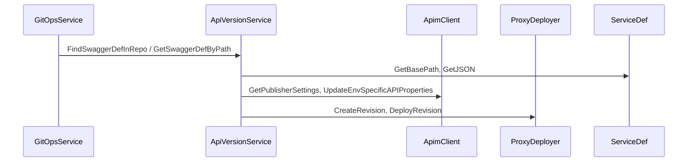

# 15.2 Integration points: where GitOps output feeds deployments/endpoints

This section traces how GitOps-derived API definitions flow through the system to drive component endpoint generation and API deployment. We cover:

- 📄 **API_DEF_TEST_DATA** files
- 🔄 **Component endpoint generation**
- 🚀 **API definition deployment**

---

## 📄 API_DEF_TEST_DATA

The directory `internal/services/gitops/api_def_test_data` contains OpenAPI/Swagger samples used by the GitOps domain to validate parsing and base-path extraction logic.

| File | Purpose |
| --- | --- |
| definition_with_two_paths.yaml | OpenAPI 3 with two distinct paths to verify `GetPathCount` and base-path extraction |
| empty_paths.yaml | OpenAPI 3 with no paths to test fallback to default definition |
| multiple_url_segments.yaml | OpenAPI 3 whose server URL has multiple segments (e.g., `/.well-known/...`) for base-path logic |
| swagger2.json | Swagger 2.0 sample to test JSON detection and conversion |


These fixtures drive unit tests in `service_definition_test.go`, ensuring `ServiceDefinition.GetBasePath` and `GetPathCount` produce correct values  .

---

## 🔄 Component endpoint generation (REST)

When a Ballerina component is deployed, auto-generated OpenAPI YAML lives in its GitOps repo under `swagger/`. The controller extracts endpoints as follows:

1. **List and fetch files**

The CICD client lists directory contents and retrieves each OpenAPI file:

```go
   fileListContents, err := c.cicdClient.RetrieveRepositoryContent(
     ctx, RepositoryTypeGitOps, ContentModeDirectory,
     componentId, commitHash, "swagger", true,
   )
   // ...
   fileContent, _, err := c.cicdClient.RetrieveRepositoryContent(
     ctx, RepositoryTypeGitOps, ContentModeFile,
     componentId, commitHash, fileListContent.Path, true,
   )
```

1. **Decode and unmarshal**

Base64-decoded YAML is parsed into `OpenAPIDefinition` structs.

1. **Build **`**ComponentEndpoint**`** objects**

For each server and path, `makeEndpointFromOpenAPIDefinition` computes:

- **DisplayName** from `info.title`
- **Port** and **ApiContext** from server URL
- **ApiDefinitionPath** (filename)
- Flags like `IsAutoGenerated` and `GenerationSource`

1. **Convert to component configuration**

The raw endpoints feed into config mapping:

```go
   generatedEps, _ := c.componentEndpointController.ExtractGitopsRESTEndpoints(
     ctx, component.ID, commitHash, component.ComponentType,
   )  // 

   componentConfig, _ := convertEndpointsToComponentConfiguration(generatedEps)
```

This yields a `cfg_descriptor.ComponentConfiguration` consumed by the release pipeline .



---

## 🚀 API definition deployment

During a REST API release, the **API Version Service** fetches the OpenAPI definition via the GitOps service and publishes it to both the API manager (APIM) and the proxy deployer:

1. **Fetch definition**

```go
   def, err := svc.gitOpsSvc.FindSwaggerDefInRepo(
     ctx, component.ID, image.GitOpsHash, component.ComponentType,
   )  // for legacy REST APIs 
```

1. **Compute upstream URL**

`def.GetBasePath()` extracts the base-path from the definition:

```go
   apiBasePath, _ := def.GetBasePath()
   upstreamUrl := fmt.Sprintf("%s%s", serviceURL, apiBasePath)  // 
```

1. **Publish to APIM**
2. Retrieve publisher settings
3. Invoke `UpdateEnvSpecificAPIProperties` to set environment-specific URLs
4. **Deploy proxy revision**

Serialize definition to JSON (`def.GetJSON()`), then:

```go
   revisionInfo, _ := svc.ProxyDeployerClient().CreateRevision(ctx, proxy_deployer.RevisionCreateRequest{...})
   svc.ProxyDeployerClient().DeployRevision(ctx, proxy_deployer.RevisionDeployRequest{...})
```



---

**Key takeaways**

- **Test data** in `api_def_test_data` cover real-world OpenAPI variants.
- **ComponentEndpointController** bridges GitOps definitions to component config .
- **ApiVersionService** uses `ServiceDefinition` to drive API publishing and proxy routing .