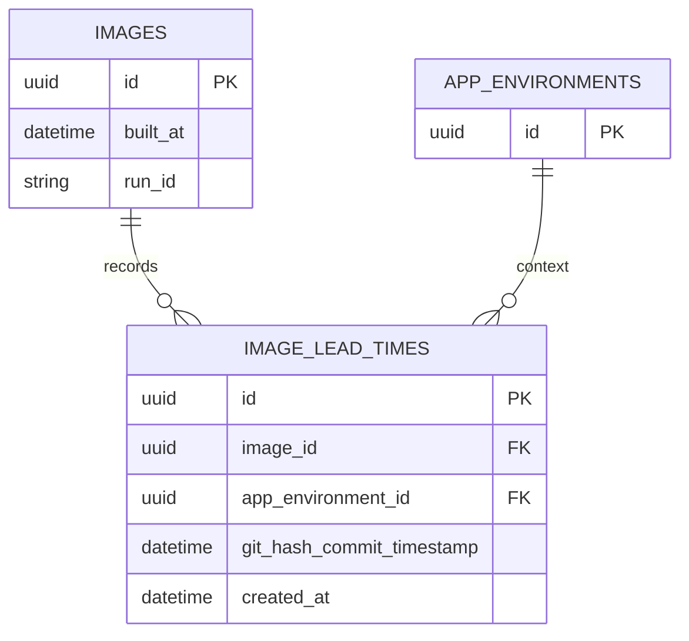

# 16 Continuous Delivery Domain (Images, Registries, Webhooks)

This domain manages container images, registries, and automated triggers (webhooks) for deployments. It persists image metadata, tracks semantic versions per registry channel, and exposes interfaces for creating, querying, and updating image records.

## 16.1 Image/registry persistence and lead-time (DORA) modeling

This section describes how images and registries are modeled in the database, how build metadata (run ID, timestamps, git commits) is recorded, and how lead-time to change (DORA) metrics are computed.

---

### 📦 Image Registry Model

The `ImageRegistry` struct represents a collection of images under a single container registry. It stores registry configuration and provides methods to manage image versions and entries.

| Field | Type | Description |
| --- | --- | --- |
| `ImageRepositoryName` | string | Logical name of the repository |
| `Public` | bool | Access visibility |
| `ContainerRegistryId` | common.UniqueIdentifier | External cloud registry ID |
| `TokenVaultID` | string | Vault reference for registry credentials |
| `ImageVersions` | []ImageVersion | List of semantic versions by channel |
| `Images` | []Image | All image entries |


Key methods:

- **GetVersionForChannel**: Retrieves or creates an `ImageVersion` for the given channel
- **CreateImageEntry**: Copies a `CDRequest` into a new `Image`, populates build metadata (`RunId`, `BuiltAt`), and persists it

```go
// Simplified signature
func (obj *ImageRegistry) CreateImageEntry(
    version *ImageVersion,
    req CDRequest,
    apiVersionID common.UniqueIdentifier,
    opts ...ImageOptions,
) (*Image, error) {
    img := Image{}
    copier.Copy(&img, &req)
    img.ImageVersionID = version.ID
    img.RunId = req.RunId
    img.BuiltAt = time.Now()
    return &img, img.Save()
}
```

---

### 🏷️ Image Version Model

An `ImageVersion` tracks semantic versioning per channel (e.g., `default-1.2.3`). It safeguards version uniqueness within a registry and supports incremental updates.

**Core fields:**

- `Channel` (string): e.g., `"default"`
- `OriginalImageTag` (string): initial Docker tag
- `SemVersion` (Major, Minor, Patch)
- `Version` (string): formatted via `SetVersion()`

**Key methods:**

- **Save** / **Update**: Persist version record in MSSQL via GORM
- **SetVersion**: Constructs `Version` from `SemVersion` and `Channel`
- **UpdateVersion**: Increments `SemVersion` based on update type (`major`, `minor`, `patch`)
- **UpdateSemVersion**: Parses an incoming version string and sets `SemVersion`

```go
func (obj *ImageVersion) UpdateVersion(updateType string) {
    switch updateType {
    case common.IMAGE_MAJOR_UPDATE:
        obj.SemVersion.Major++; obj.SemVersion.Minor = 0; obj.SemVersion.Patch = 0
    case common.IMAGE_MINOR_UPDATE:
        obj.SemVersion.Minor++; obj.SemVersion.Patch = 0
    case common.IMAGE_PATCH_UPDATE:
        obj.SemVersion.Patch++
    }
    obj.SetVersion()
}
```

---

### 🖼️ Image Entity

Each `Image` record captures a snapshot of a container image deployment, including metadata necessary for DORA lead-time calculations.

```go
type Image struct {
    common.Base
    common.XMetadata
    common.XPlatformerData

    BelongToImageVersion
    BelongToImageRegistry

    TagName                  string    `json:"tag_name"`
    ImageName                string    `json:"image_name"`
    ImageNameWithTag         string    `json:"image_name_with_tag"`
    Status                   string    `json:"status"`
    Tags                     []string  `json:"tags"` 
    // --- Build metadata for DORA ---
    GitHashCommitTimestamp   time.Time `json:"git_hash_commit_timestamp"`
    GitHash                  string    `json:"git_hash"`
    GitOpsHash               string    `json:"gitops_hash"`
    ApiDefinitionPath        string    `json:"api_definition_path"`
    Committer                string    `json:"committer"`
    CommitMsg                string    `json:"commit_msg"`
    RunId                    string    `json:"run_id"`
    BuiltAt                  time.Time `json:"built_at"`
    Ports                    []ImagePort           `json:"image_ports"`
    ClusterImageInfoArray    []ClusterImageTagInfo `json:"cluster_image_tags"`
}
```

- **`RunId`**: Unique identifier for the CI/CD pipeline run
- **`BuiltAt`**: Timestamp when the image entry was created
- **`GitHashCommitTimestamp`**: Commit timestamp from source repo

---

### 🗄️ Repository Interfaces

The package defines repository abstractions for database operations.

- **ImageRegistryRepository**
- `GetById(ctx, id) (*ImageRegistry, error)`
- `DeleteById(ctx, id) error`

- **ImageRepository**
- `Create(ctx, *Image) error`
- `Update(ctx, *Image) error`
- `ListByImageCollectionId(ctx, collectionId) ([]Image, error)`
- `ListImagesByApiVersionId(ctx, apiVersionId, registryId) ([]Image, error)`
- `GetDistinctOrgsOfInactiveImages(ctx) ([]string, error)`

---

### 🛠️ DB Helper Converters

Custom GORM type converters serialize complex fields as JSON strings:

| Type | Methods | Purpose |
| --- | --- | --- |
| `SemVersion` | `Value()`, `Scan()` | Store version triple |
| `ImagePortArray` | `Value()`, `Scan()` | Persist port definitions |
| `ClusterImageInfoArray` | `Value()`, `Scan()` | Store cluster-specific image tags |


```go
func (a SemVersion) Value() (driver.Value, error) {
    val, err := json.Marshal(a)
    return string(val), err
}
```

---

### ⏱️ DORA Lead-Time Modeling

Lead-time to change measures time between code commit and image availability. The system records each image entry in an audit table `image_lead_times` (populated via a migration).

#### Metric DTOs

```go
type LeadTimeToChangeDataItem struct {
    DurationMins            float32   // Minutes between commit and image creation
    CreatedAt               time.Time // Image entry timestamp
    GitHashCommitTimestamp  time.Time // Commit timestamp
    GitHash                 string
    ImageNameWithTag        string
    // Context fields
    AppID                   common.UniqueIdentifier
    ProjectID               common.UniqueIdentifier
    Environment             string
    Prod                    bool
    OrganizationID          common.ChoreoOrgID
}
type DoraLeadTimeToChangeMetricResponse struct {
    StartTime time.Time
    EndTime   time.Time
    Values    []LeadTimeToChangeDataItem
}
```

#### Query Logic

The function `GetLeadTimeToChangeDataFromRange` computes lead-time:

```sql
WITH depl AS (
  SELECT * 
    FROM image_lead_times A 
   WHERE A.git_hash_commit_timestamp IS NOT NULL 
     AND A.created_at BETWEEN ? AND ?
)
SELECT 
  B.created_at,
  F.image_name_with_tag,
  B.git_hash_commit_timestamp,
  F.git_hash,
  DATEDIFF(
    minute, 
    B.git_hash_commit_timestamp, 
    B.created_at
  ) AS duration_mins,
  /* join to app, env, project for context */
FROM depl B
JOIN app_environments D ON B.app_environment_id = D.id
JOIN images F           ON F.id = B.image_id
JOIN environments E     ON E.id = D.environment_id
WHERE D.project_id IS NOT NULL;
```

Implemented in Go as :

```go
func GetLeadTimeToChangeDataFromRange(
    start, end time.Time,
) ([]LeadTimeToChangeDataItem, error) {
    var results []LeadTimeToChangeDataItem
    query := `WITH depl AS ( ... ) SELECT ...`
    err := db.DB().
        Raw(query, start.Format(...), end.Format(...)).
        Scan(&results).Error
    return results, err
}
```

#### Entity-Relationship Diagram



This diagram shows how each image entry in `images` links to a lead-time record, associated with an application environment.

---

**Card Block for Key Takeaway**

```card
{
    "title": "Lead-Time Calculation",
    "content": "Duration is computed as the minute difference between commit timestamp and image creation time."
}
```

This completes the detailed documentation of image/registry persistence and DORA lead-time modeling within the Continuous Delivery domain.