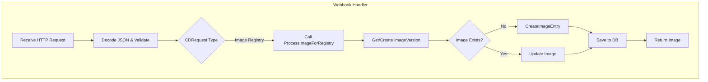

# 16.3 Webhooks: Image Registry Hook and Route Exposure

This section covers Rudder’s **webhook processing** for container image events, focusing on the internal image registry hook logic and the HTTP routes that expose these hooks. It explains how incoming webhook requests are authenticated and validated, how the image registry is updated, and how these hooks integrate with the continuous delivery workflow.

---

## 🛠 Internal Hook: ProcessImageForRegistry

The core function for handling image registry webhooks is `ProcessImageForRegistry` in

`internal/webhooks/image_registry_hook.go`. It creates or updates image records in the registry.

```go
func ProcessImageForRegistry(
  registry continuous_delivery.ImageRegistry,
  req continuous_delivery.CDRequest,
  apiVersionId common.UniqueIdentifier,
  opts ...continuous_delivery.ImageOptions,
) (*continuous_delivery.Image, error) { … }
```

**Key Responsibilities:**

- **Version Lookup**: Retrieves or creates an `ImageVersion` for the specified channel via `registry.GetVersionForChannel` .
- **Image Search**: Queries existing images matching the tag and API version.
- **Create vs. Update**:
- When no match exists, the hook:
- Sets `OriginalImageTag`, semantic version, and updates version metadata.
- Calls `registry.CreateImageEntry` to persist a new image entry.
- On redeploy, it updates fields (`ImageName`, `GitOpsHash`, `Ports`, etc.) and calls `img.Update()`.
- **Options**: Applies functional options (`ImageOptions`) to customize fields (e.g., marking Ballerina images).

**Design Decisions:**

- Separation of **version** and **image** ensures historical tracking by channel.
- Functional options pattern enables flexible image customization without altering core logic.

---

## 🔒 Security Expectations

1. **Token Validation**
2. Tokens from CDRequests (`req.Token`) are decrypted and validated by the upstream controller before invoking this hook .
3. Invalid tokens cause a **400 Bad Request** response, halting image processing.
4. **Request Data Validation**
5. `CDRequest.InitializeDefaultData()` ensures required fields (tag, status, channel) are set.
6. Regex-based validation on `TagRegex` or `RegistryRegex` guards against unexpected payloads .
7. **Permission Checks**
8. Handlers wrapping this function use `NewHandler(..., permission)` to enforce RBAC scopes.

---

## 🚦 Route Bindings

Rudder exposes two sets of HTTP routes for webhooks:

### 1. BYOC Webhooks (API Layer)

File: `api/routes/webhhok.go`

| Path | Handler | Permission |
| --- | --- | --- |
| POST `/webhook/v1/container` | `DeployNewImageToContainer` | DEPLOY_BYOC_IMAGE |
| POST `/webhook/v1/byoci/container` | `DeployNewByociImageToContainer` | EXTERNAL_CI_DEPLOY_IMAGE |


### 2. Choreo Webhooks (Choreo Layer)

File: `choreo/routes/webhooks.go` fileciteturn0file?

| Path | Handler | Permission |
| --- | --- | --- |
| POST `/choreo/webhooks/v1/save-image` | `SaveDeploymentTrackImage` | BUILD_DEPLOYMENT_TRACK |
| POST `/choreo/webhooks/v1/image` | `ChoreoComponentDeployNewImage` | DEPLOY_IMAGE |


---

## 📡 API Endpoints

### POST /webhook/v1/container

```api
{
    "title": "Deploy BYOC Image",
    "description": "Trigger processing of a bring-your-own-container image webhook.",
    "method": "POST",
    "baseUrl": "https://api.example.com",
    "endpoint": "/webhook/v1/container",
    "headers": [
        {
            "key": "Authorization",
            "value": "Bearer <token>",
            "required": true
        }
    ],
    "queryParams": [],
    "pathParams": [],
    "bodyType": "json",
    "requestBody": "{\n  \"container_id\": \"<uuid>\",\n  \"image_name\": \"host/repo\",\n  \"tag\": \"v1.0\",\n  \"registry_token\": \"<token>\",\n  \"git_hash\": \"<hash>\"\n}",
    "formData": [],
    "rawBody": "",
    "responses": {
        "200": {
            "description": "Image processing triggered",
            "body": "{}"
        },
        "400": {
            "description": "Invalid request or token"
        },
        "500": {
            "description": "Internal error"
        }
    }
}
```

### POST /webhook/v1/byoci/container

```api
{
    "title": "Deploy BYOCI Image",
    "description": "Process external CI image deployments via webhook.",
    "method": "POST",
    "baseUrl": "https://api.example.com",
    "endpoint": "/webhook/v1/byoci/container",
    "headers": [
        {
            "key": "Authorization",
            "value": "Bearer <token>",
            "required": true
        }
    ],
    "queryParams": [],
    "pathParams": [],
    "bodyType": "json",
    "requestBody": "{\n  \"component_id\": \"<uuid>\",\n  \"version_id\": \"<uuid>\",\n  \"image_url\": \"host/repo:tag\",\n  \"git_hash_commit_timestamp\": \"2026-02-18T12:00:00Z\"\n}",
    "formData": [],
    "rawBody": "",
    "responses": {
        "200": {
            "description": "BYOCI image deployed",
            "body": "{}"
        },
        "400": {
            "description": "Invalid payload"
        },
        "500": {
            "description": "Processing error"
        }
    }
}
```

### POST /choreo/webhooks/v1/save-image

```api
{
    "title": "Save Deployment Track Image",
    "description": "Save a build/deploy track image record via webhook.",
    "method": "POST",
    "baseUrl": "https://api.example.com",
    "endpoint": "/choreo/webhooks/v1/save-image",
    "headers": [
        {
            "key": "Authorization",
            "value": "Bearer <token>",
            "required": true
        }
    ],
    "queryParams": [],
    "pathParams": [],
    "bodyType": "json",
    "requestBody": "{\n  \"component_id\": \"<uuid>\",\n  \"deployment_track_id\": \"<uuid>\",\n  \"images\": [ { /* image info */ } ],\n  \"git_hash_commit_timestamp\": \"2026-02-18T12:00:00Z\"\n}",
    "formData": [],
    "rawBody": "",
    "responses": {
        "200": {
            "description": "Image saved",
            "body": "{}"
        },
        "400": {
            "description": "Validation failed"
        },
        "500": {
            "description": "Internal error"
        }
    }
}
```

### POST /choreo/webhooks/v1/image

```api
{
    "title": "Deploy New Image",
    "description": "Trigger a new image deployment in Choreo via webhook.",
    "method": "POST",
    "baseUrl": "https://api.example.com",
    "endpoint": "/choreo/webhooks/v1/image",
    "headers": [
        {
            "key": "Authorization",
            "value": "Bearer <token>",
            "required": true
        }
    ],
    "queryParams": [],
    "pathParams": [],
    "bodyType": "json",
    "requestBody": "{\n  \"app_id\": \"<uuid>\",\n  \"api_version_id\": \"<uuid>\",\n  \"cluster_image_tags\": [ /* tags */ ],\n  \"git_hash_commit_timestamp\": \"2026-02-18T12:00:00Z\"\n}",
    "formData": [],
    "rawBody": "",
    "responses": {
        "200": {
            "description": "Deployment initiated",
            "body": "{}"
        },
        "400": {
            "description": "Bad request"
        },
        "500": {
            "description": "Processing error"
        }
    }
}
```

---

## ✅ Test Coverage

`internal/webhooks/image_registry_hook_test.go` defines unit tests for `ProcessImageForRegistry` covering:

- **First image creation**
- **Redeploy (same tag)**
- **Deploy new tag**
- **Version bump redeploy**

These tests verify database persistence counts and field updates .

---

## 🔄 Downstream Effects

Upon successful processing, **image records** are stored in MSSQL via GORM. Controllers then:

1. Notify project manager of build completion.
2. Trigger CICD pipelines or Mizzen deployments.
3. Optionally create API proxies via APIM for API components.

This ensures that a push to an external registry leads to an end-to-end continuous delivery flow.

---

## 🌊 Processing Flowchart



This diagram outlines how incoming webhooks flow through the internal hook to image persistence.

---

By wiring **secure route handlers** to the robust `ProcessImageForRegistry` logic, Rudder’s webhooks module seamlessly integrates external image events into its continuous delivery pipeline.