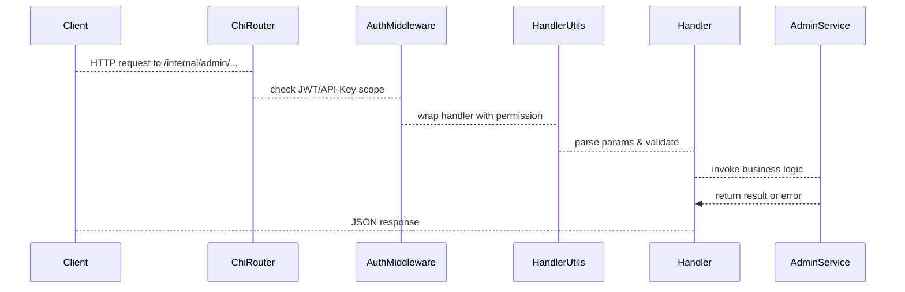

# 18. Admin, Maintenance, and Migration Runbooks

This section describes the **internal admin HTTP API** surface used by operations teams for day-2 tasks: cleanup, migration, and ad-hoc admin actions. These endpoints are mounted under `/internal/admin` and guarded by scoped permissions and service-level safety controls. They invoke core business logic in the `choreo/bundles/admin` package and related controllers to perform migrations, deletions, and configuration updates.

## 18.1 Internal Admin Endpoints and Safety Controls

Internal admin routes are registered in `choreo/routes/admin.go`. Each route is wrapped with a permission tag, enforced by the `handlerutils.NewHandler` middleware. Only callers with the matching scope can invoke these handlers  .

| Method | Path | Permission |
| --- | --- | --- |
| GET | `/internal/admin/component-security-context/{componentID}` | `GET_COMPONENT_SECURITY_CONTEXT` |
| POST | `/internal/admin/component-security-context` | `SET_COMPONENT_SECURITY_CONTEXT` |
| POST | `/internal/admin/cleanup-executions` | `CLEANUP_EXECUTIONS` |
| POST | `/internal/admin/cleanup-deleted-projects` | `CLEANUP_DELETED_PROJECTS` |
| POST | `/internal/admin/migrate-project-envs` | `MIGRATE_PROJECT_ENVS_FOR_ORG` |
| POST | `/internal/admin/migrate-mi-component-configs/{componentId}` | `ADMIN_MIGRATE_MI_COMPONENT_CONFIGS` |
| GET | `/internal/admin/get-build-deploy-migration-older-components/{orgId}` | `ADMIN_GET_BUILD_DEPLOY_OLDER_COMPONENTS` |


### Safety Controls

- **Authentication & Authorization**

All admin endpoints use `handlerutils.NewHandler(handler, permission)` to enforce JWT scopes or API-key permissions. Requests without the required scope are rejected before entering the handler logic.

- **Structured Logging**

Each handler logs start/completion timestamps and key identifiers via `logctx.WithLogger`, aiding audit and traceability.

- **Request Validation**

Path, query, and body parameters are validated using `handlerutils.NewRequestDataReader`. Invalid inputs result in `400 Bad Request`.

---

## Core Handler Flow

Below is a simplified sequence of how an admin request is processed:



---

## Bundled Admin Service

The core business logic lives in the `choreo/bundles/admin` package.

`Service` orchestrates data-plane operations, migrations, and cleanup tasks, using controllers from other bundles (apps, envs, webapps). It uses Go’s `errgroup` for concurrent tasks and `gormigrate` for database migrations .

```go
type Service struct {
  AppController  choreoapp.ChoreoAppController
  AppEnvSvc      app.AppEnvService
  WebappSvc      webappsvc.WebAppService
  ApiVersionSvc  apiversionsvc.ApiVersionService
}

func NewService(...) *Service { ... }
```

---

## Selected Endpoint Documentation

Below are representative API blocks for key internal admin endpoints. Each block shows request/response schemas, required headers, and realistic examples.

### GET Component Security Context

```api
{
    "title": "Get Component Security Context",
    "description": "Retrieve the container security context settings for a component",
    "method": "GET",
    "baseUrl": "http://localhost:3002",
    "endpoint": "/internal/admin/component-security-context/{componentId}",
    "headers": [
        {
            "key": "Authorization",
            "value": "Bearer <token>",
            "required": true
        }
    ],
    "queryParams": [],
    "pathParams": [
        {
            "key": "componentId",
            "value": "UUID of the component",
            "required": true
        }
    ],
    "bodyType": "none",
    "requestBody": "",
    "formData": [],
    "rawBody": "",
    "responses": {
        "200": {
            "description": "Security context fetched",
            "body": "{\n  \"runAsUser\": 1000,\n  \"runAsGroup\": 1000,\n  \"runAsNonRoot\": true,\n  \"fsGroup\": 2000,\n  \"fsGroupChangePolicy\": \"OnRootMismatch\"\n}"
        },
        "400": {
            "description": "Invalid componentId",
            "body": "{ \"error\": \"invalid UUID\" }"
        },
        "403": {
            "description": "Forbidden"
        },
        "500": {
            "description": "Internal server error"
        }
    }
}
```

### POST Set Component Security Context

```api
{
    "title": "Set Component Security Context",
    "description": "Configure container security defaults for a component",
    "method": "POST",
    "baseUrl": "http://localhost:3002",
    "endpoint": "/internal/admin/component-security-context",
    "headers": [
        {
            "key": "Authorization",
            "value": "Bearer <token>",
            "required": true
        },
        {
            "key": "Content-Type",
            "value": "application/json",
            "required": true
        }
    ],
    "queryParams": [],
    "pathParams": [],
    "bodyType": "json",
    "requestBody": "{\n  \"component_id\": \"<uuid>\",\n  \"run_as_user\": 1000,\n  \"run_as_group\": 1000,\n  \"run_as_non_root\": true,\n  \"fs_group\": 2000,\n  \"fs_group_change_policy\": \"OnRootMismatch\"\n}",
    "formData": [],
    "rawBody": "",
    "responses": {
        "200": {
            "description": "Security context updated",
            "body": "{\n  \"runAsUser\": 1000,\n  \"runAsGroup\": 1000,\n  \"runAsNonRoot\": true,\n  \"fsGroup\": 2000,\n  \"fsGroupChangePolicy\": \"OnRootMismatch\"\n}"
        },
        "400": {
            "description": "Validation error"
        },
        "403": {
            "description": "Forbidden"
        },
        "500": {
            "description": "Internal error"
        }
    }
}
```

### POST Cleanup Executions

```api
{
    "title": "Cleanup Old Executions",
    "description": "Delete executions older than 32 days from state store and Azure log analytics",
    "method": "POST",
    "baseUrl": "http://localhost:3002",
    "endpoint": "/internal/admin/cleanup-executions",
    "headers": [
        {
            "key": "Authorization",
            "value": "Bearer <token>",
            "required": true
        }
    ],
    "queryParams": [],
    "pathParams": [],
    "bodyType": "none",
    "requestBody": "",
    "formData": [],
    "rawBody": "",
    "responses": {
        "200": {
            "description": "Rows deleted",
            "body": "\"Deleted 123 executions\""
        },
        "403": {
            "description": "Forbidden"
        },
        "500": {
            "description": "Internal error"
        }
    }
}
```

### POST Cleanup Deleted Projects

```api
{
    "title": "Cleanup Deleted Projects",
    "description": "Remove stale project records and associated resources",
    "method": "POST",
    "baseUrl": "http://localhost:3002",
    "endpoint": "/internal/admin/cleanup-deleted-projects",
    "headers": [
        {
            "key": "Authorization",
            "value": "Bearer <token>",
            "required": true
        }
    ],
    "queryParams": [],
    "pathParams": [],
    "bodyType": "none",
    "requestBody": "",
    "formData": [],
    "rawBody": "",
    "responses": {
        "200": {
            "description": "Cleanup completed",
            "body": "null"
        },
        "403": {
            "description": "Forbidden"
        },
        "500": {
            "description": "Internal error"
        }
    }
}
```

### POST Migrate Project Environments

```api
{
    "title": "Migrate Project Environments",
    "description": "Trigger template migration for all environments in an organization",
    "method": "POST",
    "baseUrl": "http://localhost:3002",
    "endpoint": "/internal/admin/migrate-project-envs",
    "headers": [
        {
            "key": "Authorization",
            "value": "Bearer <token>",
            "required": true
        },
        {
            "key": "Content-Type",
            "value": "application/json",
            "required": true
        }
    ],
    "queryParams": [],
    "pathParams": [],
    "bodyType": "json",
    "requestBody": "{\n  \"organization_id\": \"<uuid>\",\n  \"template_version\": \"v2.0\"\n}",
    "formData": [],
    "rawBody": "",
    "responses": {
        "200": {
            "description": "Migration results per environment",
            "body": "[ { \"environment_id\": \"<uuid>\", \"status\": \"migrated\" }, ... ]"
        },
        "400": {
            "description": "Invalid request"
        },
        "403": {
            "description": "Forbidden"
        },
        "500": {
            "description": "Internal error"
        }
    }
}
```

### POST Migrate MI Component Configs

```api
{
    "title": "Migrate MI Component Configs",
    "description": "Invoke MI config migration for a specific component",
    "method": "POST",
    "baseUrl": "http://localhost:3002",
    "endpoint": "/internal/admin/migrate-mi-component-configs/{componentId}",
    "headers": [
        {
            "key": "Authorization",
            "value": "Bearer <token>",
            "required": true
        }
    ],
    "queryParams": [],
    "pathParams": [
        {
            "key": "componentId",
            "value": "Component UUID",
            "required": true
        }
    ],
    "bodyType": "none",
    "requestBody": "",
    "formData": [],
    "rawBody": "",
    "responses": {
        "200": {
            "description": "Migration completed",
            "body": "null"
        },
        "403": {
            "description": "Forbidden"
        },
        "500": {
            "description": "Migration failed"
        }
    }
}
```

### GET Older Build-Deploy Separation Components

```api
{
    "title": "Get Build-Deploy Older Components",
    "description": "List components using legacy build-deploy pipeline for an org",
    "method": "GET",
    "baseUrl": "http://localhost:3002",
    "endpoint": "/internal/admin/get-build-deploy-migration-older-components/{orgId}",
    "headers": [
        {
            "key": "Authorization",
            "value": "Bearer <token>",
            "required": true
        }
    ],
    "queryParams": [
        {
            "key": "since",
            "value": "RFC3339 timestamp",
            "required": false
        },
        {
            "key": "limit",
            "value": "Max records",
            "required": false
        }
    ],
    "pathParams": [
        {
            "key": "orgId",
            "value": "Organization UUID",
            "required": true
        }
    ],
    "bodyType": "none",
    "requestBody": "",
    "formData": [],
    "rawBody": "",
    "responses": {
        "200": {
            "description": "List of component IDs",
            "body": "[ \"<componentUUID>\", ... ]"
        },
        "403": {
            "description": "Forbidden"
        },
        "500": {
            "description": "Internal error"
        }
    }
}
```

---

These internal admin endpoints provide powerful operations for **cleanup**, **migration**, and **configuration**. They are intended for **ops-only** usage, secured by scoped permissions, and plug into the migration/runbook tooling of the `choreo/bundles/admin` service. Any invocation outside of an authorized context will be rejected by the routing middleware  .