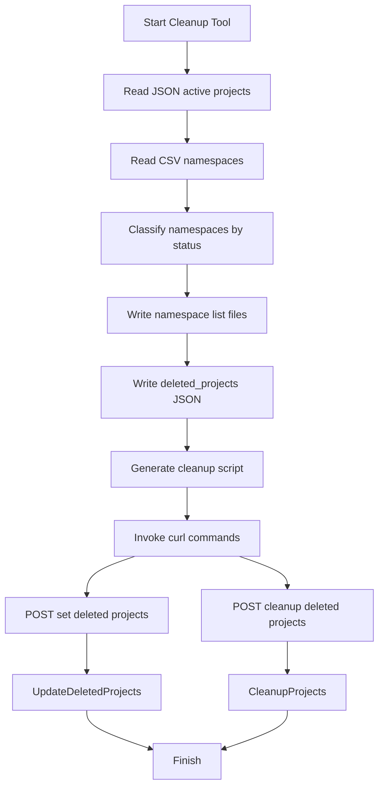

# 18.2 Namespace Cleanup Tool (cmd/nscleanup) and Workflows

The **Namespace Cleanup Tool** automates detection of stale namespaces and triggers database cleanup via internal admin endpoints. It processes raw data dumps, generates artifacts for inspection, and emits a shell script that calls Rudder’s internal admin APIs to purge orphaned project data.

## ⚙️ Components

- **cmd/nscleanup/main.go**
- Orchestrates input reading, classification, artifact generation, and script creation
- **internal/inputs**
- ReadJSON: loads JSON files generically
- ReadCSV: parses CSV into typed records
- Types: `ActiveProject` and `NamespaceRecord` definitions
- **choreo/bundles/admin/nscleanup.go**
- Implements `UpdateDeletedProjects` and `CleanupProjects` to truncate and delete DB records

## 📥 Input Artifacts

| Artifact | Description |
| --- | --- |
| mongo_output.json | JSON array of active project IDs (`ActiveProject`) |
| namespace_list.csv | CSV of stale namespaces (`NamespaceRecord`) |


## 📤 Output Artifacts

| Artifact | Description |
| --- | --- |
| invalid_org_level_ns.txt | Namespaces without associated project IDs |
| invalid_project_level_ns.txt | Namespaces tied to deleted projects |
| deleted_projects.json | JSON payload listing unique deleted project IDs |
| cleanup_projects.sh | Shell script issuing curl calls to internal admin cleanup endpoints |


## internal/inputs Package

The `internal/inputs` package provides generic readers:

```go
// ReadCSV reads a CSV and unmarshals rows into []T
func ReadCSV[T any](folder, fileName string) []T { … } 

// ReadJSON reads a JSON file into T
func ReadJSON[T any](folder, fileName string) T { … } 
```

Key types:

```go
type ActiveProject struct {
  Id common.UniqueIdentifier `json:"id"`
}

type NamespaceRecord struct {
  ProjectId common.UniqueIdentifier `json:"project_id"`
  Namespace string                  `json:"namespace"`
  ClusterId common.UniqueIdentifier `json:"cluster_id"`
}
```

## Main Workflow



1. **Read inputs**
2. Loads active projects from `mongo_output.json`
3. Parses `namespace_list.csv` into records
4. **Classify namespaces**
5. Empty `ProjectId` → org-level namespaces
6. Matching project → active namespaces
7. Missing project → inactive namespaces and mark for deletion
8. **Generate artifacts**
9. Write two text files of namespace names
10. Create `deleted_projects.json` with `{"project_ids":[…]}`
11. **Emit cleanup script**
12. `cleanup_projects.sh` contains two curl commands
13. Targets local admin endpoints at port 3002

## Generated Shell Script

```bash
curl --location 'http://127.0.0.1:3002/internal/admin/set-deleted-projects' \
  --header 'Content-Type: application/json' \
  --data @deleted_projects.json

curl --location --request POST 'http://127.0.0.1:3002/internal/admin/cleanup-deleted-projects'
```

This script sequentially calls:

- **Set Deleted Projects**: updates the `deleted_projects` table
- **Cleanup Deleted Projects**: executes cascading deletes of related tables

## 🛠 Admin API Endpoints

### Set Deleted Projects (POST)

```api
{
    "title": "Set Deleted Projects",
    "description": "Populate deleted_projects table with given project IDs",
    "method": "POST",
    "baseUrl": "http://127.0.0.1:3002",
    "endpoint": "/internal/admin/set-deleted-projects",
    "headers": [
        {
            "key": "Content-Type",
            "value": "application/json",
            "required": true
        }
    ],
    "queryParams": [],
    "pathParams": [],
    "bodyType": "json",
    "requestBody": "{\n  \"project_ids\": [\n    \"uuid-1\",\n    \"uuid-2\"\n  ]\n}",
    "formData": [],
    "rawBody": "",
    "responses": {
        "200": {
            "description": "Success",
            "body": "null"
        },
        "500": {
            "description": "Error",
            "body": "{ \"error\": \"message\" }"
        }
    }
}
```

### Cleanup Deleted Projects (POST)

```api
{
    "title": "Cleanup Deleted Projects",
    "description": "Delete all resources for projects marked as deleted",
    "method": "POST",
    "baseUrl": "http://127.0.0.1:3002",
    "endpoint": "/internal/admin/cleanup-deleted-projects",
    "headers": [
        {
            "key": "Content-Type",
            "value": "application/json",
            "required": false
        }
    ],
    "queryParams": [],
    "pathParams": [],
    "bodyType": "none",
    "requestBody": "",
    "formData": [],
    "rawBody": "",
    "responses": {
        "200": {
            "description": "Cleanup complete",
            "body": "null"
        },
        "500": {
            "description": "Error",
            "body": "{ \"error\": \"message\" }"
        }
    }
}
```

## Internal Admin Cleanup Logic

The admin bundle implements two core functions:

- **UpdateDeletedProjects**

Truncates and inserts new rows into `deleted_projects` in a transaction

- **CleanupProjects**

Builds SQL statements to delete from tables in proper order:

- `deployment_histories`, `namespaces`, `config_mounts`, `config_maps`, `secrets`
- `app_environments`, `apps`, `custom_domains`, `environments`, `image_registries`

It executes each DML and logs affected rows

```go
type DML struct { SQL string; Name string }
sql := []DML{
  { SQL: cleanUpDeploymentHistory, Name: "deployment_histories" },
  { SQL: cleanUpNs, Name: "namespaces" },
  …
}
for _, dml := range sql {
  tx := db.DB(ctx).Exec(dml.SQL)
  logctx.From(ctx).Infof("deleted %d rows from %s", tx.RowsAffected, dml.Name)
}
```

This ensures a controlled, idempotent purge of stale data across all related tables.