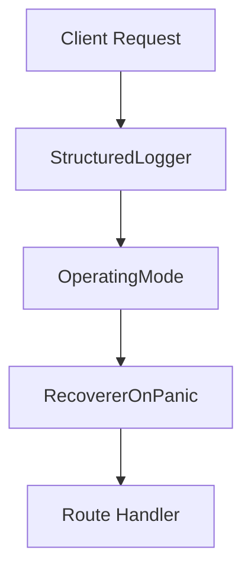

# 20. Cross-Cutting Concerns (Middleware, Common, Request, Observability)

This section covers the **middleware** layer that applies to all HTTP requests. Middlewares enforce **structured logging**, **panic recovery**, and **operating-mode gating** across routes. They integrate with the Chi router to provide cross-cutting behavior before and after handlers execute.

---

## 20.1 Middlewares: structured logging, panic recovery, operating-mode gating

Chi routes are wired with these three middlewares in **api/api.go**:

```go
r.Use(middlewares.NewStructuredLogger())
r.Use(middlewares.OperatingMode)
r.Use(middlewares.RecovererOnPanic)
```

These execute in the order above for every incoming request (including `/healthz`).

### 20.1.1 🎯 Structured Logging

**Purpose**: Emit a JSON log at request start and completion, capturing key HTTP metadata.

Implemented in `api/middlewares/logger.go`.

```go
// NewStructuredLogger returns a chi RequestLogger middleware using logrus JSON output.
func NewStructuredLogger() func(next http.Handler) http.Handler {
  logger := &logrus.Logger{
    Out:       os.Stderr,
    Formatter: new(logrus.JSONFormatter),
    Level:     logrus.InfoLevel,
  }
  return middleware.RequestLogger(&StructuredLogger{logger})
}
```

When a request arrives, **NewLogEntry** collects fields:

| Field | Description |
| --- | --- |
| log_type | Always `"request"` |
| request_id* | UUID from Chi context (if set) |
| http_scheme | `"http"` or `"https"` |
| http_proto | HTTP version (`r.Proto`) |
| http_method | HTTP verb (GET, POST, …) |
| remote_addr | Client IP:port |
| user_agent | `r.UserAgent()` |
| uri | Full URI (`scheme://host + path`) |


\* populated only if Chi’s `middleware.RequestID` ran earlier.

The logger **skips** logging for health checks:

```go
if r.RequestURI == "/healthz" {
  entry.skip = true
}
```

#### Entry Lifecycle

```go
type StructuredLoggerEntry struct {
  Logger logrus.FieldLogger
  skip   bool
}

// Write logs response status, size, and elapsed time.
func (l *StructuredLoggerEntry) Write(status, bytes int, elapsed time.Duration) {
  if l.skip { return }
  l.Logger.WithFields(logrus.Fields{
    "resp_status":         status,
    "resp_bytes_length":   bytes,
    "resp_elapsed_ms":     float64(elapsed.Nanoseconds())/1e6,
  }).Infoln("request complete")
}

// Panic enriches the entry with panic info (stack trace).
func (l *StructuredLoggerEntry) Panic(v interface{}, stack []byte) {
  l.Logger.WithFields(logrus.Fields{
    "panic": fmt.Sprintf("%+v", v),
    "stack": string(stack),
  })
}
```

---

### 20.1.2 🛡️ Panic Recovery

**Purpose**: Catch panics in handlers, log critical errors, and return HTTP 500.

Defined in `api/middlewares/panic_recover.go`:

```go
func RecovererOnPanic(next http.Handler) http.Handler {
  fn := func(w http.ResponseWriter, r *http.Request) {
    defer func() {
      if rvr := recover(); rvr != nil && rvr != http.ErrAbortHandler {
        reqId := common.GetRequestIdFromContext(r.Context())
        logrus.WithField("requestId", reqId).
          WithField("severity", "critical").
          Errorf("%s-%s", rvr, debug.Stack())
        http.Error(w, http.StatusText(http.StatusInternalServerError),
          http.StatusInternalServerError)
      }
    }()
    next.ServeHTTP(w, r)
  }
  return http.HandlerFunc(fn)
}
```

| Behavior | Details |
| --- | --- |
| Captures | Any panic ≠ `http.ErrAbortHandler` |
| Logging level | `Error` with `"severity":"critical"` |
| Additional fields | `requestId`, panic message, stack trace |
| Response | `500 Internal Server Error` |


Tests verify that panic yields 500, normal flow yields 200:

---

### 20.1.3 🚦 Operating-Mode Gating

**Purpose**: Detect “Choreo V3” clients via `X-Operating-Mode: v3` header and annotate the request context.

Code in `api/middlewares/operating_mode.go`:

```go
const (
  requestOperatingModeHeaderKey       = "X-Operating-Mode"
  requestOperatingModeHeaderValueV3   = "v3"
)

func OperatingMode(next http.Handler) http.Handler {
  fn := func(w http.ResponseWriter, r *http.Request) {
    ctx := r.Context()
    if r.Header.Get(requestOperatingModeHeaderKey) == requestOperatingModeHeaderValueV3 {
      ctx = common.WithChoreoV3OperatingContext(ctx)
    }
    next.ServeHTTP(w, r.WithContext(ctx))
  }
  return http.HandlerFunc(fn)
}
```

| Header | Action |
| --- | --- |
| `X-Operating-Mode: v3` | Sets Choreo V3 flag in context |
| anything else / missing | Leaves context in default (non-V3) mode |


Tests assert that `common.IsChoreoV3OperatingMode(ctx)` matches header presence:

---

### 20.1.4 Request Flow

Below is a simplified request-processing flow illustrating middleware order:



- **StructuredLogger** enriches logs at start.
- **OperatingMode** tags context for V3 clients.
- **RecovererOnPanic** guards against unexpected panics.
- **Route Handler** executes business logic.

This wiring ensures consistent logging, fault tolerance, and behavior variations across all API routes.