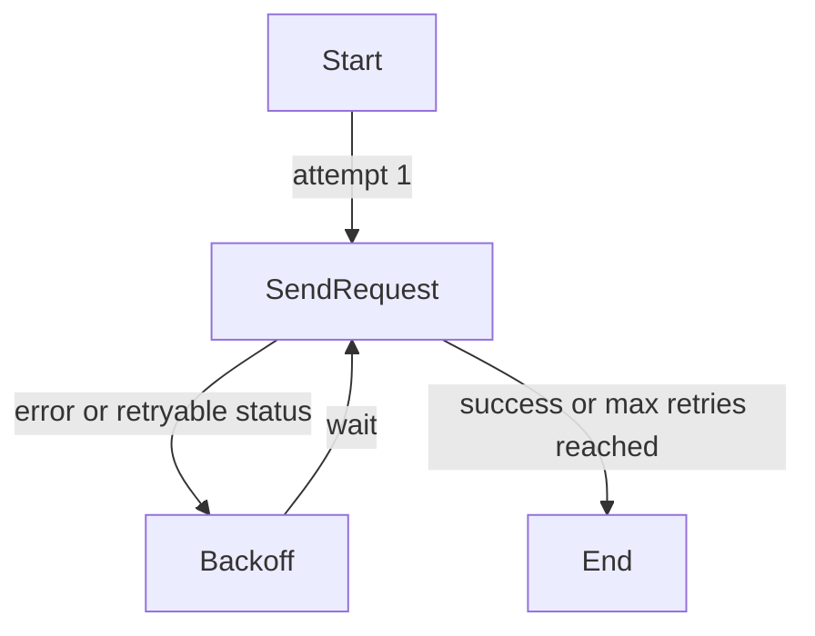

## 20.3 HTTP Request Helpers and Retry Logic for External Calls

This section covers the **HTTP client abstraction** and **retry mechanism** used throughout Rudder to invoke external control-plane services. It is split into two packages:

- **external-services/request**: a Go `http.Client` wrapper with configurable timeouts, retry policies, backoff, and error mapping.
- **external-services/request-utils**: a helper around `gorequest.SuperAgent` providing request retry with integer–based backoff and empty-response handling.

Both packages include utilities for spinning up test servers and validating retry behavior in unit tests.

---

### ⚙️ Configuration Options

The `external-services/request` package defines a set of functional options to tune each request:

| Option | Description | Default |
| --- | --- | --- |
| `Timeout(t)` | Per-try request deadline (cancels context after `t`). | 5 minutes |
| `MaxRetries(n)` | Number of retries on failure (total attempts = `n+1`). | 3 |
| `RetryOnStatus(...)` | HTTP status codes that trigger a retry when received. |  |
| `BackoffFunc(fn)` | Function returning backoff duration given failed-count (1-based). | `failedCount * 3s` |
| `LogFnName(name)` | Attaches a function name tag to logs for correlating failures. |  |


```go
// Set a 10s timeout, retry up to 5 times on 5xx codes, with exponential backoff.
req := request.New(ctx, client, httpReq, http.StatusOK,
    request.Timeout(10*time.Second),
    request.MaxRetries(5),
    request.RetryOnStatus(500, 502, 503, 504),
    request.BackoffFunc(func(attempt int) time.Duration {
        return time.Duration(attempt*attempt) * 500 * time.Millisecond
    }),
)
```

---

### 🔄 Retry Flow

All retries funnel through the helper `retryWithBackoff`, which:

1. Iterates attempts from 1 to `maxRetries+1`.
2. Skips backoff before the first attempt.
3. Invokes a callback `fn(attemptNo)` that:
4. Clones the original HTTP request (so bodies can be re-sent).
5. Applies a per-try deadline via `context.WithTimeout`.
6. Issues `client.Do(req)`.
7. Interprets errors:
8. **Connection errors** (`err != nil`) always retry.
9. **Status codes** outside the success list but present in `retryOnStatus` trigger retry.
10. Logs each failure with the attempt number and reason.
11. Waits `backoffFunc(attemptNo)` before next iteration (unless on the final attempt).



---

### 📨 Request Lifecycle

1. **Construction**

`New(ctx, client, req, successStatus, opts...)`

- Copies the request body into a string buffer for replaying on retries.
- Aggregates options into an `options` struct.
- Stores any error from body-copying for early failure.

1. **Result Binding**

`SetResult(dest)`

- Accepts a **pointer** to a Go value (e.g., `*MyResponse`).
- If non-pointer passed, sets a pre-error: `"expected a pointer value"`.

1. **Send**

`Send()` → `SendWithMultipleSuccessStatus([]int{})`

- Wraps the retry loop.
- On each attempt:
- Clones `*http.Request` (to reset body, headers, query).
- Sets per-try timeout and invokes `client.Do`.
- Calls `processHttpResponse` to read body, unmarshal on success, or wrap in `HttpError`.

1. **Response Processing**

```go
   func (s *request) processHttpResponse(resp *http.Response, logger *CtxLogger, successStatusList []int) (*Response, error)
```

- Reads all bytes from `resp.Body`.
- If `resp.StatusCode ∈ successStatusList`, unmarshals into the user’s `dest`.
- Otherwise returns a `HttpError{status, message, fnName}`.
- Slow requests (> 60s) emit a log warning.

---

### ❗ Error Mapping

Errors are surfaced as either:

- **Transport errors** (network failures, timeouts) propagated directly (with context deadline errors).
- **`HttpError`**: wraps non-2xx (or outside success list) status codes along with response body.

```go
type HttpError struct {
    err    error
    status int
    fnName string
}
func (e HttpError) Error() string
func (e HttpError) Status() int
func IsHttpError(err error, status int) bool
func AsHttpError(err error) (*HttpError, bool)
```

---

### 🛠️ Test Utilities

- **`CreateMockHttpError`**: test helper to simulate a `HttpError`.
- **`startServerAfterDelay`** (in tests): spins up an `httptest.Server` after a millisecond delay to validate client-side timeouts.
- Validation functions ensure headers, query params, and body replay behavior on retries.

---

### 📦 `external-services/request-utils`

A lightweight wrapper around the `gorequest` library for simpler use cases:

- **`RetryParams`**
- `MaxAttempts`
- `RetryOnEmptyResponse`
- `RetryOnStatus []int`
- `BackoffTime`

- **`SendRequest(ctx, requestFn, params)`**

Loops `MaxAttempts` times:

- Invokes `requestFn()` → `*gorequest.SuperAgent`.
- Calls `.End()` to get `(Response, body, errs)`.
- Retries on any `errs != nil`, `nil response`, empty body (when enabled), or status codes in `RetryOnStatus`.
- Applies linear backoff: `(attemptNo) * BackoffTime`.

- **Presets**
- `DefaultRetryParams()`
- `ProxyUserAppRetryParams()`
- `HealthCheckRetryParams()`

- **`NewTestServerWithURL(url, handler)`**

Binds an `httptest.Server` to a custom listener address for control-plane service mocks.

```go
resp, body, errs := requestutils.SendRequest(
    ctx,
    func() *gorequest.SuperAgent {
        return gorequest.New().Timeout(10*time.Millisecond).Get(serverUrl)
    },
    requestutils.RetryParams{
        MaxAttempts:          5,
        RetryOnEmptyResponse: true,
        RetryOnStatus:        []int{http.StatusInternalServerError},
        BackoffTime:          100*time.Millisecond,
    },
)
```

---

This **cross-cutting HTTP layer** ensures:

- **Consistency** in timeout and retry behavior across all external-service clients.
- **Observability** via structured logs (attempt counts, reasons, durations).
- **Testability** through injected test servers and mock errors.

By leveraging these helpers, Rudder’s higher-level service clients remain concise, focusing on domain logic rather than boilerplate retry handling.