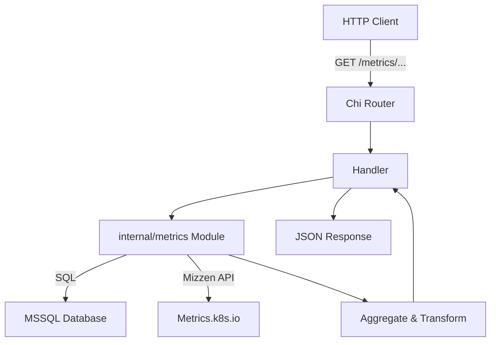

# 20.4 Metrics Subsystem

The **Metrics** subsystem collects, aggregates, and exposes operational data and performance indicators. It comprises:

- **Route Exposure**: HTTP routes under `/metrics`
- **Handlers**: Bridge HTTP requests to metric logic
- **Internal Metrics Package**: Data retrieval and transformation modules
- **Cardinality & Data Sources**: Trade-offs in metric dimensionality

---

## 20.4.1 🚪 Route Exposure

Defines the HTTP endpoints under the `/metrics` namespace. Each route uses a chi‐router and wraps its handler with a permission key.

File: `api/routes/metrics.go`

```go
func MetricRoutes(r chi.Router) {
  r.Get("/deployments", handlerutils.NewHandler(handlers.GetMetricDeployments, "GET_DEPLOYMENTS_METRICS"))
  r.Get("/dora-deployments", handlerutils.NewHandler(handlers.GetMetricDoraDeployments, "GET_DORA_DEPLOYMENTS_METRICS"))
  r.Get("/dora-leadtime", handlerutils.NewHandler(handlers.GetMetricDoraLeadTimeToChange, "GET_DORA_LEADTIME_METRICS"))
  r.Get("/pod-metrics", handlerutils.NewHandler(handlers.GetPodMetrics, "GET_POD_METRICS"))
  r.Get("/active-count", handlerutils.NewHandler(handlers.GetActiveComponentCount, "GET_ACTIVE_COMPONENT_COUNT"))
  r.Get("/active-count-by-environment", handlerutils.NewHandler(handlers.GetActiveComponentCountByEnvironment, "GET_ACTIVE_COMPONENT_COUNT_BY_ENV"))
}
```

- **Purpose**: Expose metrics endpoints consistently.
- **Pattern**: Each route uses `handlerutils.NewHandler` for logging, tracing, and permission enforcement.

---

## 20.4.2 🔗 Handlers

File: `api/handlers/metrics.go`

Each handler:

1. Decodes query parameters.
2. Invokes a function in the `internal/metrics` package.
3. Responds with JSON or error.

Example:

```go
func GetMetricDeployments(w http.ResponseWriter, r *http.Request) {
  var query metrics.DeploymentMetricsRequest
  if err := decoder.Decode(&query, r.URL.Query()); err != nil {
    handlerutils.RespondWithError(w, r, 400, err)
    return
  }
  data, err := metrics.GetDeploymentMetrics(query)
  if err != nil {
    handlerutils.RespondWithError(w, r, 500, err)
    return
  }
  handlerutils.RespondWithJSON(w, r, 200, data)
}
```

- **Metrics Covered**:
- Deployment counts over time
- DORA deployment frequency
- DORA lead time to change
- Pod resource usage
- Active component counts

---

## 20.4.3 ⚙️ Counters & Time Series

File: `internal/metrics/counters.go`

### Data Types

| Type | Description |
| --- | --- |
| **MetricCount** | Simple count with `name`, `count`, `date` |
| **TimeSeriesObject** | Series per environment with `values` |
| **ChartData** | Single point in a time series (`value`,`date`) |


### Key Functions

- **GetMetricCounters()**

Returns static counters:

- Total environments
- Critical environments
- Apps
- App environments
- Deployment histories
- **GetMetricTimeSeriesDaily()**

Returns yesterday’s deployment counts as `MetricCount`.

- **GetDeploymentMetrics(req)**

Delegates to `GetDeploymentHistoryTimeSeries` for time series .

---

## 20.4.4 🗓️ Deployment History Series

File: `internal/metrics/series.go` (merged with counters)

```go
func GetDeploymentHistoryTimeSeries(req DeploymentMetricsRequest) ([]*TimeSeriesObject, error) {
  // SQL: group deployment_histories by date and environment
}
```

- **Purpose**: Show deployment trends over a date range.
- **Cardinality**: One series per environment, values per day.

---

## 20.4.5 🎯 DORA Metrics

File: `internal/metrics/dora.go`

### Data Types

- **DeploymentDataItem**: `{environment, count, prod flag, timestamps, IDs}`
- **LeadTimeToChangeDataItem**: `{duration_mins, image_name_with_tag, git timestamps, environment}`
- **DoraMetricsRequest**: `start_time`, `end_time`
- **DoraDeploymentMetricResponse** / **DoraLeadTimeToChangeMetricResponse**: wrap values with start/end

### SQL Sources

- **deployment_histories**
- Filters on `dora_deployment_bool = 'true'` and non‐null `container_image_list`.
- **image_lead_times**
- Filters valid `git_hash_commit_timestamp` and created_at range.

> **DORA Cardinality**: Bounded by number of distinct app environments and image builds in the time window.

---

## 20.4.6 🐳 Pod Metrics

File: `internal/metrics/pod_metrics.go`

### Workflow

1. **Active Environments**:

Filter environments via release history or project manager.

1. **Gather Pod Usage**:

Concurrent calls (max 20) to Mizzen metrics API.

1. **Aggregate**:

Sum CPU/memory limits, requests, usage; track healthy vs unhealthy pods.

### Key Types

- **PodMetricRequest**: `{org_id, org_int_id, project_id, component_id}`
- **ResourceUsageResponse**: global and per‐environment summaries
- **ResourceUsage**: CPU/memory fields, pod counts, labels

> **Pod Metrics Cardinality**: High cardinality due to labels per component+env combination.

---

## Architecture Overview



---

## Interactive API Blocks

### GET /metrics/deployments

```api
{
    "title": "Get Deployment Metrics",
    "description": "Retrieve deployment counts over time for a project",
    "method": "GET",
    "baseUrl": "https://api.example.com/api/v1",
    "endpoint": "/metrics/deployments",
    "headers": [
        {
            "key": "Authorization",
            "value": "Bearer <token>",
            "required": true
        }
    ],
    "queryParams": [
        {
            "key": "project_id",
            "value": "Project UUID",
            "required": true
        },
        {
            "key": "start_date",
            "value": "YYYY-MM-DD",
            "required": true
        },
        {
            "key": "end_date",
            "value": "YYYY-MM-DD",
            "required": true
        }
    ],
    "pathParams": [],
    "bodyType": "none",
    "requestBody": "",
    "formData": [],
    "rawBody": "",
    "responses": {
        "200": {
            "description": "Deployment time series",
            "body": "[\n  {\n    \"environment_name\": \"dev\",\n    \"environment_id\": \"...\",\n    \"values\": [ { \"date\": \"2025-01-01T00:00:00Z\", \"value\": 10 } ]\n  }\n]"
        }
    }
}
```

### GET /metrics/dora-deployments

```api
{
    "title": "Get DORA Deployment Metrics",
    "description": "Retrieve deployment frequency between start_time and end_time",
    "method": "GET",
    "baseUrl": "https://api.example.com/api/v1",
    "endpoint": "/metrics/dora-deployments",
    "headers": [
        {
            "key": "Authorization",
            "value": "Bearer <token>",
            "required": true
        }
    ],
    "queryParams": [
        {
            "key": "start_time",
            "value": "RFC3339 timestamp",
            "required": true
        },
        {
            "key": "end_time",
            "value": "RFC3339 timestamp",
            "required": true
        }
    ],
    "pathParams": [],
    "bodyType": "none",
    "requestBody": "",
    "formData": [],
    "rawBody": "",
    "responses": {
        "200": {
            "description": "DORA deployment metrics",
            "body": "{\n  \"start_time\": \"...\",\n  \"end_time\": \"...\",\n  \"values\": [ { \"environment\": \"prod\", \"count\": 5, ... } ]\n}"
        }
    }
}
```

### GET /metrics/dora-leadtime

```api
{
    "title": "Get DORA Lead Time Metrics",
    "description": "Retrieve lead time to change metrics over a time range",
    "method": "GET",
    "baseUrl": "https://api.example.com/api/v1",
    "endpoint": "/metrics/dora-leadtime",
    "headers": [
        {
            "key": "Authorization",
            "value": "Bearer <token>",
            "required": true
        }
    ],
    "queryParams": [
        {
            "key": "start_time",
            "value": "RFC3339 timestamp",
            "required": true
        },
        {
            "key": "end_time",
            "value": "RFC3339 timestamp",
            "required": true
        }
    ],
    "pathParams": [],
    "bodyType": "none",
    "requestBody": "",
    "formData": [],
    "rawBody": "",
    "responses": {
        "200": {
            "description": "DORA lead time metrics",
            "body": "{\n  \"start_time\": \"...\",\n  \"end_time\": \"...\",\n  \"values\": [ { \"duration_mins\": 120, ... } ]\n}"
        }
    }
}
```

### GET /metrics/pod-metrics

```api
{
    "title": "Get Pod Metrics",
    "description": "Retrieve CPU/memory usage and pod counts per environment",
    "method": "GET",
    "baseUrl": "https://api.example.com/api/v1",
    "endpoint": "/metrics/pod-metrics",
    "headers": [
        {
            "key": "Authorization",
            "value": "Bearer <token>",
            "required": true
        }
    ],
    "queryParams": [
        {
            "key": "org_id",
            "value": "Organization UUID",
            "required": true
        },
        {
            "key": "org_int_id",
            "value": "Organization internal ID",
            "required": true
        },
        {
            "key": "project_id",
            "value": "Project UUID",
            "required": false
        },
        {
            "key": "component_id",
            "value": "Component ID",
            "required": false
        }
    ],
    "pathParams": [],
    "bodyType": "none",
    "requestBody": "",
    "formData": [],
    "rawBody": "",
    "responses": {
        "200": {
            "description": "Resource usage summary",
            "body": "{\n  \"prod\": { \"cpu_usage\": 100, ... },\n  \"non_prod\": { ... },\n  \"environments\": { ... }\n}"
        }
    }
}
```

### GET /metrics/active-count

```api
{
    "title": "Get Active Component Count",
    "description": "Retrieve count of active components for an org/project",
    "method": "GET",
    "baseUrl": "https://api.example.com/api/v1",
    "endpoint": "/metrics/active-count",
    "headers": [
        {
            "key": "Authorization",
            "value": "Bearer <token>",
            "required": true
        }
    ],
    "queryParams": [
        {
            "key": "org_id",
            "value": "Organization UUID",
            "required": true
        },
        {
            "key": "project_id",
            "value": "Project UUID",
            "required": true
        }
    ],
    "pathParams": [],
    "bodyType": "none",
    "requestBody": "",
    "formData": [],
    "rawBody": "",
    "responses": {
        "200": {
            "description": "Active component count",
            "body": "{\n  \"prod_active_count\": 3,\n  \"non_prod_active_count\": 5\n}"
        }
    }
}
```

### GET /metrics/active-count-by-environment

```api
{
    "title": "Get Active Component Count by Environment",
    "description": "Retrieve active components filtered by environment or template",
    "method": "GET",
    "baseUrl": "https://api.example.com/api/v1",
    "endpoint": "/metrics/active-count-by-environment",
    "headers": [
        {
            "key": "Authorization",
            "value": "Bearer <token>",
            "required": true
        }
    ],
    "queryParams": [
        {
            "key": "environment_id",
            "value": "Environment UUID",
            "required": false
        },
        {
            "key": "environment_template_id",
            "value": "Environment template UUID",
            "required": false
        }
    ],
    "pathParams": [],
    "bodyType": "none",
    "requestBody": "",
    "formData": [],
    "rawBody": "",
    "responses": {
        "200": {
            "description": "List of active components",
            "body": "{\n  \"active_components\": [ { \"component_id\": \"...\", \"component_name\": \"svc\", ... } ]\n}"
        }
    }
}
```

---

<small>All handler logic resides in the `internal/metrics` package. Data persistence uses MSSQL via GORM. Cardinality considerations ensure counters remain low-dimensional, time series limited per environment, and DORA/pod metrics scale with active entities.</small>