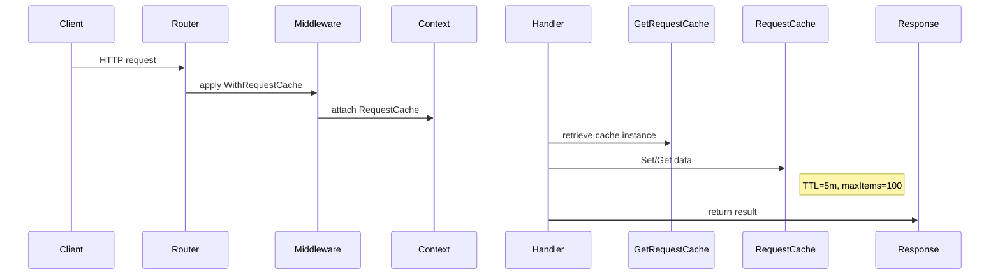

# 21.2 Request cache: purpose, lifecycle, and test coverage

The **Request cache** domain provides a lightweight, in-memory cache scoped to the lifetime of a single HTTP request. It supports storing arbitrary key/value pairs with a time-to-live and automatic eviction when the cache grows too large.

---

## Purpose of the Request cache

- Store data computed or fetched once per request
- Avoid repeated calls to external services during a single request
- Improve performance by caching intermediate results

---

## Middleware injection into each request

The cache is created at the very start of every incoming HTTP request and attached to the request’s `context.Context`. This happens in `api.LoadAPI()` via a small inline middleware:

```go
r.Route("/", func(r chi.Router) {
  r.Use(func(next http.Handler) http.Handler {
    return http.HandlerFunc(func(w http.ResponseWriter, r *http.Request) {
      ctx := requestcache.WithRequestCache(r.Context())
      next.ServeHTTP(w, r.WithContext(ctx))
    })
  })
  // ... mount /api/v1 routes ...
})
```

This ensures **every handler** under `/api/v1/` can retrieve the same `RequestCache` instance for its context .

---

## Core types and functions

### RequestCache

A thread-safe map with per-item expiration:

| Field | Type | Description |
| --- | --- | --- |
| `data` | `map[any]CacheItem` | Stores items by arbitrary key |
| `mutex` | `sync.RWMutex` | Protects concurrent access |


### CacheItem

Encapsulates a value plus its expiration time:

```go
type CacheItem struct {
  Value     any
  ExpiresAt time.Time
}
```

### Set(key, value)

Stores a value with a **fixed TTL** of 5 minutes.

- Initializes `data` map if `nil`
- Adds `CacheItem{Value, time.Now().Add(ttl)}`
- If `len(data) > maxCacheSize` (100), calls `purgeOldest`

```go
func (rc *RequestCache) Set(key any, value any) {
  rc.mutex.Lock(); defer rc.mutex.Unlock()
  if rc.data == nil {
    rc.data = make(map[any]CacheItem)
  }
  rc.data[key] = CacheItem{Value: value, ExpiresAt: time.Now().Add(ttl)}
  if len(rc.data) > maxCacheSize {
    rc.purgeOldest()
  }
}
```

### Get(key)

Retrieves a value if it exists **and** has not expired:

```go
func (rc *RequestCache) Get(key any) (any, bool) {
  rc.mutex.RLock(); defer rc.mutex.RUnlock()
  if rc.data == nil {
    return nil, false
  }
  item, exists := rc.data[key]
  if !exists || time.Now().After(item.ExpiresAt) {
    return nil, false
  }
  return item.Value, true
}
```

### purgeOldest()

Evicts items in two phases **(must be called with write lock)**:

1. Remove all **expired** items
2. While cache still exceeds `maxCacheSize`, remove the item with the **earliest** `ExpiresAt` timestamp

---

## Lifecycle of the Request cache

1. **Creation**
2. Attached to `context.Context` in middleware via `WithRequestCache`
3. **Usage**
4. Handlers call `GetRequestCache(ctx)` to retrieve the instance
5. Any part of the code (services, utils) may do `Set`/`Get` to cache per-request data
6. **Eviction**
7. Individual entries expire after **5 minutes** (TTL)
8. When the total entries exceed **100**, `purgeOldest` runs automatically
9. **Destruction**
10. When the request completes, the context (and cache) is discarded, freeing memory

```go
// Should be called in middleware.
func WithRequestCache(ctx context.Context) context.Context {
  if _, ok := ctx.Value(requestCacheKey).(*RequestCache); ok {
    return ctx
  }
  return context.WithValue(ctx, requestCacheKey, &RequestCache{})
}

func GetRequestCache(ctx context.Context) *RequestCache {
  if cache, ok := ctx.Value(requestCacheKey).(*RequestCache); ok {
    return cache
  }
  return nil
}
```

---

## Extending safely

- Always retrieve the cache via `GetRequestCache(ctx)` and check for `nil`
- Store only lightweight data; large blobs may exhaust memory
- Avoid unbounded growth: rely on TTL and `maxCacheSize` to constrain size
- New helper functions can wrap `Set`/`Get` without changing core behavior

---

## Sequence of cache usage



---

## Test coverage overview

The suite in `internal/requestcache/request_cache_test.go` exercises all core behaviors :

| Test Name | Focus |
| --- | --- |
| **TestRequestCache_SetAndGet** | Storing and retrieving string, integer, struct, and `nil` values |
| **TestRequestCache_GetNonExistent** | `Get` on missing key returns `(nil, false)` |
| **TestRequestCache_Overwrite** | `Set` twice on same key yields latest value |
| **TestRequestCache_ConcurrentAccess** | Safe concurrent `Set` and `Get` across 100 goroutines |
| **TestRequestCache_TTLExpiration** | Expired item (ExpiresAt in past) is not returned |
| **TestWithRequestCache** | `WithRequestCache` and `GetRequestCache` properly attach and retrieve a cache instance |
| **TestGetRequestCache_NoCache** | `GetRequestCache` returns `nil` when no cache in context |
| **TestGetRequestCache_WrongType** | `GetRequestCache` returns `nil` if context value under key is not a `*RequestCache` |
| **TestRequestCache_MultipleContexts** | Different contexts produce isolated cache instances |
| **TestContextKeys_HaveDifferentValues** | Demonstrates Go’s map key equality for empty-struct keys and overwrite semantics |


This comprehensive coverage ensures the Request cache behaves correctly under normal, concurrent, and edge-case scenarios.