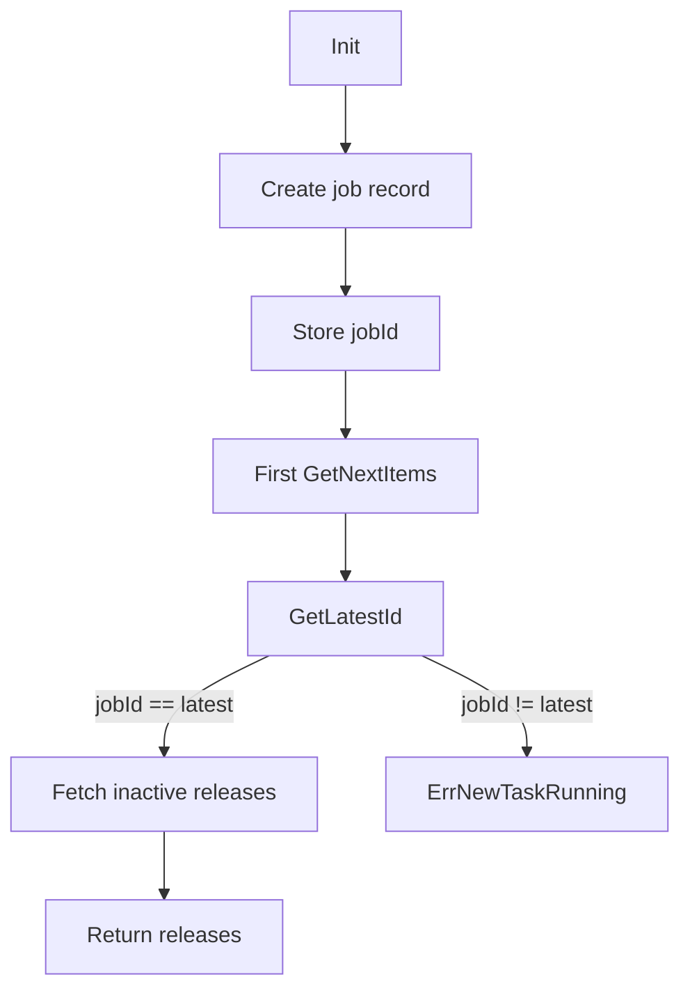

# 22. Auto-Undeploy and WebApp Undeployer

## 22.1 Auto-undeploy Service Behavior and Job Persistence

This section describes the **Auto-Undeploy** domain, covering how the service schedules undeploy jobs for inactive releases, persists job metadata, and prevents overlapping runs.

---

### 22.1.1 Service Overview

The **AutoUndeployService** orchestrates the automatic cleanup of inactive Choreo app releases. It:

- Determines which organizations to skip (paid or whitelisted).
- Uses a paginated, batched workflow to fetch inactive releases.
- Undeploys each release in parallel, recording success and error counts.
- Supports both synchronous and asynchronous invocations.

This service plugs into scheduled tasks for continuous day-2 operations.

---

### 22.1.2 ReleaseUndeployParams ⚙️

The `ReleaseUndeployParams` struct configures each run’s behavior, with sensible defaults applied via `setDefaults()`.

| Field | Type | Default | Description |
| --- | --- | --- | --- |
| **Hours** | int64 |  | Maximum age in hours before a release is considered inactive. |
| **ExcludedOrgIds** | []common.ChoreoOrgID |  | Organizations to always skip. |
| **Timeout** | time.Duration | 1 hour | Overall deadline for the undeploy process. |
| **Interval** | time.Duration | 10 seconds | Pause between batch fetches. |
| **BatchSize** | int | 20 | Number of releases fetched per batch. |
| **ParallelUndeployCount** | int | 5 | Maximum concurrent undeploy goroutines. |


```go
type ReleaseUndeployParams struct {
    Hours                 int64
    ExcludedOrgIds        []common.ChoreoOrgID
    Timeout               time.Duration
    Interval              time.Duration
    BatchSize             int
    ParallelUndeployCount int
}
```

---

### 22.1.3 AutoUndeployService Workflow

1. **Construction**

`NewAutoUndeployService(clientSet, releaseSvc, appEnvSvc)` returns a configured service instance.

1. **Entry Point**

`UndeployInactiveReleases(ctx, params, runSync)`

- Calls `setDefaults()` on `params`.
- Runs `undeployInactiveReleases` synchronously or in a goroutine.

1. **Core Loop** (`undeployInactiveReleases`)
2. Calculate cutoff time: `time.Now().Add(-Hours)`.
3. Fetch excluded org map via subscription client.
4. Initialize `InactiveReleaseGetterImpl2`.
5. Repeatedly call `GetNextItems` to fetch batches.
6. For each batch, spawn `ParallelUndeployCount` goroutines to call `undeployInactiveRelease`.
7. Wait for all to complete, logging total successes and failures.

1. **Release Undeploy**
2. Retrieve `AppEnvironment` by ID.
3. Skip if already undeployed.
4. Find default container image.
5. Invoke `releaseService.UndeployRelease`.

```go
func (svc *AutoUndeployService) UndeployInactiveReleases(
    ctx context.Context, params ReleaseUndeployParams, runSync bool,
) (*InactiveReleaseUndeployResponse, error) {
    params.setDefaults()
    if runSync {
        svc.undeployInactiveReleases(ctx, params)
    } else {
        go svc.undeployInactiveReleases(ctx, params)
    }
    return &InactiveReleaseUndeployResponse{}, nil
}
```

---

### 22.1.4 InactiveReleaseGetterImpl2 & Job Persistence

The **InactiveReleaseGetterImpl2** component coordinates job persistence in the `auto_undeploy_jobs` table, preventing concurrent runs.

```go
type inactiveReleaseGetterImpl2 struct {
    params        Params
    lastReleaseId common.UniqueIdentifier
    jobId         int
    repository    *jobrespository.JobRepository
}
```

#### Responsibilities

- **Init**
- Stores `params`.
- Inserts a new job record via `JobRepository.CreateNew` (type `"auto_undeploy"`).
- Captures the returned `job.Id` for this run.

- **GetNextItems**
- Calls `GetLatestId`; if it doesn’t match `r.jobId`, returns `ErrNewTaskRunning`.
- Otherwise queries `AppEnvRepository.FindInactiveReleases` with pagination.
- If no more items, returns `ErrNoNewItems`.
- Updates `lastReleaseId` for the next offset and filters out excluded orgs.

#### Task-Conflict Flowchart



---

### 22.1.5 Database Evolution for Job Persistence

The `auto_undeploy_jobs` table was introduced in migration **0.0.123**, capturing each run’s identity and timestamp.

```go
type AutoUndeployJob struct {
    Id        int16     `gorm:"primary_key;autoIncrement;not null"`
    CreatedAt time.Time `gorm:"type:datetime;not null;default:current_timestamp"`
}

func init() {
    RegisterMigration(gormigrate.Migration{
        ID: "0.0.123",
        Migrate: func(db *gorm.DB) error {
            return db.AutoMigrate(&AutoUndeployJob{})
        },
    })
}
```

#### Table Schema

| Column | Type | Constraints |
| --- | --- | --- |
| **id** | int identity(1) | Primary Key, Clustered Unique Index |
| **created_at** | datetime | Not null, Default `getdate()` |


```erDiagram
auto_undeploy_jobs {
  int id PK "identity, clustered"
  datetime created_at "default getdate()"
  string type "job type (e.g., auto_undeploy)"
}
```

> **Card** { "title": "Single Run Guard", "content": "Active runs are tracked via job IDs; stale runs abort early." }

---

This detailed view shows how the Auto-Undeploy domain manages scheduled undeploy actions, enforces single-task execution through job persistence, and cleans up inactive app releases in a fault-tolerant, batched manner.