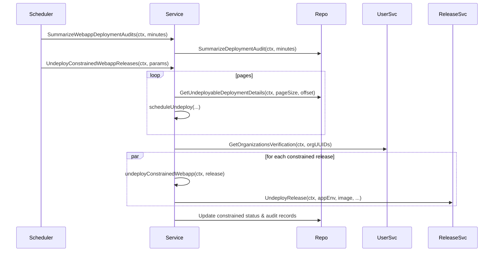

## 22.2 Webapp Undeploy Service and Scheduled Task Integration

This section describes how Rudder’s **WebAppUndeployer** domain automatically identifies and undeploys webapp releases that exceed configured deployment hour limits. It covers the core `webappundeployer.Service` implementation and its integration with a scheduled task in the HTTP handler layer.

---

### 22.2.1 WebAppUndeployer Service 🚀

The `webappundeployer.Service` encapsulates all logic to:

- Summarize recent webapp deployment audits
- Determine which releases violate deployment-hour constraints
- Perform parallel undeploy operations
- Update both the deployment audit records and each organization’s constrained status

#### Key Types

| Type | Responsibility |
| --- | --- |
| **Service** | Holds `clientset` and `releaseService` dependencies |
| **ReleaseUndeployParams** | Configuration for an undeploy run (hours, pagination, concurrency) |
| **OrganizationWebappConstrainedStatus** | Payload for constrained-status HTTP responses |
| **Result**, **Counts** | Thread-safe counters and maps to record undeploy outcomes per organization and audit ID |


```go
type ReleaseUndeployParams struct {
  Hours                   int64                `json:"hours"`
  ExcludedOrgIds          []common.ChoreoOrgID `json:"excluded_org_ids"`
  Timeout                 time.Duration
  Interval                time.Duration
  BatchSize               int
  ParallelUndeployCount   int
}

func (r *ReleaseUndeployParams) setDefaults() {
  if r.Timeout == 0 { r.Timeout = time.Hour }
  if r.Interval == 0 { r.Interval = 10 * time.Second }
  if r.BatchSize == 0 { r.BatchSize = 20 }
  if r.ParallelUndeployCount == 0 { r.ParallelUndeployCount = 5 }
}
```

---

#### SummarizeWebappDeploymentAudits

Logs the request and delegates to the repository to aggregate deployment audit data older than the configured limit:

```go
func (svc *Service) SummarizeWebappDeploymentAudits(
  ctx context.Context,
  deploymentLimitInMinutes int32,
) error {
  logctx.From(ctx).Infof("Request to summarize webapp deployment audits")
  return app.DeploymentAuditRepository.SummarizeDeploymentAudit(
    ctx, deploymentLimitInMinutes,
  )
}
```

---

#### GetWebappConstrainedStatusForOrganization

Fetches whether a given organization is currently marked as constrained:

```go
func (svc *Service) GetWebappConstrainedStatusForOrganization(
  ctx context.Context,
  orgUuid string,
) (OrganizationWebappConstrainedStatus, error) {
  status := OrganizationWebappConstrainedStatus{OrgUuid: orgUuid}
  isConstrained, err := app.CumulativeDeploymentTimeRepo.GetConstrainedStatus(ctx, orgUuid)
  if err != nil {
    return status, common.PossibleNotFoundError(
      err, "webapp constrained status not found",
    )
  }
  status.IsConstrained = isConstrained
  return status, nil
}
```

---

#### UndeployConstrainedWebappReleases

Coordinates a full undeploy run:

- Applies defaults
- Times out after `params.Timeout`
- Paginates through `GetUndeployableDeploymentDetails` in batches of `BatchSize`
- Calls `scheduleUndeploy` for each page of releases
- Invokes `processUndeploymentResult` to persist outcomes

```go
func (svc *Service) UndeployConstrainedWebappReleases(
  ctx context.Context,
  params ReleaseUndeployParams,
) {
  params.setDefaults()
  ctx, cancel := context.WithTimeout(ctx, params.Timeout)
  defer cancel()

  resultSet := NewResult()
  pageSize, offset := 10, 0

  for {
    if ctx.Err() != nil { break }
    releases, err := app.DeploymentAuditRepository.
      GetUndeployableDeploymentDetails(ctx, pageSize, offset)
    if err != nil { return }
    svc.scheduleUndeploy(ctx, releases, params, resultSet)
    if len(releases) < pageSize { break }
    offset += pageSize
  }

  svc.processUndeploymentResult(ctx, resultSet)
}
```

---

#### scheduleUndeploy

For each page of `releasesList`:

1. Build a slice of organization UUIDs
2. Fetch verification status via `UserSvcClient().GetOrganizationsVerification`
3. For each release with a **NON-VERIFIED** status, spawn a goroutine to call `undeployConstrainedWebapp`
4. Record success or failure in the shared `Result`

```go
func (svc *Service) scheduleUndeploy(
  ctx context.Context,
  releasesList []*app.DeploymentAudit,
  params ReleaseUndeployParams,
  resultSet *Result,
) {
  // 1. Extract org UUIDs
  // 2. metadata.AppendToOutgoingContext for system identity
  res, _ := svc.clientset.UserSvcClient().
    GetOrganizationsVerification(ctx, &app_service.GetOrganizationsVerificationRequest{
      OrganizationUuidList: orgUUIDs,
    })

  // 3. Parallel undeploy for NON-VERIFIED orgs
  for _, rel := range releasesList {
    g.Go(func() error {
      if res.OrganizationsVerification[rel.OrgUuid].GetStatus() == "NON-VERIFIED" {
        err := svc.undeployConstrainedWebapp(ctx, *rel)
        resultSet.Write(rel.OrgUuid, rel.ID, err == nil)
      }
      return nil
    })
  }
  g.Wait()
}
```

---

#### undeployConstrainedWebapp

Runs the actual undeploy logic:

1. Load `AppEnvironment` and check if already undeployed
2. Resolve the default container and its `Image`
3. Delegate to `releaseService.UndeployRelease` with a descriptive message

```go
func (svc *Service) undeployConstrainedWebapp(
  ctx context.Context,
  release app.DeploymentAudit,
) error {
  appEnv, err := app.AppEnvRepository.GetAppEnvById(
    ctx, release.AppEnvId,
    app.PreloadContainerAndImages,
    app.PreloadApp,
  )
  if appEnv.IsUndeployed() { return nil }

  container, _ := app.GetDefaultContainer(appEnv, appEnv.App)
  image := container.Image
  _, err = svc.releaseService.UndeployRelease(
    ctx, appEnv, image, appEnv.App,
    "Undeployed due to deployment hour constraint",
    choreoapp.UndeployReleaseOpts{},
  )
  return err
}
```

---

#### processUndeploymentResult

After all undeploy tasks complete, this method:

- Logs per-organization success and error counts
- If an organization has zero errors, updates its **constrained** flag via `CumulativeDeploymentTimeRepo`
- Marks each release audit record as `UNDEPLOYED` on success

```go
func (svc *Service) processUndeploymentResult(
  ctx context.Context,
  result *Result,
) {
  for orgUUID, counts := range result.CountsMap {
    if counts.ErrCount == 0 {
      app.CumulativeDeploymentTimeRepo.UpdateOrganizationConstrainedStatus(
        ctx, orgUUID, true,
      )
    }
    for auditID, ok := range counts.UndeploymentMap {
      if ok {
        app.DeploymentAuditRepository.UpdateDeploymentStatusByID(
          ctx, auditID, "UNDEPLOYED",
        )
      }
    }
  }
}
```

---

### 22.2.2 Scheduled Task Integration ⏰

The `scheduledWebappUndeployTask` in `handlers/webapp_undeploy_scheduled_task.go` wires the service into Rudder’s task runner.

```go
type scheduledWebappUndeployTask struct{}

func NewWebappUndeployTask() *scheduledWebappUndeployTask {
  return &scheduledWebappUndeployTask{}
}

func (s *scheduledWebappUndeployTask) Start() {
  cfg := config.GetConfig().WebappAutoUndeploy
  excludedOrgs, err := cfg.GetExcludedOrgIds()
  if err != nil {
    logrus.WithError(err).
      Error("webapp-auto-undeploy [excludedOrgs] invalid; disabling process")
    return
  }

  logrus.WithField("config", cfg).
    Info("Starting webapp-auto-undeploy task")
  defer logctx.RecoverAndLog()

  ctx, cancel := context.WithCancel(context.Background())
  defer cancel()

  // Correlation ID for tracing
  formattedDate := time.Now().Format("20060102")
  corrID := fmt.Sprintf("webapp-auto-undeploy-%s-%s",
    formattedDate, common.NewUUID(),
  )
  ctx = context.WithValue(ctx, middleware.RequestIDKey, corrID)

  // 1. Aggregate audits
  if err := webappUndeployService.
    SummarizeWebappDeploymentAudits(ctx, cfg.GetDeploymentLimitInMinutes()); err != nil {
    return
  }
  // 2. Run undeploy pass
  webappUndeployService.UndeployConstrainedWebappReleases(
    ctx,
    choreowebappundeploy.ReleaseUndeployParams{
      ExcludedOrgIds: excludedOrgs,
    },
  )
}
```

---

### 22.2.3 HTTP Endpoint: Organization Constrained Status

Rudder exposes a **GET** endpoint to fetch an organization’s current webapp deployment constraint status:

```go
func OrganizationWebappDeploymentHourStatus(
  w http.ResponseWriter, r *http.Request,
) {
  orgId, err := common.UUIDFromString(chi.URLParam(r, "uuid"))
  if err != nil {
    RespondWithError(w, r, 400, err)
    return
  }

  status, err := webappUndeployService.
    GetWebappConstrainedStatusForOrganization(r.Context(), orgId.String())
  if err != nil {
    RespondWithError(w, r, 500, err)
    return
  }
  RespondwithJSON(w, 200, status)
}
```

---

### Sequence Diagram



This diagram highlights the interplay between the scheduled task, the undeployer service, data repositories, and external control-plane clients.

---

Through this integration, Rudder ensures that web applications run only within allowed windows and are automatically suspended when constraints are violated, offloading operators from manual cleanup and maintaining operational governance.