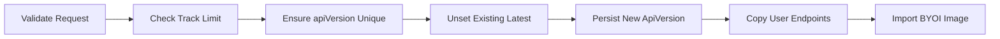

# 23. Deployment Tracks (DeploymentTrack Domain)

Deployment tracks encapsulate the lifecycle of a component’s API versions. Each track represents a branch-specific stream of releases, isolating builds, deployments, and rollback operations. The **DeploymentTrack** domain comprises request/response types, a controller interface with implementations in `choreo/bundles/app/deploymenttrack/controller.go`, helper functions, and HTTP handlers in `choreo/handlers/deployment_tracks.go`.

## 23.1 Deployment track controller/types and how tracks influence releases

This section covers:

- Core request/response **types**
- The **Controller** methods and their responsibilities
- How tracks enforce **uniqueness** and tie into **release management**
- HTTP **handlers** and route wiring

---

### ✏️ Request/Response Types

| Type | Fields (JSON) | Purpose |
| --- | --- | --- |
| **CreateDeploymentTrackRequest** | `id`, `apiVersion`, `branch`, `description`, `auto_deploy_enabled` | Create a new track; validate semver and branch. |
| **UpdateDeploymentTrackRequest** | `branch?`, `description?`, `auto_deploy_enabled?` | Modify track metadata. |
| **DeployDeploymentTrackRequest** | `image_id`, `environment_id`, `api_settings?`, `deployment_pipeline_id?`, `release_mgt_release_id?`, `release_mgt_deployment_id?` | Trigger a deploy into an environment. |
| **RollBackDeploymentTrackRequest** | same as `DeployDeploymentTrackRequest` | Roll back to a previous image in a track. |
| **SaveDeploymentTrackImageRequest** | `organization_id`, `project_id`, `component_id`, `deployment_track_id`, `images`, `registry_token`, `git_hash`, `git_hash_commit_timestamp`, `gitops_hash`, `run_id`, `environment_id?`, `api_definition_path?`, `image_ports?` | Persist build artifacts before deployment. |
| **GetMigratedSrcConfigContentRequest** | `component_id`, `deployment_track_id`, `commit_hash` | Fetch legacy config for migration. |
| **GetMigratedSrcConfigContentResponse** | `file_content`, `file_name`, `migrated_from` | Response payload for migrated config. |
| **DeploymentTrack** | wraps `app.ChoreoApiVersion` | Represents a persisted track. |
| **DeploymentTrackImage** | `image_id`, `created_at`, `updated_at`, `built_at`, `status`, `author`, `commit_msg`, `commit_hash`, `run_id` | Enriched build metadata per track. |


```go
type DeploymentTrack struct {
    app.ChoreoApiVersion
}

type DeploymentTrackImage struct {
    ImageId       common.UniqueIdentifier `json:"image_id"`
    CreatedAt     time.Time                `json:"created_at"`
    UpdatedAt     time.Time                `json:"updated_at"`
    BuiltAt       time.Time                `json:"built_at"`
    Status        string                   `json:"status"`
    Author        Author                   `json:"author"`
    CommitMessage string                   `json:"commit_msg"`
    CommitHash    string                   `json:"commit_hash"`
    RunId         string                   `json:"run_id"`
}
```

---

### 🚀 Controller Methods

The `Controller` interface (in `controller.go`) defines methods for managing tracks:

```go
type Controller interface {
    CreateDeploymentTrack(...)
    ListDeploymentTracks(...)
    UpdateDeploymentTrack(...)
    DeleteDeploymentTrack(...)
    GetDeploymentTrackImages(...)
    DeployDeploymentTrack(...)
    RollBackDeploymentTrack(...)
    UpdateDeploymentTrackConfigs(...)
    SaveDeploymentTrackImage(...)
    ApplyComponentConfig(...)
    GetMigratedSrcConfigContent(...)
}
```

#### CreateDeploymentTrack

1. **Validate & Defaults**:
2. Ensures `apiVersion` matches `v<major>.<minor>` (MajorMinor strategy)
3. Enforces free-tier limit of 2 tracks; paid orgs unlimited
4. **Uniqueness Check**:
5. Rejects duplicate versions via `GetApiVersionObjByVersion`
6. **Branch Decoding**:
7. URL-decodes branch names (slashes/spaces)
8. **Reset “latest” Flag**:
9. Unsets existing latest track; marks new one as latest
10. **Copy Endpoints**:
11. Clones user-provided endpoints from previous latest track
12. **Persist**:
13. Transactionally saves new `app.ChoreoApiVersion`
14. **BYOI Image Import** (if applicable)



#### ListDeploymentTracks

Fetches all API versions for a component and wraps them as `DeploymentTrack` instances  .

#### UpdateDeploymentTrack

- Decodes and applies mutable fields (`branch`, `description`, `autoDeployEnabled`)
- Persists via `UpdateApiVersionMutableFieldsById`

#### DeleteDeploymentTrack

- Ensures at least two tracks remain
- Cleans up gateway configs, key sets, external resources via `ComponentResourceDeleter`
- Deletes from database

#### GetDeploymentTrackImages

1. **List Images**:
2. Queries `ImageRepository.ListImagesByApiVersionId`
3. Migrates unversioned builds via `UpdateAndListImagesByImageRegistryWithNoVersion`
4. **Enrich Metadata**:
5. Fills missing CI/CD fields (`run_id`, `built_at`) via `cicdSvc.GetBuildStatusByDeploymentTrack`
6. Adds commit author/message via `cicdSvc.GetCommitHistory`
7. **Map to **`**DeploymentTrackImage**`

#### DeployDeploymentTrack

- Determines target environment (pipeline vs explicit ID)
- For non-mediation:
- Creates release & deployment in release-management
- Invokes `deployDeploymentTrackImageToEnvironment`
- Updates release-management status on success/failure

#### RollBackDeploymentTrack

- Validates request
- Calls `deployDeploymentTrackImageToEnvironment` with rollback flag
- Updates release-management status post-rollback

#### SaveDeploymentTrackImage

- Converts CD request into `SaveDeploymentTrackImageRequest`
- Persists images in `continuous_delivery.ImageRepository`
- Triggers `CreateRelease` and `DeployRelease` in release-management
- Delegates to `DeployDeploymentTrack` for actual deployment

---

### 🔗 How Tracks Influence Releases

- **Isolation**: Each track (branch) carries its own deployment history and CI/CD artifacts.
- **Version Strategy**: Tracks enforce **Major.Minor** only versioning, preventing arbitrary semver patches .
- **Uniqueness Constraint**: Duplicate API versions per component are rejected at creation.
- **Release Management Integration**:
- Deploy operations create and manage release objects in the release-management service.
- Rollbacks update deployment statuses downstream.
- **Subscription Limits**: Free-tier orgs limited to two concurrent tracks, guarding resource usage.

---

### 🛣️ HTTP Handlers & Routes

The handlers in `choreo/handlers/deployment_tracks.go` wire HTTP routes to controller methods via [chi](https://github.com/go-chi/chi):

```go
func ChoreoDeploymentTrackCreate(w, r) { ... }      // POST   /components/{componentId}/deployment_tracks  
func ChoreoDeploymentTrackList(w, r) { ... }        // GET    /components/{componentId}/deployment_tracks
func ChoreoDeploymentTrackUpdate(w, r) { ... }      // PUT    /components/{componentId}/deployment_tracks/{deploymentTrackId}
func ChoreoDeploymentTrackDeploy(w, r) { ... }      // POST   /components/{componentId}/deployment_tracks/{deploymentTrackId}/deploy
func ChoreoDeploymentTrackRollBack(w, r) { ... }    // POST   /components/{componentId}/deployment_tracks/{deploymentTrackId}/rollback
func ChoreoDeploymentTrackDelete(w, r) { ... }      // DELETE /components/{componentId}/deployment_tracks/{deploymentTrackId}
```

Each handler parses path and body parameters, delegates to the corresponding controller method, and responds with JSON or error codes.

---

This completes the detailed overview of the **DeploymentTrack** domain’s types, controller logic, and release-tie-ins within Rudder’s Choreo data-plane service.