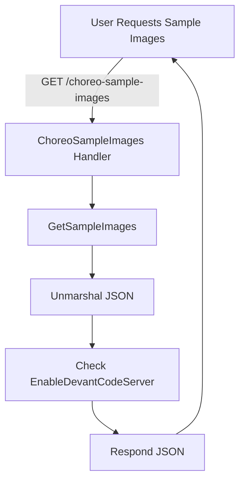

# 24. BYOI/BYOC and Sample Images (BYOI Domain)

This section covers the **Bring Your Own Image (BYOI)** domain in Rudder’s Choreo data-plane, focusing on how **sample images** are defined, served via an API, and consumed during BYOI component creation and deployment flows.

## 24.1 BYOI sample images and how they’re served/consumed

BYOI sample images provide a curated list of container images that users can instantly deploy or validate against. Rudder embeds a JSON manifest of these images, exposes them through an HTTP endpoint, and integrates them into component creation and deploy flows.

### 📦 `sample_images.go`

This file lives under `choreo/bundles/app/byoi/sample_images.go` and:

- Embeds `sample_images.json` at compile time.
- Defines Go types to model the JSON.
- Implements `GetSampleImages` to unmarshal the data and optionally append a dev-tag for the **Devant Code Server** image when enabled.

```go
//go:embed sample_images.json
var sampleImages []byte

type SampleImages struct {
  Images []SampleImage `json:"images"`
}

type SampleImage struct {
  Name        string `json:"name"`
  Description string `json:"description"`
  ImageUrl    string `json:"image_url"`
  Type        string `json:"type"`
  ReadmeUrl   string `json:"readme_url"`
  IsTemporary bool   `json:"is_temporary"`
}

const DevantEditorImgName = "Code Server"

func GetSampleImages(ctx context.Context) (SampleImages, error) {
  var data SampleImages
  if err := json.Unmarshal(sampleImages, &data); err != nil {
    return SampleImages{}, err
  }
  // Append user-configured tag to Code Server image if feature enabled
  if config.GetConfig().FeatureFlags.EnableDevantCodeServer {
    for i, img := range data.Images {
      if img.Name == DevantEditorImgName {
        data.Images[i].ImageUrl = img.ImageUrl + ":" + config.GetConfig().DevantEditorTag
        break
      }
    }
  }
  return data, nil
}
```

()

### 🔍 `sample_images.json`

Defines the actual list of sample images. Each entry has:

| Field | Type | Description |
| --- | --- | --- |
| **name** | string | Human-readable identifier |
| **description** | string | Short explanation of the image |
| **image_url** | string | Fully qualified registry URL with tag |
| **type** | string | Category (e.g. microservices, WebApp) |
| **readme_url** | string | Link to documentation or quick-start guide |
| **is_temporary** | bool | Indicates one-off or demo images |


```json
{
  "images": [
    {
      "name": "Pet Store",
      "description": "Choreo Pet Store Sample to manage pet information",
      "image_url": "choreoanonymouspullable.azurecr.io/pet-store:v0.9",
      "type": "microservices",
      "readme_url": "https://github.com/wso2/choreo-sample-apps/blob/main/byoi-components/services/pet-store/docs/openapi.yaml"
    },
    {
      "name": "Angular SPA",
      "description": "Choreo Angular SPA Sample",
      "image_url": "choreoanonymouspullable.azurecr.io/angular-spa:v0.9",
      "type": "WebApp",
      "readme_url": "https://github.com/wso2/choreo-sample-apps/tree/main/byoi-components/web-apps/angular-spa#use-the-following-commands-to-create-byoi-component"
    },
    // … additional entries …
  ]
}
```

()

### 🚀 HTTP API: List Sample Images

#### GET /api/v1/choreo-sample-images

Retrieves the full list of BYOI sample images.

```api
{
    "title": "Get Sample Images",
    "description": "Fetch the curated list of BYOI sample images available for deployment",
    "method": "GET",
    "baseUrl": "https://api.example.com",
    "endpoint": "/api/v1/choreo-sample-images",
    "headers": [
        {
            "key": "organization_id",
            "value": "<org UUID>",
            "required": true
        },
        {
            "key": "project_id",
            "value": "<project UUID>",
            "required": true
        }
    ],
    "queryParams": [],
    "pathParams": [],
    "bodyType": "none",
    "requestBody": "",
    "formData": [],
    "rawBody": "",
    "responses": {
        "200": {
            "description": "List of sample images",
            "body": "{\n  \"data\": {\n    \"images\": [ /* SampleImage[] */ ]\n  }\n}"
        }
    }
}
```

()

### 🔄 Serving & Consumption Flow



- **Handler** routes incoming requests and invokes `GetSampleImages`.
- **GetSampleImages** reads the embedded JSON, applies any tag override, and returns the structured data.
- JSON is returned with HTTP 200 and content-type `application/json`.

### 🔗 Integration in BYOI Component Flows

When users **create** or **deploy** BYOI components, Rudder validates image URLs against the sample list:

- **Component creation** uses `validateCDPImageURL`, which allows any URL present in the sample manifest or matching known sample registries.
- **Deploy requests** via `makeByoiImageUrlFromDeployRequest` ensure the provided URL belongs to the selected registry; sample images bypass this if validated.

```go
func validateCDPImageURL(ctx context.Context, imageUrl string) bool {
  samples, err := byoi.GetSampleImages(ctx)
  if err != nil {
    return false
  }
  for _, img := range samples.Images {
    if img.ImageUrl == imageUrl {
      return true
    }
  }
  // allow quick-deploy prefixes
  return strings.HasPrefix(imageUrl, common.CHOREO_SAMPLE_IMAGE_REPOSITORY) ||
         strings.HasPrefix(imageUrl, common.CHOREO_MCP_IMAGE_REPOSITORY)
}
```

()

### 🎯 BYOI Image Registry Handling & Deploy

Once validated, BYOI images enter the **continuous_delivery** pipeline:

1. **MakeByoiImageForCollection** extracts image name and tag, attaches registry metadata, and builds an `Image` model.
2. **ProcessByoiImageForCollection** persists the new image record under the component’s image registry.

This ensures BYOI images are tracked, versioned, and available for rollout across environments just like build-generated images.

---

Through this domain, Rudder delivers a seamless experience: users browse sample images, select or bring their own, and deploy containers with consistent validation and registry management.