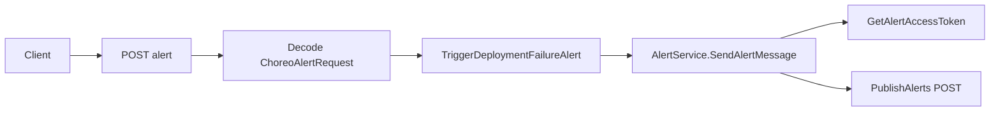

# 25. Alerts and Autodeploy (Alert-Service Domain)

This section covers how Rudder exposes an HTTP endpoint to receive deployment-failure alerts and how it integrates with the external Alert Service. It explains the route definition, the handler logic, the client interface, data models, mocks, and reliability considerations.

## 25.1 Alerts endpoints and alert-service integration

Rudder defines a single POST `/alert` endpoint. Incoming requests carry a `ChoreoAlertRequest` payload. The request is decoded, forwarded to the core controller, and then sent to the external notification-service. Below we document each piece.

### Alerts Routes

The Chi router registers one endpoint in `choreo/routes/alerts.go`:

```go
func AlertsRoutes(r chi.Router) {
	r.Post("/alert", NewHandler(handlers.TriggerNewDeployFailureAlert, "DEPLOY_FAILURE_ALERT"))
}
```

- **Path**: `/alert`
- **Method**: POST
- **Handler**: `TriggerNewDeployFailureAlert`
- **Middleware**: correlation ID injection via `NewHandler`

### POST /alert

```api
{
    "title": "Trigger Deployment Failure Alert",
    "description": "Receive a deployment failure alert and forward to Alert Service",
    "method": "POST",
    "baseUrl": "https://<rudder-host>",
    "endpoint": "/alert",
    "headers": [
        {
            "key": "Content-Type",
            "value": "application/json",
            "required": true
        }
    ],
    "queryParams": [],
    "pathParams": [],
    "bodyType": "json",
    "requestBody": "{\n  \"app_id\": \"<uuid>\",\n  \"environment_id\": \"<uuid>\",\n  \"api_version_id\": \"<uuid>\",\n  \"commitId\": \"<sha>\",\n  \"runId\": 123,\n  \"failureReason\": 1\n}",
    "formData": [],
    "rawBody": "",
    "responses": {
        "200": {
            "description": "Alert forwarded successfully",
            "body": "\"<success message>\""
        },
        "400": {
            "description": "Bad Request"
        },
        "500": {
            "description": "Internal Server Error"
        }
    }
}
```

### TriggerNewDeployFailureAlert Handler

Located in `choreo/handlers/alerts.go`, this function:

- Decodes a `ChoreoAlertRequest` from the body
- Calls `ChoreoAppController.TriggerDeploymentFailureAlert(...)`
- Responds with the alert service’s message or an error

```go
func TriggerNewDeployFailureAlert(w http.ResponseWriter, r *http.Request) {
    body := choreoapp.ChoreoAlertRequest{}
    if err := json.NewDecoder(r.Body).Decode(&body); err != nil {
        RespondWithError(w, r, 400, err)
        return
    }
    alertPublishResponse, err := ChoreoAppController.TriggerDeploymentFailureAlert(
        r.Context(),
        body.AppID, body.APIVersionId,
        body.EnvironmentID, body.CommitId,
        body.RunId, body.FailureReason,
    )
    if err != nil {
        RespondWithError(w, r, 500, err)
        return
    }
    RespondwithJSON(w, 200, alertPublishResponse.AlertPublishResponse.Message)
}
```

- **Error handling**: returns 400 on JSON errors, 500 on controller or service failures

### External Alert-Service Client

The `alert_service` package implements a pluggable client to the Choreo notification‐service.

```go
const (
    tokenEndpoint         = "/oauth2/token"
    alertPublisherBasePath = "/notification-service/1.0.0"
    alertApiUrlPath       = "/publishAlerts"
    correlationHeader     = "activityid"
)

//go:generate moq -rm -out alert_service_mock.go . AlertService
type AlertService interface {
    GetAlertAccessToken(ctx context.Context) (string, error)
    SendAlertMessage(ctx context.Context, alertPublish AlertPublishRequest) (*AlertPublishStatusResponse, error)
}

type alertService struct {
    httpClient *http.Client
}

func NewAlertService(httpClient *http.Client) AlertService {
    return &alertService{httpClient: httpClient}
}
```

#### GetAlertAccessToken

1. Encodes `client_id:client_secret` as Basic auth.
2. POSTs `grant_type=client_credentials` to `<ChoreoSTEndpoint>/oauth2/token`.
3. Parses `access_token` from JSON `AlertTokenResponse`.

#### SendAlertMessage

1. Encodes `AlertPublishRequest` to JSON.
2. POSTs to `<ChoreoAlertUrl>/notification-service/1.0.0/publishAlerts`.
3. Sets headers:
4. `Authorization: Bearer <token>`
5. `Content-Type: application/json`
6. `activityid: <correlation-id>`
7. Parses `AlertPublishResponse`, wraps in `AlertPublishStatusResponse`



### Data Models

All models live in `external-services/alert-service/types.go`.

| Struct | JSON Key | Description |
| --- | --- | --- |
| AlertPublishRequest | — | Top-level alert payload |
| └─ OrganizationId (string) | `orgId` | Organization UUID |
| └─ EnvironmentId (string) | `envId` | Environment UUID |
| └─ Publisher (string) | `publisher` | Alert origin (e.g. “ChoreoCICD”) |
| └─ Time (string) | `time` | ISO timestamp of alert |
| └─ Severity (string) | `severity` | e.g. “High” |
| └─ MetaData | `metaData` | Contextual alert metadata |
| └─ Properties | `properties` | Extension fields (empty struct) |


| Struct | JSON Key | Fields |
| --- | --- | --- |
| AlertPublishMetadata | `metaData` | OrgName, ComponentName, ComponentVersion, |
| EnvName, CommitId, AlertType |
| AlertPublishResponse | — | `message` |
| AlertPublishStatusResponse | — | orgId, envId, componentName, nested response |


:

| Constant | Value |
| --- | --- |
| AlertPublisher | `"ChoreoCICD"` |
| AlertSeverity | `"High"` |
| AlertEnvironmentName | `"Dev"` |
| AlertType | `"ApplicationAutoBuildFailure"` |


### Mock Implementation

Generated by `moq`, `external-services/alert-service/alert_service_mock.go` provides `AlertServiceMock`:

- **GetAlertAccessTokenFunc** and **SendAlertMessageFunc** for behavior injection.
- **Call trackers** (`GetAlertAccessTokenCalls`, `SendAlertMessageCalls`) for verifying invocation in tests.

```card
{
    "title": "Mock Verification",
    "content": "Use AlertServiceMock to assert token and publish calls in unit tests."
}
```

### Reliability Considerations

- 🚨 **Correlation ID**: Every request carries `activityid` for tracing.
- **Idempotence**: Duplicate publishes return the same HTTP 200 from notification‐service.
- **Error Propagation**: Network or auth failures bubble up as 500 from `/alert`.
- **Testability**: The mock client ensures alert logic can be validated without real HTTP calls.

This integration ensures that deployment failures trigger actionable alerts in downstream systems, enabling automated responses such as rollbacks or notifications.