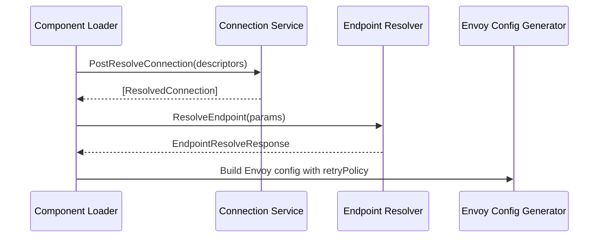

### 26.3 Connection service and endpoint resolver clients

This section covers the two external‐service clients that drive connection metadata resolution and endpoint URL discovery in Rudder. The **Connection Service Client** retrieves and manages connection configuration, while the **Endpoint Resolver Client** turns logical endpoint identifiers into concrete URLs, enabling resilient routing flows.

---

## ⚙️ Connection Service Client

The Connection Service Client wraps HTTP calls to the Connection Service microservice. It handles:

- Fetching per-environment connection configuration
- Deleting all connections for a component
- Resolving named connection descriptors into rich metadata

### Instantiation

```go
import (
  "net/http"
  "github.com/wso2-enterprise/choreodp-rudder/external-services/connection-service"
)

httpClient := &http.Client{ Timeout: 10 * time.Second }
connClient := connection_service.NewConnectionService(httpClient)
```

### Client Interface

| Method | Description |
| --- | --- |
| GetEnvironmentConnection | Retrieve configuration for a connection in an environment |
| DeleteConnections | Remove all connections for a given component |
| PostResolveConnection | Resolve descriptors into detailed connection metadata |


#### Key Types

```go
// Request to resolve one or more connection descriptors
type ResolveConnectionRequest struct {
  Descriptors    []ConnectionDescriptor `json:"descriptors"`
  ComponentId    string                 `json:"componentId"`
  OrganizationId string                 `json:"organizationId"`
}

// One descriptor: name + connectionId
type ConnectionDescriptor struct {
  Name         string `json:"name"`
  ConnectionId string `json:"connectionId"`
}

// Detailed result of a resolved connection
type ResolvedConnection struct {
  Name               string  `json:"name"`
  Description        *string `json:"description,omitempty"`
  GroupUUID          string  `json:"groupUuid"`
  SchemaReference    string  `json:"schemaReference"`
  ServiceID          string  `json:"serviceId"`
  ServiceName        *string `json:"serviceName,omitempty"`
  SchemaName         *string `json:"schemaName,omitempty"`
  IsPartiallyCreated *bool   `json:"isPartiallyCreated,omitempty"`
  Status             interface{} `json:"status,omitempty"`
  ComponentID        *string `json:"componentId,omitempty"`
  DependentComponentID *string `json:"dependentComponentId,omitempty"`
  Version            *string `json:"version,omitempty"`
  ResourceType       *string `json:"resourceType,omitempty"`
}
```

### API Endpoints

#### Get Environment Connection

Retrieves configuration entries and visibility rules for a connection in a specific environment.

```api
{
    "title": "Get Environment Connection",
    "description": "Fetch connection configuration for a given environment",
    "method": "GET",
    "baseUrl": "https://<connection-service-url>",
    "endpoint": "/connections/v1/configurations/service-configs/{connectionId}",
    "headers": [
        {
            "key": "x-organization-id",
            "value": "<org-id>",
            "required": true
        }
    ],
    "queryParams": [
        {
            "key": "environmentId",
            "value": "Environment template UUID",
            "required": true
        }
    ],
    "pathParams": [
        {
            "key": "connectionId",
            "value": "Connection UUID",
            "required": true
        }
    ],
    "bodyType": "none",
    "requestBody": "",
    "formData": [],
    "rawBody": "",
    "responses": {
        "200": {
            "description": "Connection configuration",
            "body": "{ /* EnvConnection JSON */ }"
        }
    }
}
```

#### Delete Connections

Deletes all connections associated with a component.

```api
{
    "title": "Delete Connections",
    "description": "Remove all connections for a component",
    "method": "DELETE",
    "baseUrl": "https://<connection-service-url>",
    "endpoint": "/connections/v1/configurations/choreo-connections",
    "headers": [
        {
            "key": "x-organization-id",
            "value": "<org-id>",
            "required": true
        },
        {
            "key": "x-correlation-id",
            "value": "<correlation-id>",
            "required": true
        }
    ],
    "queryParams": [
        {
            "key": "projectId",
            "value": "Project UUID",
            "required": true
        },
        {
            "key": "componentId",
            "value": "Component UUID",
            "required": true
        }
    ],
    "pathParams": [],
    "bodyType": "none",
    "requestBody": "",
    "formData": [],
    "rawBody": "",
    "responses": {
        "200": {
            "description": "Deletion successful"
        }
    }
}
```

#### Resolve Connection Identifiers

Posts a batch of descriptors to get rich connection metadata for each.

```api
{
    "title": "Resolve Connection Identifiers",
    "description": "Convert connection descriptors into detailed metadata",
    "method": "POST",
    "baseUrl": "https://<connection-service-url>",
    "endpoint": "/connections/v1/connections/resolve",
    "headers": [
        {
            "key": "x-organization-id",
            "value": "<org-id>",
            "required": true
        }
    ],
    "queryParams": [],
    "pathParams": [],
    "bodyType": "json",
    "requestBody": "{\n  \"descriptors\": [ { \"name\": \"db-conn\", \"connectionId\": \"...\" } ],\n  \"componentId\": \"...\",\n  \"organizationId\": \"...\"\n}",
    "formData": [],
    "rawBody": "",
    "responses": {
        "200": {
            "description": "Metadata resolved",
            "body": "[ /* array of ResolvedConnection */ ]"
        },
        "201": {
            "description": "Created with metadata",
            "body": "[ /* array of ResolvedConnection */ ]"
        }
    }
}
```

---

## 🔍 Endpoint Resolver Client

The Endpoint Resolver Client calls into the APIM-backed endpoint resolver service. It maps a logical `endpointId` and environment context into a concrete URL, attaching authorization and correlation headers.

### Instantiation

```go
import (
  "net/http"
  "github.com/wso2-enterprise/choreodp-rudder/external-services/endpoint-resolver"
  "github.com/wso2-enterprise/choreodp-rudder/external-services/apim-auth"
)

httpClient := &http.Client{ Timeout: 10 * time.Second }
tokenManager := apim_auth.NewTokenManager(...)
resolver := endpoint_resolver.NewEndpointResolver(httpClient, tokenManager)
```

### Types

```go
type EndpointResolveRequest struct {
  OrganizationId string
  OrgHandle      string
  EndpointId     string
  EnvironmentId  string
  ProjectHandle  string
}

type EndpointResolveResponse struct {
  EndpointUrl      string `json:"endpointUrl"`
  ApiId            string `json:"apiId"`
  ComponentId      string `json:"componentId"`
  ComponentVersion string `json:"componentVersion"`
}
```

### Resolve Endpoint

```api
{
    "title": "Resolve Endpoint URL",
    "description": "Map logical endpoint ID to a concrete URL",
    "method": "GET",
    "baseUrl": "https://<endpoint-resolver-url>",
    "endpoint": "/endpoint/resolver/v1/resolve",
    "headers": [
        {
            "key": "Authorization",
            "value": "Bearer <token>",
            "required": true
        },
        {
            "key": "Content-Type",
            "value": "application/json",
            "required": true
        },
        {
            "key": "x-correlation-id",
            "value": "<correlation-id>",
            "required": true
        }
    ],
    "queryParams": [
        {
            "key": "organizationId",
            "value": "Organization UUID",
            "required": true
        },
        {
            "key": "orgHandle",
            "value": "Organization handle",
            "required": true
        },
        {
            "key": "endpointId",
            "value": "Endpoint UUID",
            "required": true
        },
        {
            "key": "environmentId",
            "value": "Environment UUID",
            "required": true
        },
        {
            "key": "projectHandle",
            "value": "Project handle",
            "required": true
        }
    ],
    "pathParams": [],
    "bodyType": "none",
    "requestBody": "",
    "formData": [],
    "rawBody": "",
    "responses": {
        "200": {
            "description": "Resolved endpoint details",
            "body": "{ /* EndpointResolveResponse */ }"
        }
    }
}
```

---

## 🔗 Integration Flow

The typical flow chains these clients:



- **Connection metadata** (serviceId, schemaReference, groupUuid) informs which route and cluster to configure.
- **Endpoint URL** is fetched by the resolver and injected into the generated Envoy filters for resiliency (retries, timeouts, failover).

```card
{
    "title": "Key Insight",
    "content": "ConnectionService and EndpointResolver work together to embed rich metadata and actual URLs into runtime network configs."
}
```