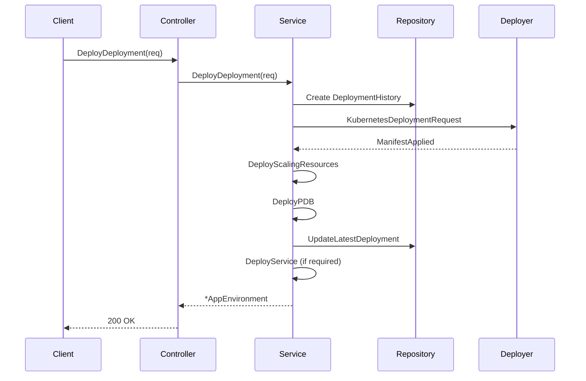

### 3. Core Domain: App/Component Lifecycle (Bundles Domain)

#### 3.1 App Environment Lifecycle (Create/Update, State Transitions, Deploy/Undeploy Hooks)

This section covers the internal **App Environment** domain, which manages the lifecycle of a particular component’s deployment in a specific environment. It spans:

- **Model** definitions and validations
- **Repository** for persistence
- **Service** orchestration of state transitions and hooks
- **Controller** endpoints exposing lifecycle operations

---

##### Model: `AppEnvironment`

Each `AppEnvironment` represents a single release of an application in an environment, tracking configuration, deployment state, and operational metadata.

| Field | Purpose |
| --- | --- |
| `AppID`, `EnvironmentID` | Links to parent App and Environment |
| `Namespace`, `KubernetesName` | Kubernetes namespace and generated resource name |
| `AutoDeploy` | Whether new versions auto-deploy |
| `Undeployed` | Pointer flag for paused/undeployed state |
| `LatestDeployment` | Embeds the last `DeploymentHistory` record |
| `ReleaseMgtReleaseId` | Correlates to external Release Management service |
| `ReleaseMgtDeploymentId` | Correlates to external Release Management deployment |


Key methods on the model:

- `IsUndeployed() bool` returns true if the release is paused or undeployed.
- `BeforeCreate(tx *gorm.DB) error` validates mandatory fields before persistence.
- `Save(ctx)` and `Update(ctx...)` wrap GORM create/update calls.
- `SetNewHash()` generates a fresh hash for the release.
- `HasDeployedAtLeastOnce() bool` checks if any deployment history exists.
- `GenerateReleaseName(appName, versionID)` computes a Kubernetes-safe name.
- `SetKubernetesName()` loads the App and applies naming logic .

```go
func (obj *AppEnvironment) IsUndeployed() bool {
  return obj.Undeployed != nil && *obj.Undeployed
}

func (obj *AppEnvironment) BeforeCreate(tx *gorm.DB) error {
  if err := obj.Base.BeforeCreate(tx); err != nil {
    return err
  }
  if obj.Namespace == "" {
    return fmt.Errorf("namespace is required")
  }
  return nil
}
```

---

##### Repository: `appEnvRepository`

The repository provides direct data access and atomic updates for `AppEnvironment` records.

| Method | Purpose |
| --- | --- |
| `GetAppEnvByAppEnvVersion(...)` | Fetches a release by app, env, and version, with preloads |
| `SetUndeployedState(ctx, id, bool)` | Atomically pause or resume a release |
| `UpdateCronConfigs(...)` | Clears or sets CronJob schedule |
| `UpdateReleaseMgtReleaseInfo(...)` | Persists external release-management identifiers |
| `FindInactiveReleases(...)` | Query for releases inactive past a cutoff, used in auto-undeploy |
| `GetAppEnvsByEnvId(...)` | Paginated list of releases in an environment |


```go
func (*appEnvRepository) SetUndeployedState(ctx context.Context, releaseId common.UniqueIdentifier, undeployed bool) error {
  patch := &AppEnvironment{Undeployed: &undeployed}
  if dbc := db.DB(ctx).Where("id = ?", releaseId).Updates(patch); dbc.Error != nil {
    return fmt.Errorf("SetUndeployedState: %w", dbc.Error)
  }
  return nil
}
```

---

##### Service: `AppEnvService`

The service layer encapsulates complex workflows, orchestrating repository updates, Kubernetes deployments, and external interactions.

Key responsibilities:

- **Deployment**
- `DeployDeployment(ctx, req)`
- `DeployConfigs(ctx, releaseId)`
- `DeployService(ctx, releaseId)`
- **State Transitions**
- `SetDeploymentPaused(ctx, obj)`
- `SetDeploymentActive(ctx, obj)`
- `ClearCron(ctx, obj)`
- **Hooks & Hooks**
- `DeployScalingResources` and `DeployPDB` for HPA/PDB sync
- `RemoveClusterResourcesOnUndeploy` for cleanup
- `EnsureDefaultHealthcheck` to populate health-check if missing
- `RedeployReleaseArtifacts` to resume a stopped release
- `PromoteReleaseImageToTarget` for blue–green or environment promotions

```go
type AppEnvService interface {
  DeployDeployment(ctx context.Context, req CustomDeploymentRequest) (*AppEnvironment, error)
  SetDeploymentPaused(ctx context.Context, obj *AppEnvironment) error
  SetDeploymentActive(ctx context.Context, obj *AppEnvironment) error
  RedeployReleaseArtifacts(ctx context.Context, obj *AppEnvironment) (bool, bool, error)
  // ...other methods...
}

func (a *appEnvService) SetDeploymentPaused(ctx context.Context, obj *AppEnvironment) error {
  obj.Undeployed = common.BoolPointer(true)
  return AppEnvRepository.SetUndeployedState(ctx, obj.ID, true)
}

func (a *appEnvService) RedeployReleaseArtifacts(ctx context.Context, obj *AppEnvironment) (bool, bool, error) {
  if obj.IsUndeployed() || !obj.HasDeployedAtLeastOnce() {
    return false, false, nil
  }
  obj.LoadFullObject()
  if err := a.DeployConfigs(ctx, obj.ID); err != nil { return true, false, err }
  _, err := a.DeployDeployment(ctx, CustomDeploymentRequest{AppEnvironmentID: obj.ID.String(), Message: "Redeployment"})
  // ...sync HPA/PDB, services...
  return true, true, err
}
```

---

##### Controller: `internal/bundles/app/app_environment_controller.go`

The controller exposes CRUD and lifecycle operations to the CLI or HTTP API. Each method delegates to the service:

- `AppEnvironmentList(req)`
- `AppEnvironmentGet(requestID)`
- `AppEnvironmentDeployDeployment(req)`
- `AppEnvironmentDeployHistory(requestID)`
- `AppEnvironmentPods(appId, requestID)`

```go
func AppEnvironmentDeployDeployment(req CustomDeploymentRequest) (*AppEnvironment, error) {
  return GetDefaultAppEnvService().DeployDeployment(context.Background(), req)
}
```

---

##### Deployment Flow Sequence



This diagram illustrates how a **deployment request** flows from the controller down to the cluster deployer, with repository calls handling persistence at each stage.

---

#### Cross-References in Release Flows

In the **Choreo** bundle, `choreo_app_controller.go` orchestrates higher-level release flows and invokes key service methods:

- **Fetching a release** with `app.AppEnvRepository.GetAppEnvByAppEnvVersion(...)`
- **Resuming** a paused release with `SetDeploymentActive(ctx, appEnv)`
- **Triggering** `DeployDeployment` and related hooks (`DeployPDB`, `DeployService`)

This tight integration ensures app environments created and managed by the Bundles domain participate seamlessly in full release pipelines.

---

🔑 **Key Takeaways**

```card
{
    "title": "Lifecycle Summary",
    "content": "AppEnvironment orchestrates create, update, deploy, undeploy, and promotion steps via model, repository, service, and controller layers."
}
```