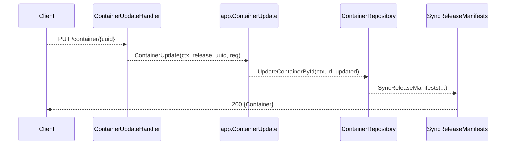

# 3. Core Domain: App/Component Lifecycle (Bundles Domain)

## 3.2 Component model: containers, ports, volumes, secrets/config mounts, and security context

This section details how Rudder models application components—**containers**, **ports**, **volumes**, **volume mounts**, **config mounts**, and **security contexts**—and exposes CRUD operations for each via HTTP APIs.

---

## 3.2.1 Container Model 🐳

Each component container is represented by the `Container` struct. It captures resource requests/limits, image details, ports, mounts, and security settings.

**Key fields**

| Field | Type | Purpose |
| --- | --- | --- |
| `CPUMili` | int64 | CPU request in millicores |
| `MemoryMB` | int64 | Memory request in MB |
| `CPUMiliLimit` | int64 | CPU limit in millicores |
| `MemoryMBLimit` | int64 | Memory limit in MB |
| `Ports` | `[]Port` | Container ports |
| `VolumeMounts` | `[]*AppVolumeMount` | Mounted volumes |
| `ConfigMounts` | `[]*ConfigMount` | Mounted config maps or secrets |
| `SecurityContext` | `*ContainerSecurityContext` | Linux security context (see below) |
| `AppArmorProfileName` | string | Applied AppArmor profile |


**Port struct**

```go
type Port struct {
  Name        string `json:"name"`
  Port        int32  `json:"port"`
  Protocol    string `json:"protocol"`
  ServicePort int32  `json:"service_port"`
}
```

Ports auto-generate names via:

```go
func (p *Port) GenerateName() {
  p.Name = fmt.Sprintf("port-%d", p.Port)
}
```

---

## 3.2.2 Security Context 🔐

Rudder defines container-level and pod-level security contexts, enforcing least privilege and compliance defaults.

**ContainerSecurityContext**

```go
type ContainerSecurityContext struct {
  RunAsUser                *int64
  RunAsGroup               *int64
  RunAsNonRoot             *bool
  Privileged               *bool
  ReadOnlyRootFilesystem   *bool
  AllowPrivilegeEscalation *bool
  Capabilities             *generator.Capabilities
}
```

Defaults apply in `Container.SetSecurityDefaults` based on component type and environment (e.g., PDP vs CDP) .

**Applying to PodSpec**

During manifest generation, Rudder’s deployer injects this context into each container spec:

```go
func (d *deployer) SetSecurityContext(podSpec *generator.PodSpec, ... ) error {
  // load context from DB
  // for each container:
  podSpec.Containers[i].SecurityContext.ReadOnlyRootFilesystem = ...
  podSpec.Containers[i].SecurityContext.Capabilities = &capabilities
  ...
  return nil
}
```

---

## 3.2.3 Volumes 📦

Rudder supports multiple volume types (`EmptyDir`, `PVC`, `NFS`, etc.) via the `AppVolume` model.

**AppVolume fields & methods**

- `Type` (e.g., “EmptyDir”, “PVC”)
- `Volume` struct detailing config (e.g., `VolumeEmptyDir`, `VolumePVC`)
- `GetVolumeSpec() *generator.PodVolumeSpec` – converts to a K8s volume spec

### 3.2.3.1 Volume CRUD APIs

- **POST /volume** → `handlers.VolumeCreate` → `app.VolumeCreate`
- **GET  /volume** → `handlers.VolumeList` → `app.VolumeList`
- **GET  /volume/{uuid}** → `handlers.VolumeGet` → `app.VolumeGet`
- **PUT  /volume/{uuid}** → `handlers.VolumeUpdate` → `app.VolumeUpdate`
- **DELETE /volume/{uuid}** → `handlers.VolumeDelete` → `app.VolumeDelete`

---

## 3.2.4 Volume Mounts 🔗

`AppVolumeMount` binds a volume into a container filesystem.

```go
type AppVolumeMount struct {
  MountPath        string
  SubPath          string
  ReadOnly         bool
  ContainerID      common.UniqueIdentifier
  AppVolumeID      common.UniqueIdentifier
  AppEnvironmentID common.UniqueIdentifier
  EnvironmentID    common.UniqueIdentifier
}
```

**Spec generation**

```go
func (m *AppVolumeMount) GetContainerMountSpec() (*generator.ContainerMountSpec, error)
```

returns a K8s `ContainerMountSpec` for PodSpec.

### 3.2.4.1 Volume Mount CRUD APIs

- **POST   /component/{appID}/release/{envID}/container/{containerID}/volume-mount**
- **GET    /…/volume-mount**
- **PUT    /…/volume-mount/{uuid}**
- **DELETE /…/volume-mount/{uuid}**

Each maps to `app.VolumeMountCreate`, `app.VolumeMountList`, `app.VolumeMountUpdate`, `app.VolumeMountDelete` and triggers `SyncReleaseManifests` on success .

---

## 3.2.5 Config Mounts 📑

`ConfigMount` exposes ConfigMaps or Secrets as files, env vars, or env-from.

```go
type ConfigMount struct {
  MountPath   string
  MountType   string  // "File", "Var", "From"
  ConfigMapID common.UniqueIdentifier
  SecretID    common.UniqueIdentifier
  KeyOverride string
}
```

**Mount specs**

- `GetContainerEnvSpec()` → sets a single env var
- `GetContainerEnvFromSpec()` → sets env-from
- `GetContainerMountSpec()` → mounts as a volume file

### 3.2.5.1 Config Mount CRUD APIs

- **POST   /component/{appID}/release/{envID}/container/{containerID}/config-mount**
- **GET    …/config-mount**
- **GET    …/config-mount/{uuid}**
- **PUT    …/config-mount/{uuid}**
- **DELETE …/config-mount/{uuid}**

Handlers delegate to `app.ConfigMountCreate`, `app.ConfigMountGet`, etc., then invoke manifest sync .

---

## 3.2.6 Component Security Context Management 🛡

Beyond container defaults, Rudder persists per-component security settings via:

```go
type CompSecurityContextSetRequest struct {
  OrganizationID common.UniqueIdentifier
  ComponentID    common.UniqueIdentifier
  Context        *ComponentSecurityContextRequest
}
```

`ComponentSecurityContextRequest` validates required fields:

```go
type ComponentSecurityContextRequest struct {
  ReadOnlyRootFileSystem *bool
  AddCapabilities        []string
  DropCapabilities       []string
}
```

After validation, `ToComponentSecurityContext()` maps to the persisted `ComponentSecurityContext` GORM model .

### 3.2.6.1 Security Context API

- **POST /internal/admin/components/security-context** → set or update context
- **GET  /internal/admin/components/{componentID}/security-context** → retrieve context

Controllers use `ComponentSecurityContextRepository.Upsert` and `GetByComponentID`, and the deployer injects at manifest time.

---

## 3.2.7 Sequence: Container Update Flow 🔄



---

This component model ensures Rudder consistently manages container lifecycles, mounting resources and enforcing security across environments.