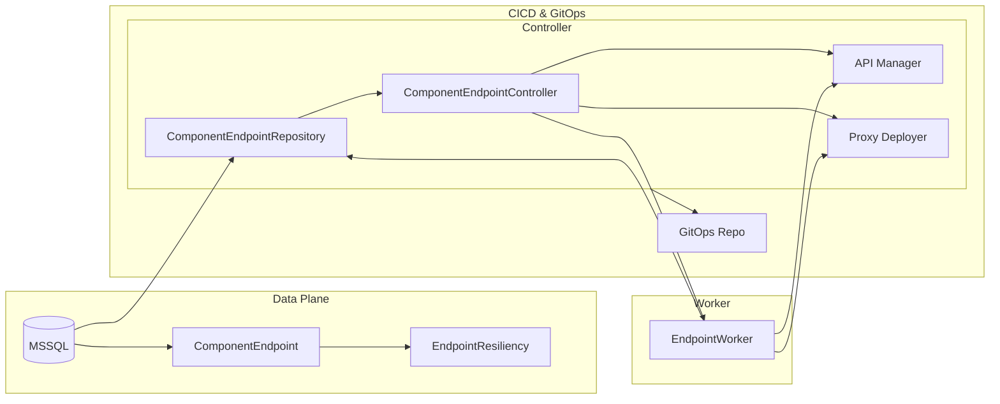

# 3 Core Domain: App/Component Lifecycle (Bundles Domain)

## 3.3 Component endpoints: generation, workers, resiliency, and APIM-related metadata

This section describes how Rudder manages component endpoints—from reading source configs to publishing APIs, handling asynchronous workers, persisting resiliency settings, and tracking APIM metadata. It spans four layers: the **data model**, the **repository**, the **controller/generator**, and the **worker**, tied together by database migrations for hashes and gateway revisions.

---

## 3.3.1 📦 ComponentEndpoint Model

The `ComponentEndpoint` struct defines the persisted shape of an endpoint. It captures identification, API metadata, networking details, and runtime state.

| Field | Type | Description |
| --- | --- | --- |
| Name | string | Unique name identifier at component level |
| DisplayName | string | Human-readable name |
| Port | int | Service port |
| ApiContext | string | URL context (e.g. `/greet`) |
| ApiDefinitionPath | string | Path to OpenAPI/AsyncAPI file |
| **ApiSpecHash** | string | SHA256 of API spec contents |
| **EndpointYamlHash** | string | SHA256 of endpoint YAML definition |
| Visibility | `EndpointVisibilityV2` | Public/Organization/Project scoping |
| ApiType | `EndpointType` | REST, GraphQL, WS, TCP, UDP |
| ApimId | string | API Manager UUID |
| InternalGwRevisionId | string | Revision deployed to internal gateway |
| ExternalGwRevisionId | string | Revision deployed to external gateway |
| ApimName | string | API name in APIM |
| ProjectUrl | string | In-cluster URL |
| OrganizationUrl | string | Org-scoped API URL |
| PublicUrl | string | Internet-facing URL |
| State | `EndpointState` | Pending, Progressing, Active, Error |
| StateReason | `*StateReason` | Last known status reason (with human-friendly message) |
| AppEnvironmentID | `UniqueIdentifier` | Foreign key to release (`app_environments.id`) |
| IsDeleted | bool | Soft delete flag |
| IsAutoGenerated | bool | True if created from Ballerina-generated OAS |
| IsShortUrl | bool | Flags “short” URL usage |
| LastGenerationReason | `LastGenerationReason` | Tracks user/system action leading to this endpoint state |

This model is defined in **internal/bundles/app/component_endpoint_model.go** .

---

## 3.3.2 💾 Repository Persistence

`component_endpoint_repository.go` provides CRUD and batch methods via GORM. Key methods include:

- Create, batch create, and soft-delete endpoints.
- **CreateDeleteUpdateEndpointsBatch**: atomically sync new, updated, and deleted endpoints per release, while updating `EndpointYamlHash`.
- **ListComponentEndpointsByReleases**: fetch active endpoints for given release IDs.
- **UpdateComponentEndpointApimRevisionIds**: persist `InternalGwRevisionId` and `ExternalGwRevisionId`.
- **UpdateComponentEndpointInvokeUrlsById**: update `ProjectUrl`, `OrganizationUrl`, `PublicUrl`.
- **UpdateApimNameByContext**: bulk update API names by matching URL context.

These methods ensure consistency of spec hashes, YAML hashes, visibility, and APIM metadata.

---

## 3.3.3 ✍️ Endpoint Generation & Controller

The **ComponentEndpointController** orchestrates endpoint lifecycle in two phases:

1. **Raw Generation**:
2. `generateRawEndpoints` builds in-memory endpoints from source configs (e.g. `component.yaml` or default templates) when none exist.
3. It invokes `extractEndpointsFromSourceConfiguration`, which scans OAS files in the GitOps repo, unmarshals YAML, and maps definitions to `app.ComponentEndpoint` structs.

1. **Full Generation**:
2. `GenerateEndpoints` validates inputs, reuses raw generation logic, injects JMX endpoints for MI components, and persists the resulting endpoints via the repository.
3. It then marks `EndpointYamlHash` for the batch.

1. **Create/Update/Delete API Manager Entities**:
2. **ensureEndpointInAPIManager** handles import or update of APIs in APIM:
3. Searches existing APIs by context and version via `SearchAPIByContext`.
4. Imports swagger/async APIs using `ImportSwaggerDefinition`/`ImportAsyncApiDefinition`; retries with hashed names on collision.
5. Updates API properties (visibility, security schemes) when necessary.
6. **createAPIRevision** and **createAPIRevisionV2**, **deployGatewayRevision**, **updateEndpointURLs** manage gateway proxy deployments and set `InternalGwRevisionId`/`ExternalGwRevisionId` in the database.

1. **Controller Update Flows**:
2. `UpdateEndpoint` selectively renames APIs without redeploying if only `ApiName` changes.
3. `ListEndpoints` and `ListManagedEndpointsByComponent` return endpoints per release or component, enriching URLs and custom domain settings.

All controller logic lives in **choreo/bundles/app/component_endpoint_controller.go**.

---

## 3.3.4 ⚙️ Worker Processing

The **component_endpoint_worker.go** schedules background goroutines for each endpoint. Responsibilities include:

- Setting Kubernetes services for endpoint ports (`updateK8sService`).
- Reconciling managed APIs (`reconcileManagedApi`), which calls deploy/undeploy based on visibility.
- Persisting worker state transitions (`Progressing`, `Active`, `Error`) with `StateReason`.
- Interacting with external services: Project-Manager, Service Registry, Vault for metadata enrichment.

The worker recovers panics, updates release management statuses, and logs detailed trace fields. Unit tests in **component_endpoint_worker_test.go** validate every branch of API import, search, retry, and error handling.

---

## 3.3.5 🛠️ Resiliency Configuration

Rudder supports per-endpoint resiliency (e.g. retries, timeouts).

- **Migration 0.0.176** creates the `endpoint_resiliencies` table, linking each endpoint to its JSON‐serialized resiliency data (`ep_resiliency_data`) and enforcing cascade delete to `component_endpoints` .
- The `resiliencyController` offers `UpsertEpResiliencyConfig` and `GetConnResiliencyConfig`, persisting `EndpointResiliency` and `ConnectionResiliency` via `ResiliencyRepository`.
- A separate process (`makeCiliumEnvoyConfigManifest`) reads from `endpoint_resiliencies` to generate Envoy filter chains for Cilium-based resiliency policies.

---

## 3.3.6 🔗 Database Migrations & Metadata Tracking

Several migrations augment the endpoint schema:

- **0.0.139** (not shown) adds `ApiSpecHash` and `EndpointYamlHash` columns to `component_endpoints`.
- **0.0.189** (not shown) adds `InternalGwRevisionId` and `ExternalGwRevisionId` columns for gateway revision tracking.
- **0.0.176** adds the resiliency table (`endpoint_resiliencies`) .

These migrations ensure backward compatibility and support long-lived metadata for operational observability and rollback.

---

## 3.3.7 Architecture Overview

This diagram shows persistence in MSSQL, the controller managing API and gateway workflows, and the worker orchestrating asynchronous endpoint reconciliation.

---

**Key Takeaways**

- The **model** stores endpoint definitions, hashes, APIM IDs, gateway revisions, and state.
- The **repository** batches create/update/delete operations, preserving YAML & spec hashes and gateway metadata.
- The **controller** generates endpoints, handles schema parsing, APIM interactions, and gateway deployments.
- The **worker** schedules, recovers, and updates endpoints in the background, persisting state and resiliency configs.
- **Migrations** add columns and tables to support metadata (hashes, revisions) and resiliency.