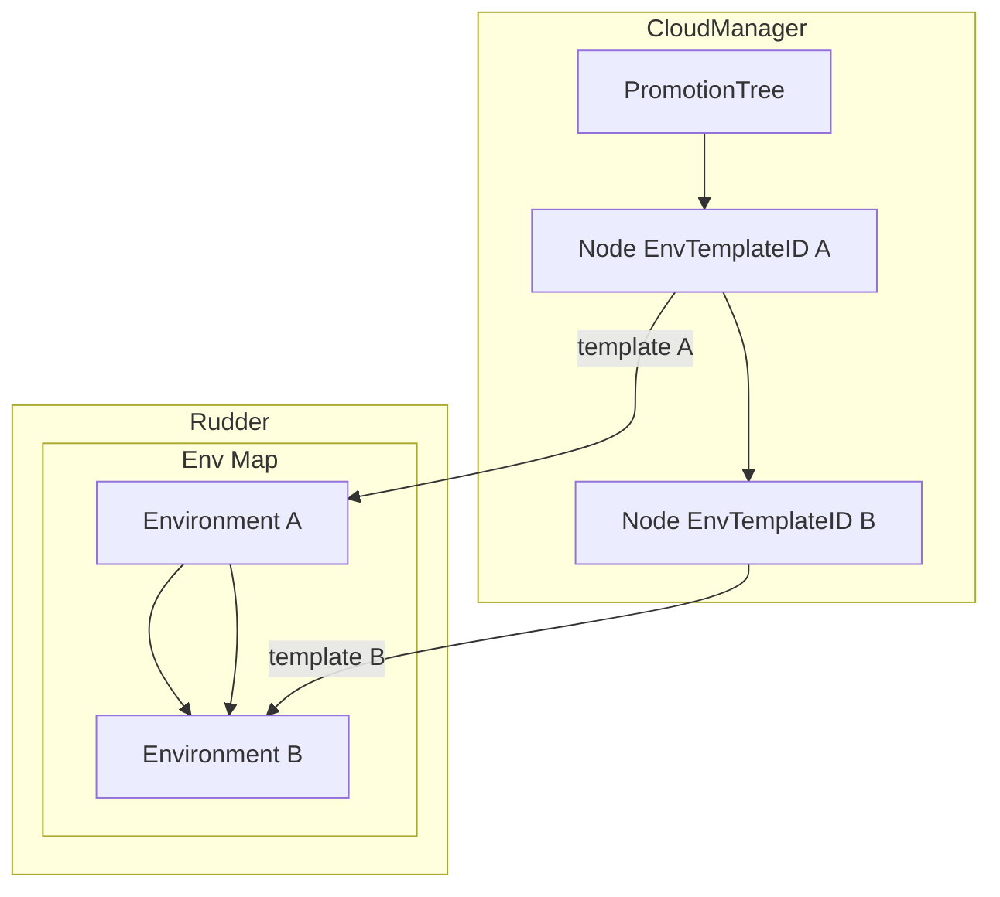

## 3.4 Component dependencies and promotion flows

This section describes how Rudder models component-to-component dependencies, enforces them at build/deploy time, and propagates those dependencies across environments via promotion trees. It covers:

- Representation in the domain model and persistence layer
- Business logic in the ComponentDependencyController
- Hooks in the application promotion flow
- Construction and use of environment promotion trees
- Exposed HTTP handlers for environment-based promotions

---

### 🔗 ComponentDependency model

The `ComponentDependency` struct captures a downstream component or service that an application component depends on. It lives in `internal/bundles/app/component_dependency_model.go`.

| Field | Type | Description |
| --- | --- | --- |
| `ID` | `UUID` | Unique record identifier (from `common.Base`) |
| `Name` | `string` | Optional human-readable name of the dependency |
| `ServiceIdentifier` | `string` | External service or connection identifier |
| `ConfigGroupIdentifier` | `string` | ID of the configuration group in the connection service |
| `State` | `common.DependencyState` | One of `Pending`, `Progressing`, `Active`, or `ErrorState` |
| `StateReason` | `*StateReason` | JSON-serialized reason for the current state |
| `DeploymentTrackId` | `UUID` | The component version/track this dependency belongs to |
| `AppEnvironmentId` | `UUID`  | The release (environment) in which this dependency is active |
| `ConfigMappingId` | `string`  | ID of the created mapping in the configuration-mapping service |


```go
type ComponentDependency struct {
    common.Base
    Name                   string                 `json:"name"`
    ServiceIdentifier      string                 `json:"service_identifier"`
    ConfigGroupIdentifier  string                 `json:"config_group_identifier"`
    State                  common.DependencyState `json:"state"`
    StateReason            *StateReason           `json:"state_reason" gorm:"serializer:json"`
    DeploymentTrackId      common.UniqueIdentifier `json:"deployment_track_id"`
    ConfigMappingId        string                 `json:"config_mapping_id,omitempty"`
    AppEnvironmentId       common.UniqueIdentifier `json:"app_environment_id,omitempty"`
}
```

---

### 💾 Persistence: ComponentDependencyRepository

CRUD operations against SQL Server via GORM live in `internal/bundles/app/component_dependency_repository.go`. Key methods:

- `CreateComponentDependency(ctx, cdp)`
- `CreateComponentDependencyBatch(ctx, []cdp)`
- `ListComponentDependecies(ctx, versionId, envId)`
- `GetComponentDependencyById(ctx, id)`
- `UpdateComponentDependencyById(ctx, dep)`
- `DeleteComponentDependencyById(ctx, id)`

These methods encapsulate DB interactions and soft-delete semantics.

---

### 🛠️ Business logic: ComponentDependencyController

Implemented in `choreo/bundles/app/component_dependency_controller.go`, this controller orchestrates dependency creation, listing, bulk processing, and promotion.

#### Interface overview

| Method | Responsibility |
| --- | --- |
| `CreateDependency` | Validate and insert a single dependency |
| `GetDependency` | Retrieve by ID |
| `DeleteDependency` / `DeleteDependencyBulk` | Remove one or all dependencies for a component |
| `ListDependencies` | List dependencies for a component version and release |
| `ProcessDependencies` | Alias for `ProcessBulkComponentDependencies` |
| `ProcessBulkComponentDependencies` | Validate, diff, and upsert dependency configs in the target env |
| `PromoteDependencies` | Copy dependencies from source to target environment release |


#### Bulk processing flow

1. **Validation**: Ensure each `ComponentDependencyItem` has `ServiceIdentifier` and required mapping fields.
2. **Fetch current state**: Load existing dependencies via repository.
3. **Diff**: Compute new, updated, and deleted lists.
4. **Config mapping**: Create/update mapping entries via `ConfigurationMappingClient`.
5. **Persist**:
6. Batch-insert new dependencies
7. Update existing ones
8. Delete removed entries

```go
func (c *componentDependencyController) ProcessBulkComponentDependencies(
  ctx context.Context, componentId, versionId common.UniqueIdentifier,
  req ComponentDependencyProcessRequest,
) ([]*app.ComponentDependency, error) {
  ctx = GetComponentDependencyProcessLogContext(ctx)
  // Validation...
  deps, err := c.getComponentDependencies(...)
  // Diff and mapping...
  return c.ProcessUpsertDependencyConfigs(ctx, addProcessReq)
}
```

#### Promotion logic

When an application is promoted between environments, dependencies must also be promoted.

```go
func (c *componentDependencyController) PromoteDependencies(
  ctx context.Context, componentId, versionId, sourceEnvId, targetEnvId,
  releaseMgtReleaseID, releaseMgtDeploymentID common.UniqueIdentifier,
  configMappingRevision *int,
) error {
  // Retrieve source env deps
  sourceEnvDeps, err := c.ListDependencies(ctx, componentId, versionId, sourceEnvId)
  // Bulk upsert for target env
  _, err = c.ProcessBulkComponentDependencies(ctx, componentId, versionId, 
    ComponentDependencyProcessRequest{
      Dependencies:           sourceEnvDeps.Dependencies,
      ReleaseId:              targetEnvId,
      ReleaseMgtReleaseID:    releaseMgtReleaseID,
      ReleaseMgtDeploymentID: releaseMgtDeploymentID,
    })
  return err
}
```

---

### 🔄 Integration in application promotion

In `choreo/bundles/app/choreo_app_controller.go`, after validating releases and promoting code/configs, `PromoteDependencies` is invoked to mirror dependencies:

```go
err = c.componentDependencyController.PromoteDependencies(
  ctx, application.ID, apiVersion.ID,
  sourceAppEnv.ID, targetAppEnv.ID,
  releaseMgtReleaseID, releaseMgtDeploymentID,
  configMappingRevision,
)
```

---

### 🌳 Environment promotion trees

#### Finding the next environment

Rudder uses Cloud Manager’s `PromotionTree` to determine which environment a release should go to next:

```go
// Recursively search for the node matching source.
func findEnvironmentNodeByIDHelper(nodes []PromotionTreeNode, targetID UniqueIdentifier) (*PromotionTreeNode, error)

// Return the first child of the found node.
func findNextEnvironmentTemplateInPromotionTree(
  tree *PromotionTree, sourceEnvTemplateId UniqueIdentifier,
) (UniqueIdentifier, error)
```

#### Building the promotion view

The `choreo/bundles/environment` bundle constructs a client-facing `EnvironmentPromotionTree` by mapping template IDs to actual `Environment` records:

```go
func buildEnvironmentTreeFromPromotionTree(
  promotionTree *cloud_manager.PromotionTree,
  envs []environment.Environment,
) (*environment.EnvironmentPromotionTree, error)
```

This produces a tree of `EnvironmentPromotionTreeNode` structs, embedding environment metadata and child relationships.

**Diagram: Promotion Tree Construction**



---

### 🏷️ Exposed endpoint

Clients retrieve this promotion tree via the Choreo Environment handler:

```go
// GET /api/v1/choreo/environments/pipeline/{pipelineId}
func (c *choreoEnvController) GetProjectEnvironmentsOfDeploymentPipeline(
  ctx, pipelineId, query,
) (*environment.EnvironmentPromotionTree, error)
```

This endpoint returns the structured tree for UI-driven promotion flows.

---

**Card Block: Key Takeaway**

```card
{
    "title": "Dependency Promotion",
    "content": "Rudder promotes component dependencies alongside application artifacts by diff-driven bulk processing based on environment promotion trees."
}
```