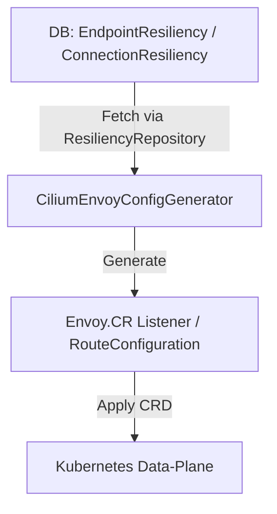

# 3.5 Resiliency, Health Checks, and Observability Configuration

This section covers how Rudder manages application resiliency settings, container-level health checks, and HTTP-metrics observability. It describes the data models, repositories, service layers, K8s manifest generation, and HTTP handler mappings.

---

## 3.5.1 Resiliency

Resiliency allows per-endpoint and per-connection retry policies. Rudder stores retry configurations in MSSQL and generates Envoy-based CRD manifests to enforce retries in the data-plane.

### Data Model

- **EndpointResiliency**
- Primary key: `EndpointID`
- JSON column: `EpResiliencyData`
- **ConnectionResiliency**
- Primary key: `ConnectionID`
- Fields: `ReceiverComponentId`, `ReceiverMajorVersion`, `ReceiverEndpointHash`
- JSON column: `ConnResiliencyData`

Types are defined in `internal/bundles/app/resiliency_model.go` . Key structs:

```go
type EpResiliencyData struct {
  OperationLevelRetries []ResiliencyPath  `json:"operation_level_retries"`
  ApiLevelRetry         *RetryConfig      `json:"api_level_retry"`
}

type ConnResiliencyData struct {
  RetryConfig *RetryConfig `json:"retry_config"`
}

type RetryConfig struct {
  IsEnabled      bool     `json:"is_enabled"`
  RetryCondition []string `json:"retry_conditions"`
  RetryCount     int      `json:"retry_count"`
  RetryBackOff   int      `json:"retry_back_off"`   // ms
  PerTryTimeout  int      `json:"per_try_timeout"`  // s
}
```

### Persistence & Migrations

Rudder persists resiliency records via GORM migrations. The `endpoint_resiliencies` table is created in migration **0.0.176** :

```sql
create table endpoint_resiliencies(
  endpoint_id uniqueidentifier not null,
  ep_resiliency_data nvarchar(MAX) default null,
  constraint pk_endpoint_resiliency primary key(endpoint_id),
  constraint fk_endpoint_id foreign key (endpoint_id)
    references component_endpoints(id) on delete cascade
);
```

### Repository

ResiliencyRepository exposes CRUD methods over the models in `internal/bundles/app/resiliency_repository.go` :

| Method | Description |
| --- | --- |
| `GetEpResiliency(ctx, epID)` | Fetches `EndpointResiliency` or `nil` if not present |
| `UpsertEpResiliency(ctx, epID, model)` | Inserts or updates an endpoint retry policy |
| `GetConnResiliency(ctx, connID)` | Fetches `ConnectionResiliency` |
| `UpsertConnResiliency(ctx, connID, model)` | Inserts or updates a connection retry policy |


### Manifest Generation

Rudder’s CiliumEnvoyConfig generator in `internal/bundles/app/make_resiliency.go` loops through endpoints and connection wraps, then builds Envoy listeners and route configurations:

```go
for _, cecResData := range cecResDataList {
  // Build FilterChain for each port (destinationPort = cecResData.Port)
  // Insert wasm filter for connection-based retries
  // Append HTTP filters including Envoy router
}
…
for each EpResiliencyData.OperationLevelRetries { 
  route.Match.Headers = [
    {Name: GwApiIdHeaderKey, Exact: cecResData.ApimId},
    optional Path or SafeRegex for operation
  ]
  route.Route.RetryPolicy = &RetryPolicy{…}
}
for each ConnResiliencyDataWrap {
  route.Match.Headers = [
    {Name: ConnStringHeaderKey, Exact: connResDataWrap.ConnectionString}
  ]
  route.Route.RetryPolicy = &RetryPolicy{…}
}
… return CiliumEnvoyConfig CRD
```

This influences the generated K8s manifest by embedding retry policies directly into Envoy XDS resources (listeners, RDS, clusters).



---

## 3.5.2 Health Checks

Rudder manages liveness/readiness probes at the container level and persists custom configurations in the database. Changes trigger a sync of Deployment manifests.

### Data Model & Repository

- **HealthCheck** model includes `Probes` (liveness/readiness) and `ChoreoManaged` flag.
- The `HealthCheckRepository` (in `internal/bundles/app/health_check_repository.go`) offers methods to fetch by container or release:

```go
GetHealthCheckByContainerID(ctx, containerID) (*HealthCheck, error)
GetHealthChecksByReleaseId(ctx, releaseID) ([]HealthCheck, error)
UpdateUserManagedProbesById(ctx, id, probes)
```

### Service Layer

`internal/bundles/app/health_check_controller.go` implements:

- `HealthCheckCreate` – creates tcp or exec probes, marks `ChoreoManaged=false`
- `HealthCheckList` – lists per-release checks
- `HealthCheckGet/Update/Delete` – CRUD operations with access validation

On create/update/delete, Rudder calls:

```go
GetDefaultAppEnvService().SyncReleaseManifests(ctx, WorkloadManifestSyncOpts{…})
```

to regenerate Deployment manifests with updated probes.

### HTTP Handlers

Handlers live in `api/handlers/health_check.go`. Each endpoint gets its own API block:

#### Create Health Check

```api
{
    "title": "Create Health Check",
    "description": "Create a new health check for a container",
    "method": "POST",
    "baseUrl": "https://<host>",
    "endpoint": "/component/{appID}/release/{appEnvID}/container/{containerID}/health-check",
    "headers": [
        {
            "key": "Authorization",
            "value": "Bearer <token>",
            "required": true
        }
    ],
    "queryParams": [],
    "pathParams": [
        {
            "key": "appID",
            "value": "App UUID",
            "required": true
        },
        {
            "key": "appEnvID",
            "value": "Release UUID",
            "required": true
        },
        {
            "key": "containerID",
            "value": "Container UUID",
            "required": true
        }
    ],
    "bodyType": "json",
    "requestBody": "{\n  \"probes\": {\n    \"readiness_probe\": { \u2026 },\n    \"liveness_probe\": { \u2026 }\n  }\n}",
    "formData": [],
    "rawBody": "",
    "responses": {
        "200": {
            "description": "Success",
            "body": "{\n  \"id\": \"...\",\n  \"probes\": { \u2026 }\n}"
        },
        "400": {
            "description": "Bad Request"
        },
        "500": {
            "description": "Internal Server Error"
        }
    }
}
```

#### List Health Checks

```json
{
    "title": "List Health Checks",
    "description": "Retrieve health checks by release",
    "method": "GET",
    "baseUrl": "https://<host>",
    "endpoint": "/component/{appID}/release/{appEnvID}/health-check",
    "pathParams": [ … ],
    "responses": {
      "200": { "description": "OK", "body": "[{…}, …]" },
      "404": { "description": "Not Found" }
    }
}
```

#### Get Health Check

```json
{
    "title": "Get Health Check",
    "description": "Fetch a specific health check by UUID",
    "method": "GET",
    "baseUrl": "https://<host>",
    "endpoint": "/component/{appID}/release/{appEnvID}/container/{containerID}/health-check/{uuid}",
    "pathParams": [ … ],
    "responses": {
      "200": { "description": "OK", "body": "{…}" },
      "404": { "description": "Not Found" }
    }
}
```

---

## 3.5.3 Observability Configuration

ObservabilityConfig controls whether HTTP metrics are enabled on a release’s pods. Rudder stores a per-release flag and applies Cilium proxy visibility annotations on Deployment pods.

### Data Model

```go
type ObservabilityConfig struct {
  AppEnvironmentID  common.UniqueIdentifier `gorm:"primaryKey"`
  EnableHTTPMetrics bool                   `json:"enable_http_metrics"`
}
```

Defined in `internal/bundles/app/observability_config_model.go` .

### Repository & Service

- **GetEnableHTTPMetrics** returns stored flag or defaults to `true` if missing.
- **SetEnableHTTPMetrics** upserts the record.

Implemented in `observability_config_repository.go` .

`internal/bundles/app/observability_config_service.go` exposes:

```go
GetObservabilityConfig(ctx, release)
UpdateObservabilityConfig(ctx, release, req)
```

### Handler Endpoints

Defined in `choreo/handlers/observability.go`:

#### Get Observability Config

```api
{
    "title": "Get Observability Config",
    "description": "Fetch HTTP-metrics flag for a release",
    "method": "GET",
    "baseUrl": "https://<host>",
    "endpoint": "/component/{appID}/release/{appEnvID}/observability",
    "headers": [
        {
            "key": "Authorization",
            "value": "Bearer <token>",
            "required": true
        }
    ],
    "queryParams": [],
    "pathParams": [],
    "bodyType": "none",
    "requestBody": "",
    "formData": [],
    "rawBody": "",
    "responses": {
        "200": {
            "description": "OK",
            "body": "{ \"app_environment_id\": \"...\", \"enable_http_metrics\": true }"
        },
        "500": {
            "description": "Internal Server Error"
        }
    }
}
```

#### Update Observability Config

```api
{
    "title": "Update Observability Config",
    "description": "Enable or disable HTTP metrics for a release",
    "method": "PUT",
    "baseUrl": "https://<host>",
    "endpoint": "/component/{appID}/release/{appEnvID}/observability",
    "headers": [
        {
            "key": "Authorization",
            "value": "Bearer <token>",
            "required": true
        }
    ],
    "queryParams": [],
    "pathParams": [],
    "bodyType": "json",
    "requestBody": "{\n  \"enable_http_metrics\": false\n}",
    "formData": [],
    "rawBody": "",
    "responses": {
        "200": {
            "description": "OK",
            "body": "{ \"enable_http_metrics\": false }"
        },
        "400": {
            "description": "Bad Request"
        },
        "500": {
            "description": "Internal Server Error"
        }
    }
}
```

### K8s Pod Annotation

A deployer function reads `EnableHTTPMetrics` and existing `ComponentEndpoint` records to build a comma-separated annotation for Cilium proxy visibility:

- On **ingress**: `"<Ingress/{port}/TCP/HTTP>"`
- On **egress**: `"<Egress/53/UDP/DNS>,<Egress/80/TCP/HTTP>"`

If metrics disabled, no annotation is set. Tests in `internal/bundles/app/observability_config_service.go` and deployer tests confirm behavior .

---

By linking DB migrations, Go models, repositories, service layers, manifest generators, and HTTP handlers, Rudder ensures a cohesive flow from user-provided settings to live data-plane behavior.