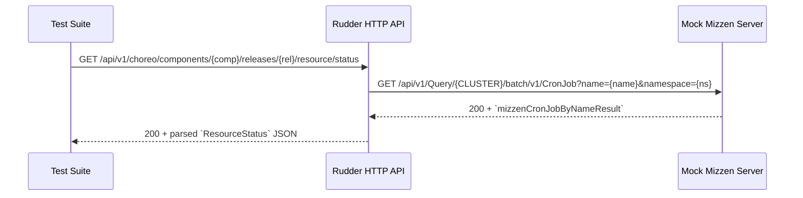

## 30.2 API Integration Tests and Fixture Data

This section describes the **end-to-end HTTP tests** under `api/tests/*.go` and their associated JSON fixtures in `api/tests/testdata/*.json`. These tests verify Rudder’s REST API for managing Choreo data-plane resources while simulating external control-plane services. The fixtures provide stable, repeatable inputs and responses, and the tests guarantee feature coverage across config maps, secrets, volumes, HPA, component mappings, cronjob status, shared PVC mounts, storage-class queries, BYOI create, and YAML extraction.

---

### Fixture Data Management 🎴

Rudder uses Go’s `embed` directive to bundle JSON fixtures into test binaries. These fixtures live under `api/tests/testdata` and are referenced via `//go:embed` annotations.

| Fixture File | Embedded Variable | Purpose |
| --- | --- | --- |
| testdata/mizzen_query_cronjob_by_name.json | `mizzenCronJobByNameResult` | Response for CronJob status queries |
| testdata/storage_class_mizzen_response.json | `storageClassResponse` | Raw Mizzen response for storage-class list |
| testdata/storage_class_list.json | `storageClassList` | Expected JSON payload of storage classes |


```go
// Embedding CronJob status fixture
//go:embed testdata/mizzen_query_cronjob_by_name.json
var mizzenCronJobByNameResult string

// Embedding storage-class fixtures
//go:embed testdata/storage_class_mizzen_response.json
var storageClassResponse string
//go:embed testdata/storage_class_list.json
var storageClassList string
```

---

### Feature Coverage Matrix 📋

| Feature | Test File | Key Scenarios |
| --- | --- | --- |
| ConfigMaps | `configmaps_test.go` | Create File/VariableList config maps; mount to releases; error on cross-environment mounts |
| Secrets | `secrets_test.go` | Create File/Opaque secrets; mount via File/ENV; validate 200/400 responses |
| Volumes | `volume_test.go` | EmptyDir & PVC mounts; mount permissions; shared/private dataplane behavior |
| HPA | `hpa_test.go` | Create/update HPA rules; GET/PUT flows; 400 on missing query params |
| Component Mappings | `config_copy_test.go` | Copy config maps/secrets across environments; maintain mount state |
| CronJob Status | `cronjob_status_test.go` | Query Mizzen for CronJob status; validate URL, query params, and JSON parsing |
| Storage Class Query | `storage_class_query_test.go` | Query Mizzen for StorageClass list; compare JSON via `jsondiff` |
| BYOI Create | `byoi_create_test.go` | POST BYOI component; mock Mizzen, APIM, Subscription, CloudManager, ProjectManager clients |
| Extract Component YAML | `extract_component_yaml_test.go` | GET source-config-file; parse JSON; validate presence and types of proxy and network visibility fields |


---

### External Service Simulation 🔌

Integration tests isolate Rudder’s HTTP handlers from real external services by:

- **HTTP Test Server**

Using `requestutils.NewTestServerWithURL(baseHost, handler)` to spin up a local server that Rudder treats as Mizzen. The handler asserts on incoming paths, queries, and methods, and returns fixture payloads.

- **Mocked gRPC/REST Clients**

The `clients.InterfaceMock` struct provides function hooks for each external client interface:

```go
  clientSet := &clients.InterfaceMock{
      MizzenClientFunc:    func() mizzen.Mizzen   { return &mizzenMock },
      SubsSvcClientFunc:   func() subscriptionsvc.SubscriptionServiceClient { ... },
      ApimClientFunc:      func() apim.ApiManager { ... },
      CloudManagerClientFunc: func() cloud_manager.CloudManager { ... },
      ProjectManagerFunc:  func() projectmanager.ProjectManager { ... },
  }
```

These return preconfigured mocks (`MizzenMock`, `SubscriptionServiceClientMock`, etc.) that record calls and return controlled responses.

---

### CronJob Status Flow

Below is a sequence diagram illustrating how the CronJob status test drives Rudder’s handler to query Mizzen and return a structured status.



---

### Example Snippet: Storage Class Query

In `TestQueryStorageClassesInEnv`, the test:

1. **Embed fixtures** for both raw Mizzen response and expected list.
2. **Start** a fake Mizzen server at the configured URL.
3. **Assert** the incoming request path and query are correct.
4. **Write** `storageClassResponse` as HTTP 200.
5. **Invoke** Rudder’s `/environments/{uuid}/storage-classes` endpoint.
6. **Compare** the JSON body against `storageClassList` using `jsondiff`.

```go
srv, err := requestutils.NewTestServerWithURL(mizzenUrl,
    http.HandlerFunc(func(w http.ResponseWriter, r *http.Request) {
        assert.Equal(t, r.URL.Path,
            fmt.Sprintf("/api/v1/Query/%s/storage.k8s.io/v1/StorageClass", strings.ToUpper(clusterId.String())))
        w.WriteHeader(http.StatusOK)
        _, _ = w.Write([]byte(storageClassResponse))
    }),
)
if err != nil { t.Fatalf("failed to start mizzen svc: %s", err) }
srv.Start(); defer srv.Close()

req := httptest.NewRequest(http.MethodGet,
    fmt.Sprintf("/api/v1/choreo/environments/%s/storage-classes", env1.ID), nil)
res := testutils.SendRequest(t, r, req)

var resp struct{ Data []map[string]any `json:"data"` }
response := testutils.ReadResBody[&resp](t, res)
gotJSON, _ := json.Marshal(response.Data)
_, diff := jsondiff.Compare([]byte(storageClassList), gotJSON, &jsondiff.Options{SkipMatches: true})
assert.Equal(t, "", diff)
```

---

### Guarantees and Benefits

- **Determinism**: Embedded fixtures and mock servers ensure tests pass regardless of external system availability.
- **Feature Completeness**: Every major API behavior—CRUD operations, resource mounting, scaling rules, and BYOI flows—has dedicated integration tests.
- **Contract Validation**: Tests assert both request formats (paths, queries, headers) and response payload shapes.
- **Isolation**: No real Kubernetes or external control-plane is invoked, reducing flakiness and test time.

By combining HTTP-level tests, JSON fixtures, and mock clients, Rudder’s integration tests deliver robust end-to-end coverage of its API surface and its interactions with external services.