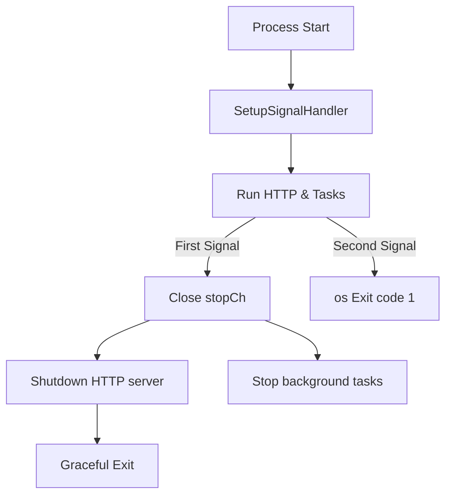

# 32. Platform/OS Signals and Graceful Shutdown (Signals Domain)

This section describes how Rudder handles OS‐level signals to orchestrate a clean shutdown of its HTTP servers and background workers. The **internal/signals** package provides a unified API for POSIX and Windows platforms. Within `main.go`, this mechanism ensures that long‐running tasks stop gracefully and resources are released before process exit.

## 32.1 Signal handling for POSIX/Windows and shutdown orchestration

Rudder uses Go’s `os/signal` package to listen for termination signals. Depending on the OS, it registers the appropriate signals, then exposes a single `<-chan struct{}` that closes once upon the first signal and forces exit on a second. The returned channel is passed to HTTP servers and background tasks to coordinate shutdown.

### Platform-specific signal definitions

| File | Platform | Registered Signals |
| --- | --- | --- |
| `internal/signals/signal_posix.go` | POSIX | Interrupt (Ctrl+C), SIGTERM |
| `internal/signals/signal_windows.go` | Windows | Interrupt (Ctrl+C) |


```go
// POSIX signals
var shutdownSignals = []os.Signal{os.Interrupt, syscall.SIGTERM}

// Windows signals
var shutdownSignals = []os.Signal{os.Interrupt}
```

### Core API: SetupSignalHandler ⚙️

The `SetupSignalHandler` function lives in `internal/signals/signal.go`. It returns a **stop channel** that closes on the first registered signal. A second signal triggers an immediate `os.Exit(1)`.

```go
// SetupSignalHandler registers for Interrupt and SIGTERM.
// stopCh closes on first signal. Second signal forces os.Exit(1).
func SetupSignalHandler() (stopCh <-chan struct{}) {
    close(onlyOneSignalHandler) // panics if called twice

    stop := make(chan struct{})
    c := make(chan os.Signal, 2)
    signal.Notify(c, shutdownSignals...)
    go func() {
        <-c
        close(stop)      // signal first handler
        <-c
        os.Exit(1)       // second signal
    }()

    return stop
}
```

**Responsibilities**

- **`onlyOneSignalHandler`** prevents multiple registrations.
- **`signal.Notify`** subscribes to OS events.
- **Goroutine** closes `stop` on first event; calls `os.Exit` on second.

### Shutdown orchestration in `main.go`

In `main.go`, Rudder wires `stopCh` into both HTTP and background tasks:

```go
if *serverFlag {
    // 1. Register signal handler
    stopCh := signals.SetupSignalHandler()

    // 2. Start auto-undeploy background worker
    handlers.NewScheduledUndeployTask().Start(stopCh)

    logrus.Info("rudder started listening on ", cfg.Address())

    // 3. Configure HTTP server
    srv := http.Server{Addr: cfg.Address(), Handler: routes}
    go func() {
        <-stopCh
        logrus.Info("shutting down http server")
        ctx, cancel := context.WithTimeout(context.Background(), 20*time.Second)
        defer cancel()
        _ = srv.Shutdown(ctx)
    }()

    // 4. Begin listening
    err := srv.ListenAndServe()
    if err != nil {
        logrus.Fatal(err)
    }
}
```

Key points:

- **Background tasks** use the same `stopCh` to exit on signal.
- **HTTP server** waits on `stopCh`, then invokes `srv.Shutdown` with a 20 s timeout.
- **ListenAndServe** returns when shutdown completes, allowing `main` to exit.

### Graceful shutdown flowchart



### Shutdown sequence summary

1. Call `SetupSignalHandler` once at startup.
2. Pass returned `stopCh` to all long-running routines.
3. On first signal, `stopCh` closes.
4. HTTP server and tasks detect `stopCh` and stop.
5. Once `ListenAndServe` returns, process exits normally.
6. A second signal triggers `os.Exit(1)` immediately.

```card
{
    "title": "Single Handler Only",
    "content": "Calling SetupSignalHandler more than once panics. Ensure it is invoked a single time."
}
```