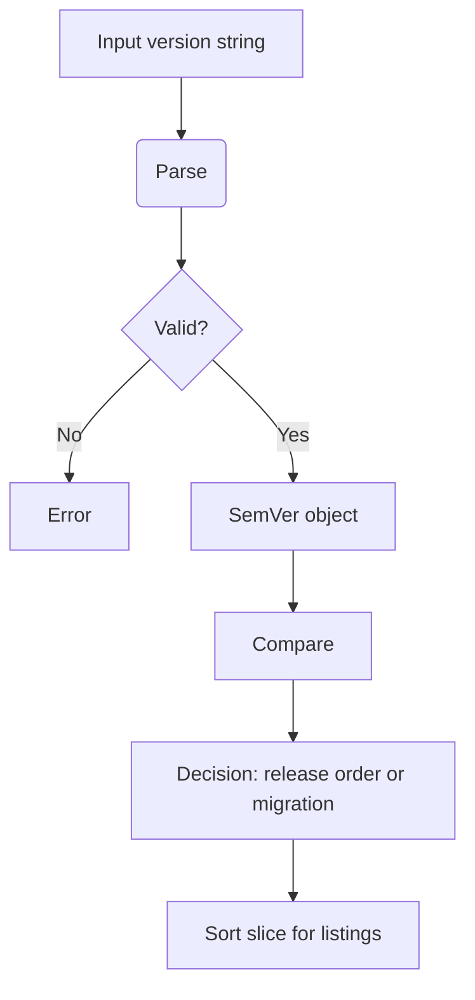

# 33. Versioning and SemVer Utilities (Semver Domain)

This section describes Rudder’s internal semantic-versioning package. It provides parsing, validation, comparison, and sorting of version strings. These utilities ensure consistent handling of release tags, API versions, and migration sequences across the application.

## 33.1 SemVer parsing/comparison utilities and usage points

Rudder’s `internal/semver` package supports two version schemas:

- **vMAJOR.MINOR** (with a required “v” prefix)
- **MAJOR.MINOR.PATCH** (no prefix)

It follows SemVer 2.0.0 rules with these variations, offering robust parsing and ordering functions for releases, API version checks, and migration decision logic .

### Supported Formats

| Format | Example | Prefix Required | VersionType |
| --- | --- | --- | --- |
| vMAJOR.MINOR | v1.2 | Yes | MajorMinor |
| MAJOR.MINOR.PATCH | 1.2.3 | No | MajorMinorPatch |


### SemVerType Enumeration

Defines the two supported version flavours:

```go
type SemVerType string

const (
  MajorMinor      SemVerType = "MajorMinor"
  MajorMinorPatch SemVerType = "MajorMinorPatch"
)
```

### SemVer Struct & Core Methods

The `SemVer` struct holds parsed integers and the format type:

```go
type SemVer struct {
  major       int
  minor       int
  patch       int
  versionType SemVerType
}
```

Key receiver methods:

- `String() string`

Renders back to **“vMAJOR.MINOR”** or **“MAJOR.MINOR.PATCH”**.

- `Major() int`, `Minor() int`, `Patch() int`

Access individual components.

- `VersionType() SemVerType`

Reports the schema used.

### Parsing Versions

The `Parse` function tokenizes input via a regex, extracting up to three numeric parts:

```go
var semVerRegex = regexp.MustCompile(`^v?(\d+).?(\d+)?.?(\d+)?`)

func Parse(version string) (*SemVer, error) {
  matches := semVerRegex.FindStringSubmatch(version)
  if len(matches) != 4 {
    return nil, fmt.Errorf("failed to get major, minor and patch version from version %s", version)
  }
  // Convert captures to integers and set SemVerType
  …
}
```

- **Regex breakdown**
- `v?`           → optional “v”
- `(\d+)`        → MAJOR (required)
- `.?(\d+)?`     → MINOR (optional)
- `.?(\d+)?`     → PATCH (optional)
- **Behavior**
- Default missing parts to zero
- Assign `MajorMinor` or `MajorMinorPatch` based on presence of patch

```card
{
    "title": "Note on Prefix",
    "content": "The \u201cv\u201d prefix is mandatory for MAJOR.MINOR versions (e.g. v2.3). Without it, input is treated as MAJOR.MINOR.PATCH."
}
```

### Comparing Versions

The `Compare` function imposes lexicographic ordering:

```go
// returns 1 if v1>v2, -1 if v1<v2, 0 if equal
func Compare(v1, v2 *SemVer) int {
  if v1.major != v2.major {
    if v1.major > v2.major { return 1 }
    return -1
  }
  if v1.minor != v2.minor {
    if v1.minor > v2.minor { return 1 }
    return -1
  }
  if v1.patch != v2.patch {
    if v1.patch > v2.patch { return 1 }
    return -1
  }
  return 0
}
```

- **Major priority** over minor/patch
- **Minor priority** if majors tie
- **Patch priority** last

### Sorting & Equality

- **Sort**

Orders a slice of `*SemVer` in ascending order:

```go
  func Sort(versions []*SemVer) {
    sort.Slice(versions, func(i, j int) bool {
      return Compare(versions[i], versions[j]) == -1
    })
  }
```

- **Equal**

Shorthand for `Compare(sv, v) == 0`.

### Version Flow in Rudder



### Usage Points

- 🏷️ **Releases**
- Tag ordering in UI listings
- Promotion pipelines
- 🔌 **API Versions**
- Route version validation
- Deprecation checks
- 🛠️ **Migration Decisions**
- Ordering database migrations via gormigrate
- Applying conditional scripts based on version comparison

These utilities centralize all version-ordering logic, ensuring consistent behavior across Rudder’s release, API, and migration subsystems.