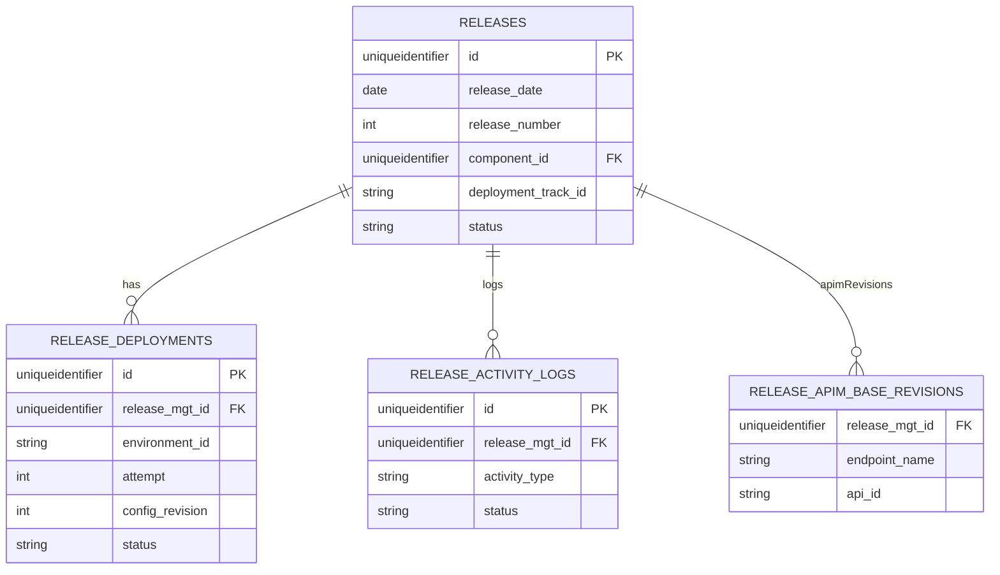

# 4. Release Management (Release_Management Domain)

This section describes how Rudder persists release and deployment data. It covers the key database migrations, GORM models, uniqueness constraints, and status fields that drive the release management domain.

## 4.1 Release management data model, constraints, and migrations

Rudder’s release management uses three primary tables—**releases**, **release_deployments**, and **release_activity_logs**—augmented by APIM base revisions and application-environment columns. Migrations ensure schema consistency, enforce uniqueness, and set default statuses.

### 4.1.1 Database Migrations

#### Migration 0.0.213: Create core release tables 🚀

This migration creates:

- **releases**: stores release metadata.
- **release_deployments**: records each deployment attempt.
- **release_activity_logs**: tracks status changes and custom events.

```sql
-- releases table
create table releases (
  id uniqueidentifier primary key,
  created_at datetime2 default GETDATE(),
  updated_at datetime2 default GETDATE(),
  release_date date not null,
  release_number int not null,
  project_id uniqueidentifier not null,
  description nvarchar(max),
  status nvarchar(50) not null default 'DRAFT',
  organization_id nvarchar(255) not null,
  created_by nvarchar(255) not null,
  metadata nvarchar(max),
  component_id uniqueidentifier not null,
  deployment_track_id nvarchar(255) not null,
  commit_hash nvarchar(255),
  image_tag nvarchar(255),
  constraint unique_release_date_number_per_component_deployment_track
    unique (release_date, release_number, component_id, deployment_track_id)
);

-- release_deployments table
create table release_deployments (
  id uniqueidentifier primary key,
  created_at datetime2 default GETDATE(),
  updated_at datetime2 default GETDATE(),
  release_mgt_id uniqueidentifier not null,
  environment_id nvarchar(255) not null,
  attempt bigint not null default 1,
  config_revision int not null default 1,
  status nvarchar(50) not null default 'PENDING',
  comment nvarchar(max),
  deployed_at datetime2,
  deployed_by nvarchar(255),
  config_mapping_revision int not null default 0,
  schema_based_config_revision int not null default 0,
  api_settings nvarchar(max),
  foreign key (release_mgt_id) references releases(id) on delete cascade,
  constraint unique_release_mgt_id_environment_id_config_revision_attempt
    unique (release_mgt_id, environment_id, config_revision, attempt)
);

-- release_activity_logs table
create table release_activity_logs (
  id uniqueidentifier primary key,
  created_at datetime2 default GETDATE(),
  updated_at datetime2 default GETDATE(),
  release_deployment_id uniqueidentifier,
  release_mgt_id uniqueidentifier not null,
  environment_id nvarchar(255),
  activity_type nvarchar(255) not null,
  activity_data nvarchar(max),
  status nvarchar(50) not null default 'PENDING',
  foreign key (release_mgt_id) references releases(id) on delete cascade
);

-- Indexes for performance
create index idx_releases_org_project on releases (organization_id, project_id);
create index idx_releases_status on releases (status);
create index idx_deployments_release_mgt_id on release_deployments (release_mgt_id);
create index idx_deployments_release_mgt_id_environment_id
  on release_deployments (release_mgt_id, environment_id);
create index idx_deployment_logs_release_mgt_id on release_activity_logs (release_mgt_id);
create index idx_releases_date_number on releases (release_date, release_number);
create index idx_release_deployments_env_config_rev
  on release_deployments (environment_id, config_revision);
create index idx_release_activity_logs_status on release_activity_logs (status);
```

#### Migration 0.0.215: APIM base revisions table

Adds **release_apim_base_revisions** to store external APIM revision metadata per release.

```sql
create table release_apim_base_revisions (
  release_mgt_id uniqueidentifier not null,
  endpoint_name nvarchar(255) not null,
  api_id nvarchar(255) not null,
  revision_id nvarchar(255) not null,
  access_mode nvarchar(255) not null,
  foreign key (release_mgt_id) references releases(id) on delete cascade
);
create index idx_release_apim_base_revisions_release_mgt_id
  on release_apim_base_revisions (release_mgt_id);
```

#### Migration 0.0.216: Augment `app_environments`

Adds release management columns to **app_environments** for day-2 operations and UI integration.

```sql
ALTER TABLE app_environments
  ADD release_mgt_release_id nvarchar(50) NULL,
      release_mgt_deployment_id nvarchar(50) NULL,
      release_mgt_deployment_name nvarchar(50) NULL;
```

### 4.1.2 GORM Models

Rudder maps these tables to two core Go structs in `release_repository_model.go`:

| Struct | Table |
| --- | --- |
| Release | releases |
| ReleaseDeployment | release_deployments |


#### Release model

```go
type Release struct {
  common.Base
  OrganizationID    common.UniqueIdentifier           `gorm:"column:organization_id;not null"`
  ProjectID         common.UniqueIdentifier           `gorm:"column:project_id;not null"`
  Name              string                            `gorm:"-"`
  Description       string                            `gorm:"column:description"`
  Status            string                            `gorm:"column:status;not null;default:DRAFT"`
  CreatedBy         string                            `gorm:"column:created_by;not null"`
  ReleaseDate       time.Time                         `gorm:"column:release_date;not null"`
  ReleaseNumber     int                               `gorm:"column:release_number;not null"`
  Metadata          common.PostgresMapStringInterface `gorm:"column:metadata"`
  ComponentID       common.UniqueIdentifier           `gorm:"column:component_id"`
  DeploymentTrackID string                            `gorm:"column:deployment_track_id"`
  CommitHash        string                            `gorm:"column:commit_hash"`
  ImageTag          string                            `gorm:"column:image_tag"`
}
```

- **BeforeCreate/BeforeUpdate** hooks auto-compute `Name = YYYYMMDD-<number>`.
- Default `Status = DRAFT`.

#### ReleaseDeployment model

```go
type ReleaseDeployment struct {
  common.Base
  ReleaseMgtID              common.UniqueIdentifier           `gorm:"column:release_mgt_id;not null"`
  EnvironmentID             common.UniqueIdentifier           `gorm:"column:environment_id;not null"`
  Attempt                   int64                              `gorm:"column:attempt;not null;default:1"`
  ConfigRevision            int                                `gorm:"column:config_revision;not null;default:1"`
  Status                    string                             `gorm:"column:status;not null;default:PENDING"`
  Comment                   string                             `gorm:"column:comment"`
  DeployedAt                time.Time                          `gorm:"column:deployed_at"`
  DeployedBy                string                             `gorm:"column:deployed_by"`
  ConfigMappingRevision     int                                `gorm:"column:config_mapping_revision;not null;default:0"`
  SchemaBasedConfigRevision int                                `gorm:"column:schema_based_config_revision;not null;default:0"`
  ApiSettings               common.PostgresMapStringInterface  `gorm:"column:api_settings"`
  Release                   *Release                           `gorm:"foreignKey:ReleaseMgtID"`
}
```

- **BeforeCreate** hook sets defaults:
- `Status = PENDING`
- `Attempt = 1`
- `ConfigRevision = 1`
- `IsDeployed()` returns true when `Status == SUCCESS`.

### 4.1.3 Uniqueness Constraints & Status Enums

#### Uniqueness constraints

| Constraint name | Applies to | Purpose |
| --- | --- | --- |
| unique_release_date_number_per_component_deployment_track | releases (release_date, release_number, component_id, deployment_track_id) | Prevent duplicate release numbers per component and track on the same date. |
| unique_release_mgt_id_environment_id_config_revision_attempt | release_deployments (release_mgt_id, environment_id, config_revision, attempt) | Ensure each attempt per config revision is unique. |


#### Status enums

| Model | Possible values |
| --- | --- |
| **Release.Status** | DRAFT, IN_REVIEW, APPROVED, REJECTED, DEPLOYING, DEPLOYED, FAILED, ROLLED_BACK |
| **ReleaseDeployment.Status** | PENDING, IN_PROGRESS, SUCCESS, FAILED, CANCELLED, ROLLED_BACK |


These enums coordinate workflow and prevent invalid transitions at both database and application levels.

### 4.1.4 Entity–Relationship Diagram



This ER diagram visualizes the one-to-many relationships among releases, their deployments, activity logs, and APIM base revisions.

---

Rudder’s release management data model ensures robust tracking of creation, deployment attempts, configuration revisions, and external API revisions. Migrations (213, 215, 216) establish the underlying schema, while GORM models and repository/controller layers enforce business logic and transaction boundaries.