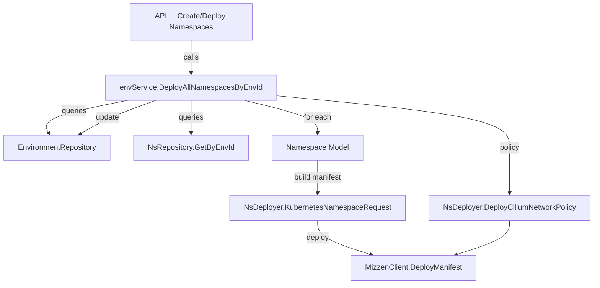

## 5.2 Namespace Lifecycle and Deployment Integration

This section covers how Rudder manages the full lifecycle of Kubernetes namespaces tied to Choreo environments. It spans:

- Defining **domain objects** (`NamespaceRequest`, `Namespace`)
- Persisting and querying namespaces
- Rendering and applying Kubernetes manifests
- Integrating with Mizzen for deployment and network policy enforcement
- Utilities and tests that validate the workflow

---

### Domain Model: Creating Namespace Objects

Rudder represents a namespace via two structs:

| Type | Purpose |
| --- | --- |
| **NamespaceRequest** | DTO for incoming API requests; holds metadata, name, annotations and env link |
| **Namespace** | Domain model with ID, platform metadata, persistence and enrichment logic |


The helper `CreateNamespaceObj` builds a `Namespace` from a request:

```go
func CreateNamespaceObj(req NamespaceRequest) (*Namespace, error) {
  if v, err := common.IsValid(req); !v {
    return nil, err
  }
  obj := Namespace{}
  if err := copier.Copy(&obj, &req); err != nil {
    return nil, err
  }
  obj.EnsureID()
  return &obj, nil
}
```

- Validates the request via `common.IsValid`
- Copies fields into the domain object
- Generates a unique ID (`EnsureID`)

---

### Persistence Layer: Namespace Repository

Namespaces are stored in the `namespaces` table. The repository exposes:

```go
var NsRepository = nsRepository{}

func (e *nsRepository) GetByEnvId(ctx context.Context, id common.UniqueIdentifier) ([]Namespace, error) {
  conditions := &Namespace{EnvironmentID: id}
  var dest []Namespace
  if dbc := db.DB(ctx).Where(conditions).Find(&dest); dbc.Error != nil {
    return nil, fmt.Errorf("nsRepository:GetByEnvId: [%w]", dbc.Error)
  }
  return dest, nil
}
```

- **GetByEnvId** retrieves all `Namespace` rows for a given environment ID
- Wraps GORM’s `Find` and surfaces errors with context

---

### Deployment Integration: `NsDeployer`

The `NsDeployer` interface encapsulates Kubernetes interactions:

```go
type NsDeployer interface {
  KubernetesNamespaceRequest(ctx context.Context, obj *Namespace, method string, dryRun bool) (*generator.Namespace, error)
  DeleteNamespace(ctx context.Context, env Environment) error
  DeployCiliumNetworkPolicy(ctx context.Context, env Environment) error
}
```

#### 1. Rendering and Applying Namespace Manifests

```go
func (d *nsDeployer) KubernetesNamespaceRequest(ctx context.Context, obj *Namespace, method string, dryRun bool) (*generator.Namespace, error) {
  if v, err := common.IsValid(obj); !v {
    return nil, err
  }
  if err := obj.LoadEnvironment(); err != nil {
    return nil, err
  }

  annotations, _ := common.ConvertInterfaceToStringMapString(obj.Annotations)
  labels, _ := common.ConvertInterfaceToStringMapString(obj.Metadata)

  ns := generator.Namespace{}
  ns.Metadata.Name = obj.Name
  ns.Metadata.SetLabels(obj.Environment.GetLabels())
  ns.Metadata.SetAnnotations(annotations)
  ns.Metadata.SetLabels(labels)
  ns.SetHeader()

  if !dryRun {
    if err := d.envDeployer.DeployToEnv(ctx, *obj.Environment, ns, method, false); err != nil {
      return nil, err
    }
    logctx.From(ctx).
      WithField("ns", obj.Name).
      WithField("id", obj.ID.String()).
      WithField("method", method).
      Infof("Namespace modified successfully")
  }
  return &ns, nil
}
```

- **Validation**: rejects invalid `Namespace` objects
- **Environment Load**: populates labels from parent environment
- **Generator**: builds a `generator.Namespace` manifest
- **Deployment**: calls `envDeployer.DeployToEnv` (Mizzen under-the-hood)

#### 2. Deleting a Namespace

```go
func (d *nsDeployer) DeleteNamespace(ctx context.Context, env Environment) error {
  ns := generator.Namespace{}
  ns.Metadata.Name = env.Namespace
  ns.SetHeader()
  return d.envDeployer.DeleteResourceFromEnv(ctx, env.ID, ns)
}
```

- Constructs a bare manifest with namespace name
- Invokes `DeleteResourceFromEnv` to remove it via Mizzen

#### 3. Cilium Network Policy Enforcement

```go
func (d *nsDeployer) DeployCiliumNetworkPolicy(ctx context.Context, env Environment) error {
  // Attempt project-level policy
  ep, err := network_policy.EgressPolicyProjectRepository.GetEgressPolicyProject(ctx, env.ProjectID)
  // Fallback to org or default policy...
  cnp := network_policy.GenerateDefaultCiliumNetworkPolicy(env.Namespace)
  // Deploy the policy manifest
  return d.envDeployer.DeployManifestToEnv(ctx, env.ID, cnp)
}
```

- Queries **project** then **organization** egress policies
- Soft-deleted or missing records default to built-in policy
- Pushes a CiliumNetworkPolicy manifest to the cluster

---

### Namespace Lifecycle in the Service

The `EnvService` orchestrates namespace deployments for an environment:

```go
func (svc *envService) deployAllNamespacesByEnvId(ctx context.Context, envId common.UniqueIdentifier) error {
  if envId.IsEmpty() {
    return errors.New("envId is empty")
  }
  env, err := EnvironmentRepository.EnvironmentById(ctx, envId)
  if err != nil {
    return err
  }
  nsList, err := NsRepository.GetByEnvId(ctx, envId)
  if err != nil {
    return err
  }
  // Deploy each namespace
  for _, ns := range nsList {
    if _, err := svc.nsDeployer.KubernetesNamespaceRequest(ctx, &ns, common.REQUEST_POST, common.DRY_RUN_FALSE); err != nil {
      return fmt.Errorf("failed to deploy namespace %s: %w", ns.Name, err)
    }
  }
  // Ensure network policies
  if err := svc.nsDeployer.DeployCiliumNetworkPolicy(ctx, *env); err != nil {
    return fmt.Errorf("failed to deploy network policies: %w", err)
  }
  return EnvironmentRepository.UpdateDeployedAt(ctx, envId)
}
```

- **Idempotent**: skips if already deployed (`EnsureNamespaceDeployed`)
- **Transaction**: sequentially ensures each namespace exists
- **Timestamp**: marks `deployed_at` to avoid re-deploying

#### Hooking into Kubernetes Workflows

Rudder registers a *namespace initializer* with Mizzen to auto-create namespaces before other resources:

```go
func CreateNamespaceInitializer(envSvc EnvService) mizzen.NamespaceInitializer {
  return func(ctx context.Context, clusterId common.UniqueIdentifier, manifest any) error {
    m, _ := common.ConvertInterfaceToStringMapInterface(manifest)
    header, _ := GetResourceHeaderFromKubernetesConfig(m)
    envIds, err := EnvironmentRepository.GetEnvIdsByNamespaceAndClusterId(ctx, header.Metadata.Namespace, clusterId)
    if len(envIds) == 1 {
      return envSvc.DeployAllNamespacesByEnvId(ctx, envIds[0])
    }
    return nil
  }
}
```

- Intercepts non-namespace manifests
- Extracts the target `namespace` and `clusterId`
- Triggers namespace creation if the env exists

---

### Testing & Utilities

A set of test helpers validate the namespace workflow:

- **`GetDeployedResources`** collects all manifests sent to the mock Mizzen client, grouping by Kind (e.g., “Namespace”, “CiliumNetworkPolicy”)
- **Resource Comparator** sorts by name for stable comparisons
- **`Test_envService_DeployNamespaces`** covers various scenarios (existing namespaces, dry-runs, policy fallback)
- **Promotion Order Sorting** has nothing to do with namespaces but shares the same utils package for sorting logic

---

### Flowchart: Namespace Deployment Workflow



- **API** layer invokes the service
- **Service** fetches environment and namespace list
- **NsDeployer** translates models into generator manifests
- **MizzenClient** applies manifests to the cluster

---

> 🚀 **Key Takeaways** - Namespaces are first-class domain objects with validation and persistence - Deployment is fully integrated with Mizzen via `NsDeployer` and initializers - Cilium network policies are enforced per-environment, falling back gracefully - Comprehensive mocks and utilities ensure correct behavior across edge cases