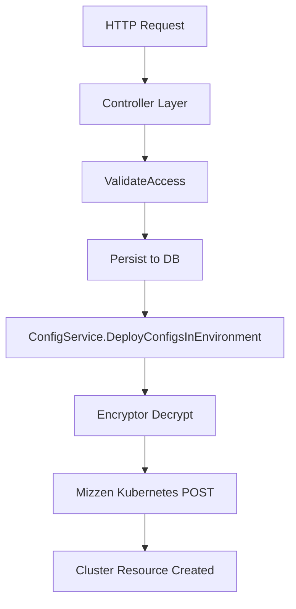

# 6 Configuration and Secrets Management

Section 6 covers how Rudder handles application configuration and secrets through Kubernetes ConfigMaps and native Secrets. It spans the **ConfigMap** domain, the **Configuration** domain, and the **ConfigurationSvc** client layer.

## 6.1 ConfigMaps and Secrets: access validation, persistence, deployment

This subsection describes how Rudder

- validates access to ConfigMaps and Secrets,
- persists them in MS SQL via GORM models and repositories,
- deploys them into Kubernetes using Mizzen.

### 🔒 Access Validation

Before any read/write, Rudder ensures the requested ConfigMap or Secret belongs to the caller’s organization, project, and environment.

| Function | File | Purpose |
| --- | --- | --- |
| **ValidateConfigmapAccess** | internal/bundles/configmap/access_validations.go | Checks `OrganizationID`, `ProjectID`, `EnvironmentID` match the caller’s context. |
| **ValidateSecretAccess** | internal/bundles/configmap/access_validations.go | Enforces the same checks for Secrets. |


```go
// Ensure the ConfigMap belongs to the right org/project/env
func ValidateConfigmapAccess(ctx context.Context, orgProject common.XPlatformerData, env *environment.Environment, cfg ConfigMap) error {
  if !orgProject.OrganizationID.IsEmpty() && cfg.OrganizationID != orgProject.OrganizationID {
    return common.BadRequestError(fmt.Errorf("configmap [%s] not found in organization %s", cfg.ID, orgProject.OrganizationID))
  }
  // … similar checks for project and environment …
  return nil
}
```

### 💾 Persistence

Rudder persists ConfigMaps and Secrets via GORM models and repository types under `internal/bundles/configmap`.

| Artifact | File | Role |
| --- | --- | --- |
| **ConfigMapRequest**, **ConfigMap** model | internal/bundles/configmap/configimap_model.go | Defines schema, JSON tags, encryption fields, and GORM hooks. |
| **SecretRequest**, **Secret** model | internal/bundles/configmap/secret_model.go | Similar to ConfigMap; handles base64, JSON, encryption metadata. |
| **ConfigMapRepository**, **SecretRepository** | internal/bundles/configmap/configmap_service.go (refs) and secret_repository.go | Offers methods to List/Get/Delete by environment or release. |


### 🚀 Deployment

After validation and storage, Rudder deploys ConfigMaps and Secrets into target Kubernetes clusters via Mizzen. The core service implementation is in `configmap_service.go`.

```go
// Deploy all ConfigMaps and Secrets to a given environment
func (svc *configService) DeployConfigsInEnvironment(ctx context.Context, envId common.UniqueIdentifier, ignoreConfigs ignoreConfigurbales) error {
  env, err := environment.EnvironmentRepository.GetEnvironmentDeployTarget(ctx, envId)
  if err != nil {
    return err
  }
  // Fetch, decrypt, and POST each ConfigMap
  configmaps, err := ConfigMapRepository.GetByEnvironmentId(ctx, envId)
  // …
  for _, c := range configmaps {
    if err := svc.encryptor.DecryptFromClusterKV(ctx, c, *env); err != nil { continue }
    if err := svc.deployer.KubernetesConfigMapRequest(ctx, c, mizzen.POST, common.DRY_RUN_FALSE); err != nil { continue }
  }
  // Repeat for Secrets…
  // Return error if any deployments failed
}
```

This flow ensures:

1. **Decryption** from Vault‐backed Cluster KV.
2. **Mizzen POST** calls to apply resources.
3. **Error Counting** to fail fast on partial deployment.



### API Endpoints

Below are interactive API examples anchored in the OpenAPI spec. Each operation is in its own block.

#### List ConfigMaps

```api
{
    "title": "List ConfigMaps",
    "description": "Get all ConfigMaps for the specified organization and project",
    "method": "GET",
    "baseUrl": "https://api.example.com",
    "endpoint": "/api/v1/configmaps",
    "headers": [
        {
            "key": "Accept",
            "value": "application/json",
            "required": true
        }
    ],
    "queryParams": [
        {
            "key": "organizationId",
            "value": "Organization UUID",
            "required": true
        },
        {
            "key": "projectId",
            "value": "Project UUID",
            "required": true
        },
        {
            "key": "environmentId",
            "value": "Environment UUID",
            "required": true
        }
    ],
    "pathParams": [],
    "bodyType": "none",
    "requestBody": "",
    "formData": [],
    "rawBody": "",
    "responses": {
        "200": {
            "description": "List of ConfigMaps",
            "body": "{\n  \"data\": [ /* ConfigMap objects */ ]\n}"
        },
        "400": {
            "description": "Bad request",
            "body": "{ \"error\": { \"message\": \"Invalid parameters\" } }"
        }
    }
}
```

– OpenAPI fragment for GET `/api/v1/configmaps`

#### Create ConfigMap

```api
{
    "title": "Create ConfigMap",
    "description": "Create a new ConfigMap",
    "method": "POST",
    "baseUrl": "https://api.example.com",
    "endpoint": "/api/v1/configmaps",
    "headers": [
        {
            "key": "Content-Type",
            "value": "application/json",
            "required": true
        }
    ],
    "queryParams": [
        {
            "key": "organizationId",
            "value": "Organization UUID",
            "required": true
        },
        {
            "key": "projectId",
            "value": "Project UUID",
            "required": true
        },
        {
            "key": "environmentId",
            "value": "Environment UUID",
            "required": true
        }
    ],
    "pathParams": [],
    "bodyType": "json",
    "requestBody": "{\n  \"name\": \"example\",          \n  \"data\": { \"key\": \"value\" },\n  \"save_type\": \"Save\"\n}",
    "formData": [],
    "rawBody": "",
    "responses": {
        "200": {
            "description": "ConfigMap created successfully",
            "body": "{ \"data\": { /* ConfigMap object */ } }"
        },
        "400": {
            "description": "Bad request",
            "body": "{ \"error\": { \"message\": \"Invalid payload\" } }"
        }
    }
}
```

– OpenAPI fragment for POST `/api/v1/configmaps`

#### Delete ConfigMap

```api
{
    "title": "Delete ConfigMap",
    "description": "Delete a ConfigMap by its UUID",
    "method": "DELETE",
    "baseUrl": "https://api.example.com",
    "endpoint": "/api/v1/configmaps/{uuid}",
    "headers": [
        {
            "key": "Authorization",
            "value": "Bearer <token>",
            "required": true
        }
    ],
    "queryParams": [
        {
            "key": "organizationId",
            "value": "Organization UUID",
            "required": true
        },
        {
            "key": "projectId",
            "value": "Project UUID",
            "required": true
        },
        {
            "key": "environmentId",
            "value": "Environment UUID",
            "required": true
        }
    ],
    "pathParams": [
        {
            "key": "uuid",
            "value": "ConfigMap UUID",
            "required": true
        }
    ],
    "bodyType": "none",
    "requestBody": "",
    "formData": [],
    "rawBody": "",
    "responses": {
        "204": {
            "description": "ConfigMap deleted successfully",
            "body": ""
        },
        "404": {
            "description": "ConfigMap not found",
            "body": "{ \"error\": { \"message\": \"Not found\" } }"
        }
    }
}
```

– OpenAPI fragment for DELETE `/api/v1/configmaps/{uuid}`

#### List Secrets

```api
{
    "title": "List Secrets",
    "description": "Get all Secrets for the specified organization and project",
    "method": "GET",
    "baseUrl": "https://api.example.com",
    "endpoint": "/api/v1/secrets",
    "headers": [
        {
            "key": "Accept",
            "value": "application/json",
            "required": true
        }
    ],
    "queryParams": [
        {
            "key": "organizationId",
            "value": "Organization UUID",
            "required": true
        },
        {
            "key": "projectId",
            "value": "Project UUID",
            "required": true
        },
        {
            "key": "environmentId",
            "value": "Environment UUID",
            "required": true
        }
    ],
    "pathParams": [],
    "bodyType": "none",
    "requestBody": "",
    "formData": [],
    "rawBody": "",
    "responses": {
        "200": {
            "description": "List of Secrets",
            "body": "{\n  \"data\": [ /* Secret objects */ ]\n}"
        },
        "400": {
            "description": "Bad request",
            "body": "{ \"error\": { \"message\": \"Invalid parameters\" } }"
        }
    }
}
```

– OpenAPI fragment for GET `/api/v1/secrets`

#### Create Secret

```api
{
    "title": "Create Secret",
    "description": "Create a new Secret",
    "method": "POST",
    "baseUrl": "https://api.example.com",
    "endpoint": "/api/v1/secrets",
    "headers": [
        {
            "key": "Content-Type",
            "value": "application/json",
            "required": true
        }
    ],
    "queryParams": [
        {
            "key": "organizationId",
            "value": "Organization UUID",
            "required": true
        },
        {
            "key": "projectId",
            "value": "Project UUID",
            "required": true
        },
        {
            "key": "environmentId",
            "value": "Environment UUID",
            "required": true
        }
    ],
    "pathParams": [],
    "bodyType": "json",
    "requestBody": "{\n  \"name\": \"my-secret\",\n  \"data\": { \"password\": \"s3cr3t\" },\n  \"secret_type\": \"Opaque\"\n}",
    "formData": [],
    "rawBody": "",
    "responses": {
        "201": {
            "description": "Secret created successfully",
            "body": "{ \"data\": { /* Secret object */ } }"
        },
        "400": {
            "description": "Bad request",
            "body": "{ \"error\": { \"message\": \"Invalid payload\" } }"
        }
    }
}
```

– OpenAPI fragment for POST `/api/v1/secrets`