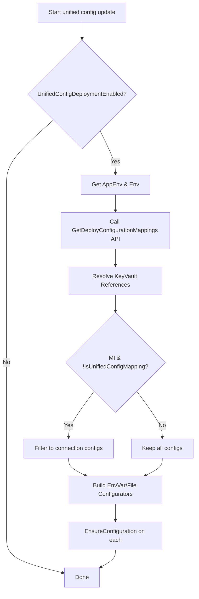

## 6.2 Configuration entities and unified configuration mapping behavior

This section covers how Rudder represents schema-based configurations in the database, and how the ConfigurationSvc integrates with the external Configuration Mapping Service to implement *unified configuration mapping*.

### 6.2.1 Configuration Domain Entities

Rudder’s **Configuration** domain resides in `internal/bundles/configuration`. It captures the schema-generated config for a given release and container.

| Struct | Purpose |
| --- | --- |
| **Configuration** | DB model for a release’s configuration. |
| **SchemaConfig** | In-memory decoded representation of environment variables and file mounts. |
| **SchemaEnvConfig** | Single environment variable entry (key, valueRef, secretName). |
| **SchemaFileConfig** | Single file mount entry (mountPath, templated content, secretName). |


```go
// Configuration represents schema-based configs stored in the DB.
// Generated from external schema service and deployed via CRD.
type Configuration struct {
  common.Base
  common.XName
  common.XPlatformerData
  environment.BelongToEnvironment

  AppEnvironmentID common.UniqueIdentifier `json:"app_environment_id"`
  ContainerID     common.UniqueIdentifier `json:"container_id"`
  ConfigData      string                   `json:"config_data"`
  SchemaConfig    SchemaConfig             `json:"-" gorm:"-"`
}
```

SchemaConfig holds two slices:

```go
type SchemaConfig struct {
  Envs  []SchemaEnvConfig  `json:"envs,omitempty"`
  Files []SchemaFileConfig `json:"files,omitempty"`
}
```

- **SchemaEnvConfig**
- Key, ValueRef, SecretName
- `GenerateSecretName` builds a unique secret name per release .
- **SchemaFileConfig**
- MountPath, TemplatedFileContent, SecretName
- Methods to derive Kubernetes `PodVolumeSpec` and `ContainerMountSpec` .

All configs relate back to an **AppEnvironment** via `AppEnvironmentID` and to a container via `ContainerID`. Migrations ensure database integrity, e.g. setting `app_environment_id` to NULL on release deletion and adding cascade deletes on `config_mounts` foreign keys .

### 6.2.2 Configuration Repository

Persistence operations live in `internal/bundles/configuration/configuration_repository.go`:

| Method | Description |
| --- | --- |
| GetConfigurationsForRelease(ctx, releaseId) | Fetches the Configuration record for a release. |
| GetConfigurationsForReleaseByContainerId(ctx,…) | Fetches by release and container. |
| Save(ctx, configuration) | Inserts a new Configuration. |
| UpdateConfigsById(ctx, id, configData) | Updates only the raw `config_data` field. |


All errors are wrapped with context for traceability .

### 6.2.3 Configuration Service

The `ConfigurationService` (`internal/bundles/configuration/configuration_service.go`) deploys schema configs via Kubernetes CRDs:

```go
type ConfigurationService interface {
  DeployConfigsInRelease(ctx, targetReleaseId) error
}

func (svc *configurationService) DeployConfigsInRelease(ctx, targetReleaseId) error {
  config, err := ConfigurationRepository.GetConfigurationsForRelease(ctx, targetReleaseId)
  // skip if nil or no Envs/Files
  schema, _ := config.DecodeConfigData()
  config.SchemaConfig = schema

  // Build CRD and deploy via environment.Deployer
  cfgCrd, _ := config.MakeCrdObject(ctx, targetReleaseId)
  return svc.deployer.DeployManifestToEnv(ctx, config.EnvironmentID, cfgCrd)
}
```

- **DecodeConfigData** deserializes the base64-encoded `ConfigData` into `SchemaConfig`.
- **MakeCrdObject** constructs a `ConfigurationCrd` (Kubernetes custom resource) containing both env vars and file mounts .

### 6.2.4 ConfigurationSvc Domain: Unified Configuration Mapping

To centralize config management, Rudder calls the external *Configuration Mapping Service* and applies a *unified mapping* strategy in `choreo/bundles/app/configurationsvc/configuration_service.go`.

**Service interface:**

```go
type Interface interface {
  UpdateConfigsInRelease(ctx, targetReleaseId, configMappingRevision) error
}
```

**UpdateConfigsInRelease** flow:

1. **Feature flag**: Skip if `UnifiedConfigDeploymentEnabled` is false .
2. **Fetch AppEnv** and corresponding Environment metadata.
3. **Invoke** `GetDeployConfigurationMappings` (HTTP GET `/configs/mappings/deploy`)
4. Response includes `Revision *int` and a list of configurations (KeyId, Key, ValueRef, Value, IsSensitive, Type, ConfigGroupId, ConfigKeyId, ValueVersion) .
5. **Resolve** any Key Vault references to actual values.
6. **Filter**:
7. If **MI integration** *and* `!release.App.IsUnifiedConfigMapping`, only connection-related configs are deployed to avoid conflicts .
8. **Generate** per-entry **configurators**:
9. `EnvVarConfig` for `type = “env”`
10. `FileConfig` for `type = “file”` (via `NewFileConfig`) .
11. **EnsureConfiguration** on each configurator: stores secrets/configmaps, creates mounts, and increments version.



### 6.2.5 Migrations supporting unified mapping

Key database migrations facilitate unified mapping:

- **090**: Clean up stale `config_mounts` and add proper FKs for `container_id` and `app_environment_id` .
- **091**: Cascade delete on `config_mounts` for `config_map_id` and `secret_id` .
- **092**: Set `app_environment_id` to NULL on `config_maps`/`secrets` when an AppEnv is deleted .

These ensure that unified-generated configs can cleanly replace or coexist with legacy config mounts.