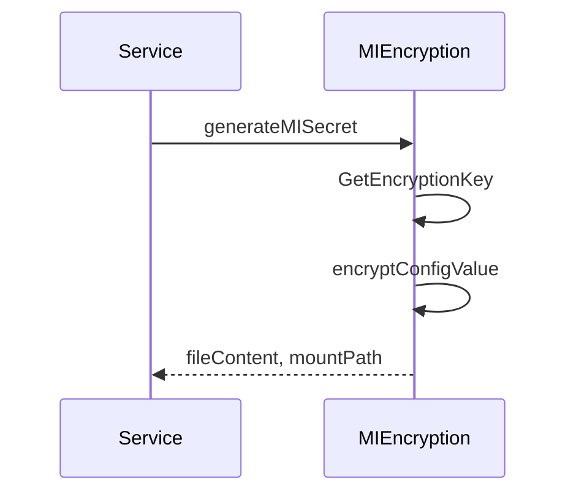

# 6.3 Configuration Service (Schema / File / EnvVar), MI Encryption, and Entity Building

The **Configuration Service** orchestrates the retrieval, encryption, persistence, and Kubernetes mounting of application configurations. It supports three configurator types—schema-based, file-based, and environment-variable-based—each implementing the `configurator` interface. For MI (Micro Integrator) components, it applies a specialized AES-ECB encryption to sensitive values and generates property files for mounting. Underlying entities are constructed via `entity_builder.go`, ensuring consistent IDs and metadata.

---

## 6.3.1 Service Orchestration

The core service lives in `configuration_service.go`. It:

- Calls the Configuration Mapping Service to fetch desired configuration mappings.
- Resolves Key Vault references via `resolveKeyVaultReferences`.
- Filters MI-specific mappings and delegates sensitive values to `generateMISecretConfigurator`.
- Constructs `FileConfig` or `EnvVarConfig` configurators based on mapping type.
- Cleans up stale configurators with `removeUnusedConfigurators`.

Each configurator then runs `EnsureConfiguration` to persist secrets and mounts.

---

## 6.3.2 Schema-Based Configurations

The **SchemaConfig** type encapsulates Choreo’s internal schema configurations:

| File | Package |
| --- | --- |
| schema_config.go | `configurationsvc` |


**Responsibilities**

- Fetch existing schema config from DB.
- Encode environment and file specs into a single Base64 string.
- Create or update a `configuration.Configuration` record with the encoded payload.

**Key Methods**

- `EnsureConfiguration(ctx)` — entry point, invokes `ensureConfiguration`.
- `encodeConfigsToBase64()` — builds a `SchemaConfig` model, sets secret names, and Base64-encodes it.
- `GetId()`, `Signature()` — track configurator identity.

```go
func (cfg *SchemaConfig) ensureConfiguration(ctx context.Context) error {
    existing, err := configuration.ConfigurationRepository.GetConfigurationsForRelease(ctx, cfg.release.ID)
    ...
    encoded, err := cfg.encodeConfigsToBase64()
    container := getMainContainer(cfg.release)
    // create or update Configuration entity
    if existing == nil {
        newCfg := makeConfigurationEntity(..., configurationName, encoded)
        configuration.ConfigurationRepository.Save(ctx, *newCfg)
    } else {
        configuration.ConfigurationRepository.UpdateConfigsById(ctx, existing.ID, encoded)
    }
    cfg.configuration = existing or newCfg
    return nil
}
```

---

## 6.3.3 File-Based Configurations

The **FileConfig** type manages per-release file mounts:

| File | Package |
| --- | --- |
| file_config.go | `configurationsvc` |


**Workflow**

1. **Secret Creation** (`ensureSecret`):
2. Looks up existing secrets for the release.
3. Derives a unique secret name from `mountPath`.
4. Encrypts `data["data"]` JSON blob into Key Vault.
5. Saves or updates `configmap.Secret`.
6. **Mount Persistence** (`ensureConfigMount`):
7. Retrieves or creates an `app.ConfigMount`, linking the secret to the container.

```go
func (cfg *FileConfig) ensureConfigMount(ctx context.Context) error {
    existing, err := app.ConfigMountRepository.GetBySecretId(ctx, cfg.secret.ID)
    if errors.Is(err, gorm.ErrRecordNotFound) {
        container := getMainContainer(cfg.release)
        newMount := makeSecretConfigMount(cfg.release.ID, container.ID, cfg.secret.ID, cfg.mountType)
        newMount.MountPath = cfg.mountPath
        newMount.Save(ctx)
        cfg.mount = newMount
    } else {
        cfg.mount = existing
    }
    return nil
}
```

Dependencies: `getMainContainer` and `hasDataChanged` from **helpers.go** , and secret operations in `configmap.SecretRepository`.

---

## 6.3.4 Environment Variable Configurations

The **EnvVarConfig** type handles mappings to environment variables:

| File | Package |
| --- | --- |
| envvar_config.go | `configurationsvc` |


**Workflow**

1. **Secret Management** (`ensureSecret`):
2. Validates new data via `hasDataChanged`.
3. Encrypts or skips encryption if data unchanged.
4. **Mount Persistence** (`ensureConfigMount`):
5. Persists an `app.ConfigMount` of type `ENVFile`.

```go
func (cfg *EnvVarConfig) ensureConfigMount(ctx context.Context) error {
    existing, err := app.ConfigMountRepository.GetBySecretId(ctx, cfg.secret.ID)
    if errors.Is(err, gorm.ErrRecordNotFound) {
        container := getMainContainer(cfg.release)
        mount := makeSecretConfigMount(cfg.release.ID, container.ID, cfg.secret.ID, cfg.mountType)
        mount.Save(ctx)
        cfg.mount = mount
    } else {
        cfg.mount = existing
    }
    return nil
}
```

Uses same helpers and repository patterns as **FileConfig**.

---

## 6.3.5 Entity Building

`entity_builder.go` provides factory functions for domain entities:

| Function | Returns |
| --- | --- |
| `makeSecret(...)` | `*configmap.Secret` |
| `makeSecretConfigMount(...)` | `*app.ConfigMount` |
| `makeConfigurationEntity(...)` | `*configuration.Configuration` |


Each sets metadata (IDs, names, platform data) and returns an initialized entity ready for persistence.

---

## 6.3.6 MI-Specific Encryption

MI components require file-based secrets with AES-ECB encryption derived from the component ID and timestamp:

| File | Package |
| --- | --- |
| mi_encryption.go | `configurationsvc` |


**Key Functions**

- `GetEncryptionKey(release)` — HMAC-SHA256 over `"appID##timestamp"` generates a 32-byte key.
- `encryptConfigValue(value, key)` — pads via PKCS#5, encrypts with AES-ECB, returns base64.
- `DecryptConfigValue(value, key)` — reverses encoding and padding.
- `generateMISecret(...)` — wraps `KEY=encryptedValue` into a `.properties` file and computes mount path.

```go
func generateMISecret(release *app.AppEnvironment, key, val string) (string, string, error) {
    encKey := GetEncryptionKey(release)
    encrypted, err := encryptConfigValue(val, encKey)
    if err != nil { return "", "", err }
    return fmt.Sprintf("%s=%s", key, encrypted),
           fmt.Sprintf(miSecretFilePath, key), nil
}
```

Tests validate padding, encryption output, and mount path format.



---

## 6.3.7 Helpers

Common support routines in `helpers.go`:

- `getMainContainer(release)` — selects the main container for mount operations.
- `hasDataChanged(existing, new map[string]string)` — deep-compares configs to avoid unnecessary re-encryption.

---

This comprehensive section ties together schema, file, and env-var configurators, MI-specific encryption logic, and entity factories. It ensures that Choreo data-plane resources receive consistent, encrypted configurations via Kubernetes secret and config map mounts.