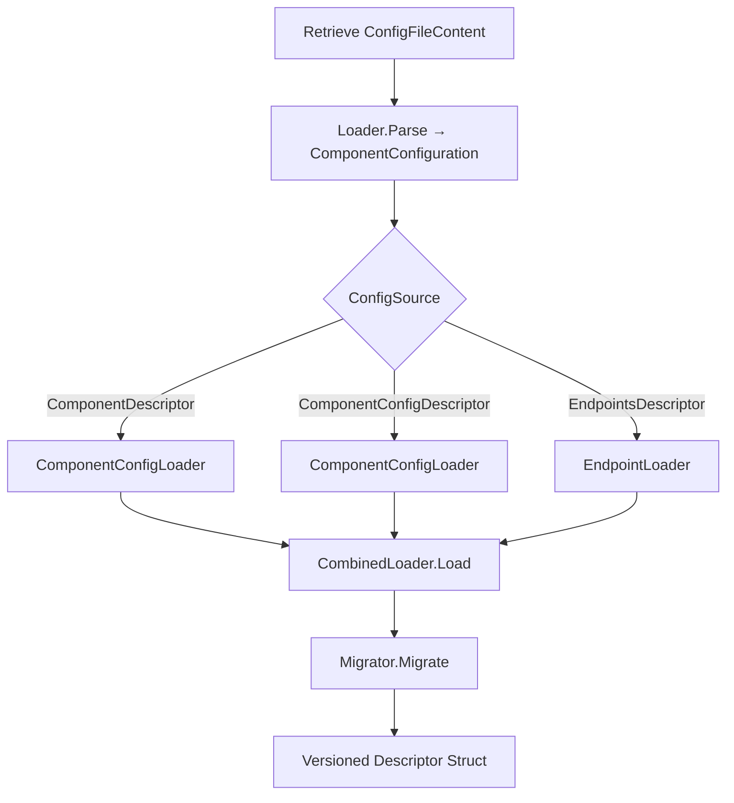

# 7. Configuration Descriptor Loader & Migrator

This section covers the core abstractions, types, and error model for the **Configuration Descriptor** domains—**Loader**, **Migrator**, and **Config_Migrator**—that underpin how Rudder ingests, validates, and evolves component configuration descriptors.

## 7.1 Descriptor Types, Interfaces, and Error Model

This subsection details the primary Go types defining configuration descriptors, the **Loader** abstraction for source files, and the associated error definitions.

---

### 📦 ConfigSource & ConfigFile

These enums identify descriptor origins and filenames:

| Type | Constant | Purpose |
| --- | --- | --- |
| **ConfigSource** | EndpointSource | Config from `endpoints.yaml` |
| ComponentSource | Config from `component.yaml` |
| ComponentConfigSource | Config from `component-config.yaml` |
| BuildSystemSource | Auto-generated from Swagger in GitOps |
| UserProvidedSource | Supplied by UI |
| **ConfigFile** | EndpointsFileName | `"endpoints.yaml"` |
| ComponentFileName | `"component.yaml"` |
| ComponentConfigFileName | `"component-config.yaml"` |


```go
type ConfigSource string

const (
  EndpointSource       ConfigSource = "EndpointsDescriptor"
  ComponentSource      ConfigSource = "ComponentDescriptor"
  ComponentConfigSource ConfigSource = "ComponentConfigDescriptor"
  BuildSystemSource     ConfigSource = "BuildSystem"
  UserProvidedSource    ConfigSource = "UserProvided"
)

type ConfigFile string

const (
  EndpointsFileName       ConfigFile = "endpoints.yaml"
  ComponentFileName       ConfigFile = "component.yaml"
  ComponentConfigFileName ConfigFile = "component-config.yaml"
)
```

---

### 🔧 ComponentConfiguration

This central struct represents loaded descriptor content. It bridges raw descriptor inputs and downstream processing:

```go
type ComponentConfiguration struct {
  // Final database structs
  Endpoints    []*app.ComponentEndpoint
  Dependencies []*app.ComponentDependency

  // Intermediate parsed structs
  EndpointObjects    []*ComponentEndpointObject
  DependencyItems    []*ComponentDependencyItem
  ProxyConfiguration *ComponentProxyConfiguration
  Configurations     *Configuration

  // Metadata
  GenerationSource           ConfigSource
  ComponentRootDirPath       string
  ComponentYamlSchemaVersion ComponentYamlSchemaVersion
}
```

- **Endpoints/Dependencies**: ready for persistence
- **EndpointObjects/DependencyItems**: as parsed from YAML/JSON
- **ProxyConfiguration**: optional proxy settings
- **Configurations**: environment variables map

---

### 📑 Descriptor Versions & Schemas

Rudder supports evolving **component.yaml** schemas:

```go
type ComponentYamlSchemaVersion string

const (
  ComponentYamlV1D0 ComponentYamlSchemaVersion = "1.0"
  ComponentYamlV1D1 ComponentYamlSchemaVersion = "1.1"
  ComponentYamlV1D2 ComponentYamlSchemaVersion = "1.2"
)
```

- Used by **Migrator** to select appropriate migration logic.

---

### 🚀 Loader Interface

Loaders abstract file-specific parsing into a `ComponentConfiguration`. Implementations exist for endpoints, component, and component-config files.

```go
type Loader interface {
  // Load reads and parses the descriptor, returning a unified configuration.
  Load(ctx context.Context,
       component *app.App,
       deploymentTrackId common.UniqueIdentifier,
       commitHash string,
  ) (*ComponentConfiguration, error)
}
```

- **CombinedLoader** attempts each specific loader in order until one succeeds.

---

### 🃏 LoaderMock

Generated via `moq`, this mock aids unit testing loader-dependent code:

```go
type LoaderMock struct {
  LoadFunc func(ctx context.Context, component *app.App,
                deploymentTrackId common.UniqueIdentifier,
                commitHash string,
  ) (*ComponentConfiguration, error)
  // call tracking omitted
}
```

---

### ⚠️ Error Definitions

Errors signal missing files or repository retrieval issues:

```go
var (
  ErrEndpointsFileNotFound        = errors.New("endpoints.yaml file not found")
  ErrComponentFileNotFound        = errors.New("component.yaml file not found")
  ErrComponentConfigFileNotFound  = errors.New("component-config.yaml file not found")
  ErrConfigurationFilesNotFound   = errors.New("no configuration files found in the repository")

  RegexCICDFileNotFoundError = regexp.MustCompile(
    `Error getting (github|bitbucket|GitLab|AzureDevOps) file content : (Not Found|No object found|Request failed with status code 404)`,
  )
)
```

- Used by **CombinedLoader** to distinguish "not found" vs. other errors.

---

### 🛠 Descriptor Types

Key YAML++Go types for descriptors:

| Type | Description |
| --- | --- |
| **ServiceReferences** | Outbound service mapping (name, config, env vars) |
| **ConnectionReferences** | Direct resource references (name, resourceRef) |
| **EnvKeyMapping** | Env var remapping (`From`,`To`) |
| **EndpointConfigurationV0D2** | v0.2 endpoint spec (`Name`,`Service`,`Type`,`Visibility`) |
| **ProxyConfigurationV0D1** | v0.1 proxy spec (`Type`,`SchemaFilePath`,`Visibilities`) |
| **Service** | Underlying service (`BasePath`,`Port`) |
| **Configuration** | Map of environment variables |


```go
type ServiceReferences struct {
  Name             string          `yaml:"name"`
  ConnectionConfig string          `yaml:"connectionConfig"`
  Env              []EnvKeyMapping `yaml:"env,omitempty"`
}

type ConnectionReferences struct {
  Name        string `yaml:"name"`
  ResourceRef string `yaml:"resourceRef"`
}

type EnvKeyMapping struct {
  From string `yaml:"from"`
  To   string `yaml:"to"`
}

type EndpointConfigurationV0D2 struct {
  Name                string
  DisplayName         string
  Service             Service
  Type                common.EndpointType
  NetworkVisibilities []common.EndpointVisibility
  SchemaFilePath      string
}

type ProxyConfigurationV0D1 struct {
  Type                common.ProxyTrafficType
  NetworkVisibilities []common.EndpointVisibility
  SchemaFilePath      string
  ThumbnailPath       string
  DocPath             string
}

type Service struct {
  BasePath string
  Port     int
}

type Configuration struct {
  Env []EnvironmentVariable `yaml:"env"`
}
```

---

### 🔄 Migrator Interface & Data

Migrations translate `ComponentConfiguration` into versioned descriptor structs:

```go
type Migrator interface {
  // Migrate upgrades or normalizes content to a target schema version.
  Migrate(ctx context.Context,
          content *cfg_descriptor.ComponentConfiguration,
  ) (*MigrationData, error)
}

type MigrationData struct {
  Content interface{}            // versioned descriptor (e.g., ComponentDescriptorV1D1)
  To      MigratedFileDetails    // target filename/version
  From    MigratedFileDetails    // source filename/version
}

type MigratedFileDetails struct {
  FileName string
  Version  string
}
```

- **GetMigrator** picks `MigratorV1D1` or `MigratorV1D2` based on requested version.

---

### ▶️ Workflow Diagram



This flow shows how Rudder:

1. Retrieves raw files via CICD.
2. Uses specific **Loader** to parse into `ComponentConfiguration`.
3. On load success, passes configuration to **Migrator** to produce a stable schema.

---

<small>All types and interfaces are defined in `choreo/bundles/app/configurationdescriptor/…` files. Errors are in `errors.go`, loader abstractions in `interfaces.go` / `interfaces_mock.go`, and core types in `types.go`.</small>