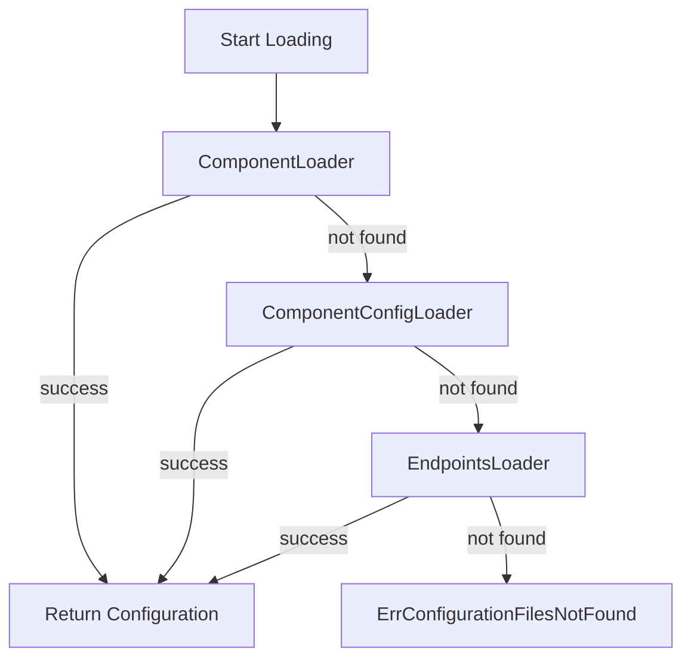

# 7.2 Loading Pipeline: Combined, Component, and Endpoints Loaders

This section describes how Rudder loads configuration descriptors by orchestrating three specialized loaders. It explains each loader’s purpose, how they stitch multiple sources, and what invariants the loader tests verify.

---

## 🔄 Combined Loader

The **combined loader** orchestrates three domain-specific loaders in a fixed priority. It returns the first successful load or a unified error if none succeed.

```go
func (c *combinedLoader) Load(ctx context.Context, component *app.App, trackID common.UniqueIdentifier, commitHash string) (*cfg_descriptor.ComponentConfiguration, error) {
    loaders := []ConfigLoader{
        {loader: c.componentLoader,       notFoundErr: cfg_descriptor.ErrComponentFileNotFound},
        {loader: c.componentConfigLoader, notFoundErr: cfg_descriptor.ErrComponentConfigFileNotFound},
        {loader: c.endpointLoader,        notFoundErr: cfg_descriptor.ErrEndpointsFileNotFound},
    }
    for _, l := range loaders {
        config, err := l.loader.Load(ctx, component, trackID, commitHash)
        if err == nil {
            return config, nil
        }
        if !errors.Is(err, l.notFoundErr) {
            return nil, fmt.Errorf("failed to load configurations for component %s: %w", component.ID, err)
        }
    }
    return nil, cfg_descriptor.ErrConfigurationFilesNotFound
}
```

- **Priority order**:
- Component Loader
- Component Config Loader
- Endpoints Loader
- **Fallback**: returns `ErrConfigurationFilesNotFound` if all report “not found” .

### Loader Priority Table

| Loader | Config File Name | NotFound Error |
| --- | --- | --- |
| **ComponentLoader** | `.choreo/component.yaml` | `ErrComponentFileNotFound` |
| **ComponentConfigLoader** | `.choreo/component-config.yaml` | `ErrComponentConfigFileNotFound` |
| **EndpointsLoader** | `.choreo/endpoints.yaml` | `ErrEndpointsFileNotFound` |


---

### Loading Pipeline Flowchart



---

## ⚙️ Component Loader

The **component loader** reads user-provided `component.yaml` and converts it into a unified `ComponentConfiguration`.

- **Context setup**: adds `"component-loader"` logger.
- **Retrieve file**: calls `retrieveConfigFileContent` with `ComponentFileName` .
- **Unmarshal schema**: parses into `ComponentSchema` to inspect `schemaVersion`.
- **Version dispatch**: invokes `unmarshalBasedOnVersion`, producing version-aware deserialization.
- **Construct output**: packs endpoint objects, dependencies, proxy, and config maps into `ComponentConfiguration`.

```go
configFileContent, err := retrieveConfigFileContent(..., cfg_descriptor.ComponentFileName, cfg_descriptor.ErrComponentFileNotFound)
if err != nil { return nil, err }
componentSchema := &cfg_descriptor.ComponentSchema{}
yaml.Unmarshal(configFileContent.DecodedYamlContent, componentSchema)
componentConfig, err := unmarshalBasedOnVersion(
    configFileContent.DecodedYamlContent,
    configFileContent.ProjectRoot,
    componentSchema.SchemaVersion,
)
return componentConfig, nil
```

---

## 📝 Component Config Loader

This loader processes `component-config.yaml`, focusing on inbound/outbound mappings.

- **Logger**: tags entries with `"component-config-loader"`.
- **Retrieve and unmarshal**: loads into `ComponentConfigKind` .
- **Convert inbound**:
- Calls `convertInboundConfigToEndpoints` to produce `ComponentEndpointObject` list.
- Ensures each entry passes `SetDefaultsAndValidate`.
- Builds `networkVisibilities` always including `Project` .
- **Convert outbound**: maps spec to `ComponentDependencyItem`.
- **Assemble**: returns `ComponentConfiguration` with endpoints, dependencies, and generation source.

```go
componentConfig := &cfg_descriptor.ComponentConfigKind{}
yaml.Unmarshal(configFileContent.DecodedYamlContent, componentConfig)
endpoints, _    := convertInboundConfigToEndpoints(componentConfig.Spec.Inbound, configFileContent.ProjectRoot, cfg_descriptor.ComponentConfigSource)
dependencies, _ := convertDependencyConfigurationV0D1ToDependencies(componentConfig.Spec.Outbound)
componentEps, _ := convertEndpointObjectsToComponentEndpoints(endpoints, cfg_descriptor.ComponentConfigSource)
return &cfg_descriptor.ComponentConfiguration{
    Endpoints:          componentEps,
    DependencyItems:    dependencies,
    EndpointObjects:    endpoints,
    Dependencies:       convertDependencyItemsToComponentDependency(dependencies),
    GenerationSource:   cfg_descriptor.ComponentConfigSource,
    ComponentRootDirPath: configFileContent.ProjectRoot,
}, nil
```

---

## 📡 Endpoints Loader

The **endpoints loader** ingests `endpoints.yaml` and merges service routes into the configuration domain.

- **Logger**: uses `"endpoints-loader"`.
- **Retrieve file**: fetches `EndpointsFileName` .
- **Unmarshal**: parses YAML into `EndpointConfiguration`.
- **Convert**: `ConvertEndpointToComponentConfig` applies:
- `SetDefaultsAndValidate` per endpoint.
- Prepends `Project` visibility; appends `Public` or `Organization` if present .
- Constructs `ComponentEndpointObject` list.
- **Finalize**: transforms objects into `ComponentEndpoint` and packs into `ComponentConfiguration`.

```go
endpoints := &cfg_descriptor.EndpointConfiguration{}
yaml.Unmarshal(configFileContent.DecodedYamlContent, endpoints)
componentConfig, err := ConvertEndpointToComponentConfig(
    endpoints, configFileContent.ProjectRoot, cfg_descriptor.EndpointSource,
)
return componentConfig, nil
```

---

## ✅ Loader Invariants and Tests

The **loader tests** validate:

- **Priority enforcement**: combined loader picks the highest-priority available file.
- **Error propagation**: non-“not found” errors bubble up immediately.
- **Field mapping**: loaded config reflects expected:
- `EndpointObjects` count and fields
- `ComponentRootDirPath` set to repository subpath
- `GenerationSource` matches loader domain
- Default inclusion of `Project` visibility
- **Fallback scenario**: all loaders not found returns `ErrConfigurationFilesNotFound`.

Test harness excerpt:

```go
cicdSvc.RetrieveRepositoryContentFunc = mockFunc
loader := NewCombinedConfigLoader(cicdSvc)
gotConfig, gotErr := loader.Load(ctx, component, trackID, commitHash)
// Compare gotErr to wantErr
// Compare gotConfig fields to wantComponentConfig
```

Named test cases include:

- `"load-configurations-using-combined-loader (Reads component.yaml)"`
- `"load-configurations-using-combined-loader (Reads component-config.yaml)"`
- `"load-configurations-using-combined-loader (Reads endpoints.yaml)"`
- `"error-handling-when-none-of-the-files-are-found"` .

These tests ensure consistency across code changes and guarantee each loader’s correctness.

---

**Summary**

The loading pipeline in Rudder decouples file-specific parsing logic into three focused loaders. The combined loader selects the appropriate source in a deterministic order. Helpers guarantee consistent defaults and validations. Comprehensive tests enforce critical invariants.