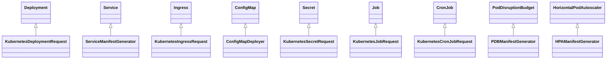

# 8. Kubernetes Manifest Generation (Generator Domain + AutoscalingV2 + PullSecret + Cilium + ChoreoNetpols)

This section describes the core manifest generators in the `internal/generator` domain and how they integrate with the bundle-level deployers. It covers:

- Standard Kubernetes resources: Deployments, Services, Ingresses, Secrets, ConfigMaps, Jobs, CronJobs, Namespaces, PodDisruptionBudgets (PDBs), Horizontal Pod Autoscalers (V2), and associated constraints.
- Auxiliary domains: pull secrets, Cilium network policies, and KEDA HTTPScaledObjects.
- How generator inputs are provided by `internal/bundles/app/deployer.go` and environment deployers.
- Error propagation via domain-specific error types (e.g. `ServiceManifestGenError`).

---

## 8.1 Core manifest generators

Below is an overview of each generator type, its purpose, and how it is invoked by higher-level deployers.

### 8.1.1 Deployment

Generates a `Deployment` manifest with spec, labels, selectors, strategy, and pod template.

- **Type**: `generator.Deployment`
- **Key methods**:
- `SetHeader()` sets `kind: Deployment` and `apiVersion: apps/v1`.
- `SetDefaultDeploymentStrategy()` applies a rolling-update strategy.
- `SetLabels(labels, selectors)` populates `.metadata.labels`, `.spec.selector.matchLabels`, and pod template labels.

```go
// internal/generator/deployment.go
type Deployment struct {
  ResourceHeaderSpec DeploymentSpec `json:"spec"`
}
func (d *Deployment) SetHeader() {
  d.Kind = "Deployment"
  d.ApiVersion = K8sAppsV1
}
func (d *Deployment) SetDefaultDeploymentStrategy() { ... }
func (d *Deployment) SetLabels(labels map[string]string, podSelectors map[string]string) {
  d.Spec.Selector.MatchLabels = podSelectors
  d.Metadata.SetLabels(labels)
  d.Spec.Template.Metadata.Labels = d.Metadata.Labels
}
```

Invoked by the app deployer in `KubernetesDeploymentRequest` to build full deployment manifests and surface errors on failure .

### 8.1.2 Service

Constructs a `Service` resource for ClusterIP or ExternalName services.

- **Type**: `generator.Service`
- **Spec fields**:
- `.spec.ports`: built via `SetPorts([]Port)`.
- `.spec.selector`: matches pod labels.
- `.spec.type` and `.spec.externalName` for scale-to-zero.

```go
// internal/generator/service.go
type Service struct {
  ResourceHeaderSpec ServiceSpec `json:"spec"`
}
func (s *Service) SetHeader() {
  s.Kind = "Service"
  s.ApiVersion = "v1"
}
func (s *Service) SetPorts(ports []Port) {
  for _, port := range ports {
    p := ServicePort{ Name: port.Name, Port: port.Port, TargetPort: port.Port, Protocol: port.Protocol }
    if port.ServicePort > 0 { p.Port = port.ServicePort }
    s.Spec.Ports = append(s.Spec.Ports, &p)
  }
}
```

`ServiceManifestGenerator` orchestrates ClusterIP and optional ExternalName services, returning a `ServiceManifestGenError` if the component does not support services .

### 8.1.3 Ingress

Generates an `Ingress` with rules and TLS configuration.

- **Type**: `generator.Ingress`
- **Key methods**:
- `SetHeader()` sets `kind: Ingress` and `apiVersion: networking.k8s.io/v1`.
- Ingress rules and TLS are injected via `.Spec.Rules` and `.Spec.TLS`.

```go
// internal/generator/ingress.go
type Ingress struct {
  ResourceHeaderSpec IngressSpec `json:"spec"`
}
func (c *Ingress) SetHeader() {
  c.Kind = "Ingress"
  c.ApiVersion = "networking.k8s.io/v1"
}
```

Used by the gateway deployer in `KubernetesIngressRequest` to translate `gateway.Ingress` objects into Kubernetes manifests .

### 8.1.4 ConfigMap and Secret

#### ConfigMap

- **Type**: `generator.ConfigMap`
- **Method**: `SetHeader()` sets `kind: ConfigMap` and `apiVersion: v1`.

```go
// internal/generator/configmap.go
type ConfigMap struct {
  ResourceHeaderData map[string]string `json:"data"`
}
func (c *ConfigMap) SetHeader() { 
  c.Kind = "ConfigMap"
  c.ApiVersion = "v1"
}
```

ConfigMap deploy requests in `configmap/deployer.go` translate DB objects into `generator.ConfigMap`, then call environment deployer.

#### Pull Secret

- **Type**: `generator.Secret`
- **Function**: `MakePullSecret(meta, dockerConfig) (Secret, error)` encodes `.dockerconfigjson` data and sets `.Type = kubernetes.io/dockerconfigjson`.

```go
// internal/generator/pullsecret/pullsecret.go
func MakePullSecret(meta metav1.ObjectMeta, dockerConfig string) (generator.Secret, error) { ... }
```

Used by deployers when mounting image pull secrets .

### 8.1.5 Job & CronJob

#### Job

- **Type**: `generator.Job`
- **Methods**: `SetHeader()` sets `kind: Job`, `apiVersion: batch/v1`; `SetLabels` applies metadata labels to the pod template.

```go
// internal/generator/job.go
type Job struct { ResourceHeaderSpec JobSpec `json:"spec"` }
func (j *Job) SetHeader() { j.Kind = "Job"; j.ApiVersion = "batch/v1" }
```

Deployed via `KubernetesJobRequest` in the app deployer.

#### CronJob

- **Type**: `generator.CronJob`
- **Fields**: `spec.schedule`, `spec.suspend`, history limits.
- **Methods**: `SetHeader()` and `SetLabels()`.

```go
// internal/generator/cronjob.go
type CronJob struct { ResourceHeaderSpec CronJobSpec `json:"spec"` }
func (j *CronJob) SetHeader() { j.Kind = "CronJob"; j.ApiVersion = K8sBatchV1 }
func (j *CronJob) SetLabels(labels map[string]string) { ... }
```

Controlled by `KubernetesCronJobRequest` and `KubernetesJobRequest` on schedule or manual trigger .

### 8.1.6 PodDisruptionBudget (PDB)

Ensures graceful pod eviction constraints.

- **Generator**: `PDBManifestGenerator`
- **Type**: `generator.PodDisruptionBudget`
- **Process**:
- Fetch PDB entity from DB.
- Compute labels and spec.
- Return or error with `PDBManifestGenError` if not found.

```go
// internal/bundles/app/make_pdb_manifest.go
func (g *PDBManifestGenerator) Generate(...) (PDBManifestResult, error) { ... }
```

Invoked in `component_delete.go` to surface PDB deletion or recreation .

### 8.1.7 Horizontal Pod Autoscaler (V2)

Builds `HorizontalPodAutoscaler` (V2) resources via the autoscaling/v2 API.

- **Function**: `makeHpaV2Manifest`
- **Type**: `autoscalingv2.HorizontalPodAutoscaler`
- **Key steps**:
- Validate `release.KubernetesName` vs `hpa.KubernetesName`.
- Map metrics (CPU, memory).
- Construct `CrossVersionObjectReference` and label metadata.

```go
// internal/bundles/app/make_hpa_manifest.go
func makeHpaV2Manifest(...)(autoscalingv2.HorizontalPodAutoscaler, error) { ... }
```

Errors surface as `HPAManifestGenError{NoHPAFoundForRelease}` when missing .

### 8.1.8 Topology Constraints

Defines pod spread across failure domains.

- **Type**: `generator.TopologySpreadConstraint`
- **Fields**: `maxSkew`, `topologyKey`, `whenUnsatisfiable`, `labelSelector`.

```go
// internal/generator/topology_contraints.go
type TopologySpreadConstraint struct { ... }
```

Applied by the deployer via `s.setTopologySpreadConstraints(&dep, opts)` in `deployer.go`.

---



This diagram highlights how each generator type is instantiated and consumed by bundle-level deployers.

---

**Key relationships**

- Bundle services (e.g. `ServiceManifestGenerator`, `HPAManifestGenerator`, `PDBManifestGenerator`) fetch domain data (apps, releases, metrics, environment), compose `*generator.*` objects, and return manifests or domain-specific errors.
- The environment deployer (`environment.Deployer`) receives these generator objects and applies them to clusters via Mizzen or KEDA.
- Generator errors (e.g. `ServiceManifestGenError`, `PDBManifestGenError`, `HPAManifestGenError`) propagate up to API callers to signal missing or unsupported resources.