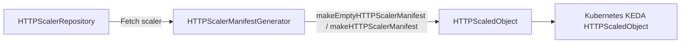

## 8.2 Autoscaling and KEDA HTTP scaler (HPA v2 and HTTPScaledObject) 🚀

This section details how Rudder generates Kubernetes manifests for Horizontal Pod Autoscalers (HPA v2) and KEDA HTTPScaledObjects. It covers:

- The **HPA v2 generator domain** and its helpers
- API version constants and database-driven migrations for HPA and CronJob resources
- The **HTTPScaledObject** generator domain for KEDA-based scale-to-zero

---

### 8.2.1 HPA v2 Generator Domain

Rudder’s HPA generator lives under `internal/generator/autoscalingv2`. It produces `autoscaling/v2` HPA CRs based on stored HPA and metric data.

#### Key Types

| Type | Purpose |
| --- | --- |
| HorizontalPodAutoscaler | Top-level HPA manifest (kind: HorizontalPodAutoscaler) |
| HorizontalPodAutoscalerSpec | Specifies `scaleTargetRef`, `minReplicas`, `maxReplicas` and `metrics` |
| CrossVersionObjectReference | Points at the workload (Deployment) to scale |
| MetricSpec | Encapsulates a metric (Resource CPU or Memory) and its target |


#### Core Helpers (utils.go)

```go
func MakeHPAV2(
  meta metav1.ObjectMeta,
  target CrossVersionObjectReference,
  metrics []MetricSpec,
) HorizontalPodAutoscaler { … }

func MakeScaleTargetRef(
  typeMeta metav1.TypeMeta,
  name string,
) CrossVersionObjectReference { … }

func MakeCpuTargetAverageUtilizationMetric(val int32) MetricSpec { … }
func MakeMemoryTargetAverageValueMetric(val string) MetricSpec { … }
```

These functions assemble the HPA’s `TypeMeta`, `ObjectMeta` and `Spec` sections.

#### Manifest Generation Flow

```mermaid
flowchart TD
  A[HPARepository] -->|Fetch HPA & Metrics| B[HPAManifestGenerator]
  B -->|makeEmptyHPAV2Manifest / makeHpaV2Manifest| C[autoscalingv2.MakeHPAV2]
  C --> D[Kubernetes HPA (autoscaling/v2)]
```

1. **Fetch**: `HPARepository.GetHPAAndMetricsByReleaseId`
2. **Empty vs Full**:
3. **Headers only** yields empty spec defaults
4. **Full** populates `metrics`, `minReplicas`/`maxReplicas`, and `scaleTargetRef`
5. **Emit**: `MakeHPAV2` builds the final manifest

---

### 8.2.2 API Version Handling & Migrations

#### Version Constant

The generator targets Kubernetes autoscaling API v2:

```go
const K8sAutoScalingVersionV2 = "v2"
```

(internal/generator/hpa_v2beta1.go) fileciteturn7file?

#### DB Model Fields

In `app/hpa_model.go`, each HPA record carries:

- `Version` (e.g. `"v2beta1"`, `"v2"`)
- `NextApiVersion` – used by migration scripts to upgrade legacy records

#### Migration Impact

- **Migrations 135/136** update `NextApiVersion` for stored HPAs and CronJobs from deprecated APIs (e.g. `batch/v1beta1`) to stable APIs (`batch/v1`).
- At runtime, Rudder’s **CronJob deployer** uses these fields to choose which `apiVersion` to submit. HPA generator always uses `autoscaling/v2`, so legacy HPA versions are ignored post-migration.

---

### 8.2.3 HTTPScaledObject Generator Domain

For scale-to-zero, Rudder uses KEDA’s `HTTPScaledObject` CRD under `internal/generator/keda/http_scaled_object.go`.

#### Key Types

| Type | Purpose |
| --- | --- |
| ScaleTargetRef | Deployment & Service names, port, and optional API version info |
| ReplicaStruct | Minimum & maximum replica counts |
| HTTPScaledObjectSpec | Fields: `host(s)`, `pathPrefixes`, `scaleTargetRef`, `replicas`, `targetPendingRequests` |
| HTTPScaledObject | Top-level CRD (kind: HTTPScaledObject, apiVersion: http.keda.sh/v1alpha1) |


#### Spec Construction (make_http_scaler.go)

1. **Metadata**: `SetTypeMetadata()` + `SetObjectMetadata(name, namespace)`
2. **ScaleTargetRef**: points at the main or `-choreo-internal` Service
3. **Replicas**: derived from `scaler.Min` and `scaler.Max`
4. **Host & Path**: set only for web-apps
5. **TargetPendingRequests**: threshold for HTTP traffic

```go
spec := keda.HTTPScaledObjectSpec{
  ScaleTargetRef: keda.ScaleTargetRef{Deployment, Service, Port},
  Replicas: &keda.ReplicaStruct{Min, Max},
  Host: &hostname,
  TargetPendingRequests: scaler.TargetPendingRequests,
}
```

#### Generator Flow



Whether only headers or full spec depends on `OnlyResourceHeaders` flag.

---

**Card:**

```card
{
    "title": "Version Consistency",
    "content": "Generators always target stable APIs (autoscaling/v2, http.keda.sh/v1alpha1) after migrations update legacy records."
}
```

This completes the detailed overview of HPA v2 and KEDA HTTP scaler manifest generation in Rudder.