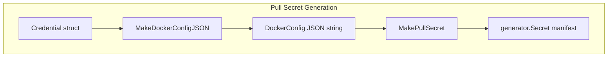

## 8.4 Pull Secret Generation and DockerConfig Encoding

This section covers how Rudder’s Generator domain produces a Kubernetes image pull secret by encoding Docker registry credentials into a `.dockerconfigjson` payload. It explains the two core functions—**MakeDockerConfigJSON** and **MakePullSecret**—their responsibilities, data flow, and associated tests.

### Overview

Rudder needs to deploy container images from private registries. To authenticate, it:

- Collects registry credentials (username, password, URL).
- Generates a Docker config JSON blob.
- Base64-encodes that blob and embeds it in a Kubernetes Secret.

These steps occur in the `internal/generator/pullsecret` package, isolating pull-secret logic.

---

### Credential to DockerConfig JSON 🎯

The **Credential** type and **MakeDockerConfigJSON** function build the standard Docker config structure:

```go
type Credential struct {
  Email    string `json:"email,omitempty"`
  Username string `json:"username,omitempty"`
  Password string `json:"password,omitempty"`
  URL      string `json:"url,omitempty"`
}

type DockerRegAuth struct {
  Auth string `json:"auth"`
}

type DockerConfig struct {
  Auths map[string]DockerRegAuth `json:"auths"`
}

// MakeDockerConfigJSON formats credentials into a JSON string:
//   {"auths":{ "<URL>": { "auth": "<base64(username:password)>" } }}
func MakeDockerConfigJSON(cred Credential) (string, error) {
  auth := fmt.Sprintf("%s:%s", cred.Username, cred.Password)
  cfg := DockerConfig{
    Auths: map[string]DockerRegAuth{
      cred.URL: {Auth: base64.StdEncoding.EncodeToString([]byte(auth))},
    },
  }
  data, err := json.Marshal(cfg)
  if err != nil {
    return "", err
  }
  return string(data), nil
}
```

- **Input**: `Credential` with registry URL, user, and password.
- **Output**: JSON string matching Docker’s expected `"auths"` schema.
- **Dependency**: uses `encoding/base64`, `encoding/json`, `fmt`.

---

### Secret Manifest Creation 🔑

Once you have the Docker config JSON, **MakePullSecret** wraps it into a Kubernetes Secret manifest:

```go
func MakePullSecret(meta metav1.ObjectMeta, dockerConfig string) (generator.Secret, error) {
  secret := generator.Secret{}

  // Populate metadata
  secret.Metadata.Name      = meta.Name
  secret.Metadata.Namespace = meta.Namespace
  secret.Metadata.SetLabels(meta.Labels)
  secret.Metadata.SetAnnotations(meta.Annotations)
  secret.SetHeader()

  // Base64-encode the JSON and assign to the well-known key
  encoded := base64.StdEncoding.EncodeToString([]byte(dockerConfig))
  secret.Data = map[string]string{".dockerconfigjson": encoded}

  secret.Type = "kubernetes.io/dockerconfigjson"
  return secret, nil
}
```

- **Metadata**: name, namespace, labels, annotations from `metav1.ObjectMeta`.
- **Data**: key `.dockerconfigjson` holds the base64-encoded JSON.
- **Type**: set to the Kubernetes pull-secret type.

#### Function Responsibilities

| Function | Purpose | Input | Output |
| --- | --- | --- | --- |
| MakeDockerConfigJSON | Build Docker registry auth JSON | `Credential` | JSON string |
| MakePullSecret | Create a Kubernetes Secret manifest for image pull | `metav1.ObjectMeta`, Docker config JSON | `generator.Secret` object |


---

### Pull-Secret Generation Flowchart



This flow shows how credentials are transformed into a Kubernetes Secret suitable for deployment.

---

### Test Coverage ✅

Rudder includes unit tests to verify both JSON encoding and manifest structure.

1. **DockerConfig JSON Structure**
2. **Test File**: `dockerconfig_test.go`
3. **Case**: Given username `abc`, password `xyz`, URL `pvtacr.azurecr.io`, expect:

```json
     {"auths":{"pvtacr.azurecr.io":{"auth":"YWJjOnh5eg=="}}}
```

- **Assertion**: exact JSON string match.

1. **PullSecret Manifest Format**
2. **Test File**: `pullsecret_test.go`
3. **Case**: For metadata name `test1`, namespace `test1ns`, labels and annotations, with dockerConfig `"dockerConfigJson"`, expect:

```json
     {
       "apiVersion":"v1",
       "kind":"Secret",
       "metadata":{
         "name":"test1",
         "namespace":"test1ns",
         "labels":{"test1Label":"test1"},
         "annotations":{"test1Annotation":"test1"}
       },
       "data":{".dockerconfigjson":"ZG9ja2VyQ29uZmlnSnNvbg=="},
       "type":"kubernetes.io/dockerconfigjson"
     }
```

- **Assertion**: deep JSON diff must fully match.

---

### Integration in Generator Domain

- **Where Used**: The `MakePullSecret` function is invoked in application bundler logic (e.g., `choreo/bundles/app/choreo_helpers.go`) to deploy image pull secrets before pod creation.
- **Interplay**: Combined with other manifest generators (Deployments, Services, HPA, Cilium policies) to produce a complete set of Kubernetes manifests.

This modular design cleanly separates credential encoding from manifest construction, ensuring maintainability and testability.