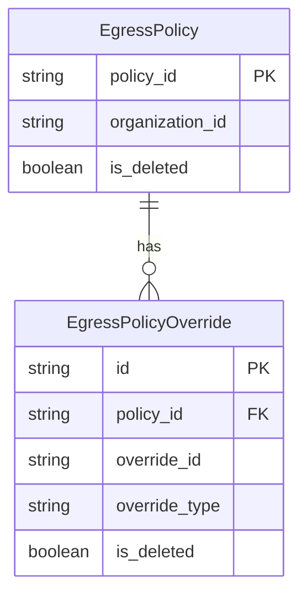

# 9. Network Policy Domain

This section covers the **egress policy data model**, its **repository layer**, and how **project-level scoping** is implemented in Rudder’s network-policy domain.

## 9.1 Egress policy data model, repositories, and project scoping

### 💾 Data Models

Rudder persists egress policies and overrides using GORM models with JSON-serialized rule lists.

| Model | Field | Type | JSON Tag | GORM Column | Description |
| --- | --- | --- | --- | --- | --- |
| **EgressPolicy** | ID | common.UniqueIdentifier | `id` | `policy_id` | Primary key |
| OrganizationID | common.UniqueIdentifier | `organization_id` | `organization_id` | Owning organization |
| Egress | []EgressRule | `egress` | `egress` | Allowed egress rules |
| EgressDeny | []EgressRule | `egress_deny` | `egress_deny` | Denied egress rules |
| Status | string | `status` | `status` | Lifecycle status (created, deployed, error) |
| IsDeleted | bool | `is_deleted` | `is_deleted` | Soft-delete flag |
| CreatedAt,UpdatedAt | time.Time | `created_at`, `updated_at` | `created_at`,`updated_at` | Timestamps for auditing |


```go
type EgressPolicy struct {
  ID             common.UniqueIdentifier `json:"id" gorm:"column:policy_id"`
  OrganizationID common.UniqueIdentifier `json:"organization_id" gorm:"column:organization_id"`
  Egress         []EgressRule            `json:"egress" gorm:"column:egress;serializer:json"`
  EgressDeny     []EgressRule            `json:"egress_deny" gorm:"column:egress_deny;serializer:json"`
  Status         string                  `json:"status" gorm:"column:status"`
  IsDeleted      bool                    `json:"is_deleted" gorm:"column:is_deleted"`
  CreatedAt      time.Time               `json:"created_at" gorm:"column:created_at"`
  UpdatedAt      time.Time               `json:"updated_at" gorm:"column:updated_at"`
}
```

| Model | Field | Type | JSON Tag | GORM Column | Description |
| --- | --- | --- | --- | --- | --- |
| **EgressPolicyOverride** | ID | common.UniqueIdentifier | `id` | `id` | PK for the override |
| PolicyId | common.UniqueIdentifier | `policy_id` | `policy_id` | FK to organization policy |
| OverrideId | common.UniqueIdentifier | `override_id` | `override_id` | Identifies project or env group |
| OverrideType | string | `override_type` | `override_type` | Either project or org override |
| Egress | []EgressRule | `egress` | `egress` | Project-scoped allow rules |
| EgressDeny | []EgressRule | `egress_deny` | `egress_deny` | Project-scoped deny rules |
| Status | string | `status` | `status` | Override lifecycle status |
| IsDeleted | bool | `is_deleted` | `is_deleted` | Soft-delete flag |
| CreatedAt,UpdatedAt | time.Time | `created_at`,`updated_at` | `created_at`,`updated_at` | Auditing timestamps |


```go
type EgressPolicyOverride struct {
  ID           common.UniqueIdentifier `json:"id" gorm:"column:id"`
  PolicyId     common.UniqueIdentifier `json:"policy_id" gorm:"column:policy_id"`
  OverrideId   common.UniqueIdentifier `json:"override_id" gorm:"column:override_id"`
  OverrideType string                  `json:"override_type" gorm:"column:override_type"`
  Egress       []EgressRule            `json:"egress" gorm:"column:egress;serializer:json"`
  EgressDeny   []EgressRule            `json:"egress_deny" gorm:"column:egress_deny;serializer:json"`
  Status       string                  `json:"status" gorm:"column:status"`
  IsDeleted    bool                    `json:"is_deleted" gorm:"column:is_deleted"`
  CreatedAt    time.Time               `json:"created_at" gorm:"column:created_at"`
  UpdatedAt    time.Time               `json:"updated_at" gorm:"column:updated_at"`
}
```

| Model | Field | Type | JSON Tag | Description |
| --- | --- | --- | --- | --- |
| **EgressRule** | ID | string | `rule_id` | Unique identifier for the rule |
| Type | string | `type` | Rule type (CIDR or FQDN) |
| Scope | string | `scope` | Organization or Project scope |
| Value | string | `value` | CIDR block or hostname |
| Name | string | `name` | Human-readable rule name |
| CreatedAt | string | `created_at` | Timestamp |
| UpdatedAt | string | `updated_at` | Timestamp |


```go
type EgressRule struct {
  ID        string `json:"rule_id"`
  Type      string `json:"type"`
  Scope     string `json:"scope"`
  Value     string `json:"value"`
  Name      string `json:"name"`
  CreatedAt string `json:"created_at"`
  UpdatedAt string `json:"updated_at"`
}
```

---

### 🛠 Repositories

#### EgressPolicyRepository

Provides CRUD and status-tracking for organization-level policies:

- **CreateEgressPolicy**: insert a new policy
- **GetEgressPolicy**: fetch by `policy_id`
- **UpdateEgressPolicy**: update rules or status
- **DeleteEgressPolicy**: hard-delete a policy
- **SoftDeleteEgressPolicy**: mark `is_deleted = 1` for soft-deletion
- **GetEgressPolicyForOrg**: fetch current org policy
- **CreateEgressPolicyStatusForEnv** / **UpdateEgressPolicyStatusForEnv** / **GetEgressPolicyStatusForEnv**: track per-environment deployment status
- **UpdateEgressPolicyStatus**: update overall policy status

#### EgressPolicyProjectRepository

Handles project-scoped overrides:

- **CreateEgressPolicyProject**: insert override
- **UpdateEgressPolicyProject**: modify override
- **UpdateEgressPolicyProjectStatus**: set status field
- **GetEgressPolicyProject**: fetch override by `override_id` and type
- **DeleteEgressPolicyProject**: hard-delete override by ID and project
- **ListEgressPolicyProjectsByPolicyID**: list all overrides for an org policy
- **SoftDeleteEgressPolicyProject**: set `is_deleted = 1` on all overrides of a policy

---

### 🔄 Soft-Delete Semantics

Both policies and overrides support soft-delete by setting `is_deleted = 1`, preserving historical records:

```go
// Organization policy soft delete
func (r *egressPolicyRepository) SoftDeleteEgressPolicy(
  ctx context.Context, policyId, organizationId common.UniqueIdentifier,
) error {
  return db.DB(ctx).
    Model(&EgressPolicy{}).
    Where("policy_id = ? AND organization_id = ?", policyId, organizationId).
    Update("is_deleted", "1").Error
}
```

```go
// Project override soft delete
func (r *egressPolicyProjectRepository) SoftDeleteEgressPolicyProject(
  ctx context.Context, policyId common.UniqueIdentifier,
) error {
  return db.DB(ctx).
    Model(&EgressPolicyOverride{}).
    Where("policy_id = ?", policyId).
    Update("is_deleted", "1").Error
}
```

---

### 🌐 Project Scoping

Project overrides take precedence over organization policies. Scoping is controlled via constants:

| Constant | Value | Description |
| --- | --- | --- |
| **EGRESS_POLICY_ORGANIZATION** | `"ORGANIZATION"` | Org-level override type |
| **EGRESS_POLICY_PROJECT** | `"PROJECT"` | Project override type |
| **EGRESS_RULE_ORG_SCOPE** | `"Organization"` | Rule belongs to org policy |
| **EGRESS_RULE_PROJECT_SCOPE** | `"Project"` | Rule belongs to project override |


```go
const (
  EGRESS_POLICY_ORGANIZATION = "ORGANIZATION"
  EGRESS_POLICY_PROJECT      = "PROJECT"
  EGRESS_RULE_ORG_SCOPE      = "Organization"
  EGRESS_RULE_PROJECT_SCOPE  = "Project"
)
```

When fetching a project policy, repositories filter on both `override_id` and `override_type`, ensuring only project overrides are returned. The controller then merges org rules with project rules based on the `Scope` field of each `EgressRule`.

---

#### Entity Relationship



This diagram shows the one-to-many relationship between an organization policy and its project overrides.