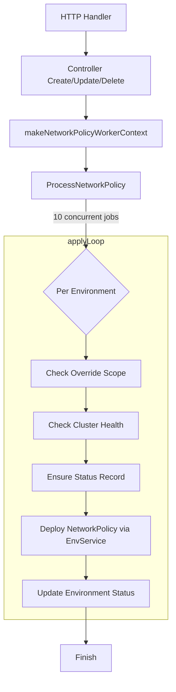

# 9. Network Policy Domain

## 9.2 Controllers/Workers and Route Exposure

This section describes how Rudder exposes network-policy APIs, orchestrates CRUD operations through controllers, and processes policies asynchronously via workers. It also shows how Cilium manifests are generated and applied.

---

## 📑 Component Overview

| Component | File | Role |
| --- | --- | --- |
| **Routes** | `choreo/routes/network_policy.go` | Registers HTTP endpoints for egress policies |
| **Handlers** | `choreo/handlers/egress_policy.go` | Validates requests, parses payloads, and calls controller methods |
| **Controller** | `choreo/bundles/network-policy/network_policy_controller.go` | Implements business logic, persistence, and kicks off asynchronous processing |
| **Worker** | `choreo/bundles/network-policy/network_policy_worker.go` | Processes policy across environments in parallel |
| **Types** | `choreo/bundles/network-policy/network_policy_types.go` | Defines `EgressPolicyRequest` payload structure |
| **Generator (Cilium)** | `internal/generator/choreonetpols/choreo_netpols.go` | Produces `CiliumNetworkPolicy` manifests |


---

## 🚀 API Routes Exposure

All network-policy routes mount under `/egress`. They require an **Authorization** header and query parameters for `organization_id` (always) and `project_id` (for overrides).

- GET    `/egress`
- POST   `/egress`
- PUT    `/egress/{uuid}`
- DELETE `/egress/{uuid}`
- POST   `/egress/{uuid}/override`
- PUT    `/egress/{uuid}/override`
- DELETE `/egress/{uuid}/override`

### List Egress Policies

```api
{
    "title": "List Egress Policies",
    "description": "Retrieve all egress policies for an organization or project",
    "method": "GET",
    "baseUrl": "https://api.example.com/api/v1/network-policies",
    "endpoint": "/egress",
    "headers": [
        {
            "key": "Authorization",
            "value": "Bearer <token>",
            "required": true
        }
    ],
    "queryParams": [
        {
            "key": "organization_id",
            "value": "Organization UUID",
            "required": true
        },
        {
            "key": "project_id",
            "value": "Project UUID",
            "required": false
        }
    ],
    "pathParams": [],
    "bodyType": "none",
    "requestBody": "",
    "formData": [],
    "rawBody": "",
    "responses": {
        "200": {
            "description": "Success",
            "body": "{\n  \"data\": [\n    { /* EgressPolicy */ }\n  ]\n}"
        }
    }
}
```

### Create Egress Policy

```api
{
    "title": "Create Egress Policy",
    "description": "Persist a new egress policy and deploy it across environments",
    "method": "POST",
    "baseUrl": "https://api.example.com/api/v1/network-policies",
    "endpoint": "/egress",
    "headers": [
        {
            "key": "Authorization",
            "value": "Bearer <token>",
            "required": true
        }
    ],
    "queryParams": [
        {
            "key": "organization_id",
            "value": "Organization UUID",
            "required": true
        }
    ],
    "pathParams": [],
    "bodyType": "json",
    "requestBody": "{\n  \"egress\": [ /* EgressRule array */ ],\n  \"egress_deny\": [ /* EgressRule array */ ]\n}",
    "formData": [],
    "rawBody": "",
    "responses": {
        "201": {
            "description": "Created",
            "body": "{ /* EgressPolicy object */ }"
        }
    }
}
```

### Update Egress Policy

```api
{
    "title": "Update Egress Policy",
    "description": "Modify an existing organization-level egress policy",
    "method": "PUT",
    "baseUrl": "https://api.example.com/api/v1/network-policies",
    "endpoint": "/egress/{uuid}",
    "headers": [
        {
            "key": "Authorization",
            "value": "Bearer <token>",
            "required": true
        }
    ],
    "queryParams": [
        {
            "key": "organization_id",
            "value": "Organization UUID",
            "required": true
        }
    ],
    "pathParams": [
        {
            "key": "uuid",
            "value": "Policy UUID",
            "required": true
        }
    ],
    "bodyType": "json",
    "requestBody": "{\n  \"egress\": [...],\n  \"egress_deny\": [...]\n}",
    "formData": [],
    "rawBody": "",
    "responses": {
        "200": {
            "description": "OK",
            "body": "{ /* Updated EgressPolicy object */ }"
        }
    }
}
```

### Delete Egress Policy

```api
{
    "title": "Delete Egress Policy",
    "description": "Soft-delete an organization-level egress policy and redeploy defaults",
    "method": "DELETE",
    "baseUrl": "https://api.example.com/api/v1/network-policies",
    "endpoint": "/egress/{uuid}",
    "headers": [
        {
            "key": "Authorization",
            "value": "Bearer <token>",
            "required": true
        }
    ],
    "queryParams": [
        {
            "key": "organization_id",
            "value": "Organization UUID",
            "required": true
        }
    ],
    "pathParams": [
        {
            "key": "uuid",
            "value": "Policy UUID",
            "required": true
        }
    ],
    "bodyType": "none",
    "requestBody": "",
    "formData": [],
    "rawBody": "",
    "responses": {
        "204": {
            "description": "No Content"
        }
    }
}
```

### Create Egress Policy Override

```api
{
    "title": "Override Egress Policy",
    "description": "Persist a project-level override and deploy the merged policy",
    "method": "POST",
    "baseUrl": "https://api.example.com/api/v1/network-policies",
    "endpoint": "/egress/{uuid}/override",
    "headers": [
        {
            "key": "Authorization",
            "value": "Bearer <token>",
            "required": true
        }
    ],
    "queryParams": [
        {
            "key": "organization_id",
            "value": "Organization UUID",
            "required": true
        },
        {
            "key": "project_id",
            "value": "Project UUID",
            "required": true
        }
    ],
    "pathParams": [
        {
            "key": "uuid",
            "value": "Organization Policy UUID",
            "required": true
        }
    ],
    "bodyType": "json",
    "requestBody": "{\n  \"egress\": [...],\n  \"egress_deny\": [...]\n}",
    "formData": [],
    "rawBody": "",
    "responses": {
        "201": {
            "description": "Created Override",
            "body": "{ /* EgressPolicyOverride object */ }"
        }
    }
}
```

### Update Egress Policy Override

```api
{
    "title": "Update Egress Policy Override",
    "description": "Modify a project-level override and redeploy",
    "method": "PUT",
    "baseUrl": "https://api.example.com/api/v1/network-policies",
    "endpoint": "/egress/{uuid}/override",
    "headers": [
        {
            "key": "Authorization",
            "value": "Bearer <token>",
            "required": true
        }
    ],
    "queryParams": [
        {
            "key": "organization_id",
            "value": "Organization UUID",
            "required": true
        },
        {
            "key": "project_id",
            "value": "Project UUID",
            "required": true
        }
    ],
    "pathParams": [
        {
            "key": "uuid",
            "value": "Organization Policy UUID",
            "required": true
        }
    ],
    "bodyType": "json",
    "requestBody": "{\n  \"egress\": [...],\n  \"egress_deny\": [...]\n}",
    "formData": [],
    "rawBody": "",
    "responses": {
        "200": {
            "description": "OK",
            "body": "{ /* Updated EgressPolicyOverride object */ }"
        }
    }
}
```

### Delete Egress Policy Override

```api
{
    "title": "Delete Egress Policy Override",
    "description": "Remove a project-level override and redeploy defaults",
    "method": "DELETE",
    "baseUrl": "https://api.example.com/api/v1/network-policies",
    "endpoint": "/egress/{uuid}/override",
    "headers": [
        {
            "key": "Authorization",
            "value": "Bearer <token>",
            "required": true
        }
    ],
    "queryParams": [
        {
            "key": "organization_id",
            "value": "Organization UUID",
            "required": true
        },
        {
            "key": "project_id",
            "value": "Project UUID",
            "required": true
        }
    ],
    "pathParams": [
        {
            "key": "uuid",
            "value": "Organization Policy UUID",
            "required": true
        }
    ],
    "bodyType": "none",
    "requestBody": "",
    "formData": [],
    "rawBody": "",
    "responses": {
        "204": {
            "description": "No Content"
        }
    }
}
```

---

## 🛠️ Controller Layer

The **NetworkPolicyController** orchestrates persistence and deployment:

- Parses request into `EgressPolicyRequest` (`network_policy_types.go`).
- Persists or updates policies via repository.
- Merges organization and project rules for overrides.
- Sets initial status to **CREATED**, then triggers asynchronous processing.
- Upon success, updates status to **DEPLOYED**; on failure, marks **ERROR**.

Key methods in `network_policy_controller.go`:

- **CreateEgressPolicy**
- **UpdateEgressPolicy**
- **DeleteEgressPolicy**
- **CreateEgressPolicyProject**
- **UpdateEgressPolicyProject**
- **DeleteEgressPolicyProject**

Each method constructs domain models, calls the repository, then calls `ProcessNetworkPolicy`.

---

## 🧑‍🔧 Worker Behavior

The **ProcessNetworkPolicy** worker applies policies across all healthy environments concurrently:

- Fetches organization environments.
- For project overrides, skips non-matching environments.
- Checks cluster health via Mizzen; ignores unhealthy clusters.
- Reads or creates `EgressPolicyStatus` per environment.
- Calls `envSvc.DeployAllNamespacesByEnvId` to apply policies.
- Updates status to **DEPLOYED** or **ERROR**.



---

## ⚙️ Generator & Cilium Support

Policies are translated into Cilium manifests by `MakeCiliumNetworkPolicyManifests`:

- Located in `internal/generator/choreonetpols/choreo_netpols.go`.
- Produces `cilium.NetworkPolicy` with default allow-within-namespace rules.
- Output follows `simplified_policy_output.yaml` format.

```yaml
kind: CiliumNetworkPolicy
apiVersion: cilium.io/v2
metadata:
  name: choreo-default-policies
  namespace: <target-namespace>
spec:
  endpointSelector: {}
  ingress:
    - fromEndpoints: [{}]
  egress:
    - toEndpoints: [{}]
```

The **EnvService** applies these manifests into each namespace, ensuring Cilium enforces them.

---

## 📦 Data Types

**EgressPolicyRequest** (`network_policy_types.go`)

```go
type EgressPolicyRequest struct {
  Egress     []network_policy.EgressRule `json:"egress"`
  EgressDeny []network_policy.EgressRule `json:"egress_deny"`
}
```

- **Egress**: list of allow rules.
- **EgressDeny**: list of deny rules.

These shapes feed both organization and project-level policy operations.

---

This completes the detailed documentation for **9.2 Controllers/Workers and Route Exposure** in the Network Policy Domain.